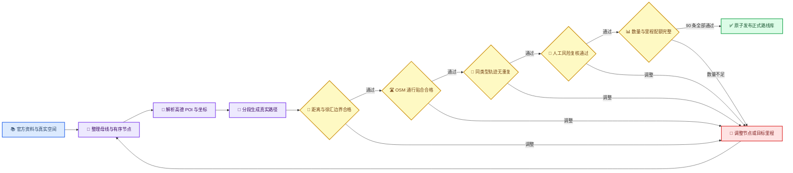
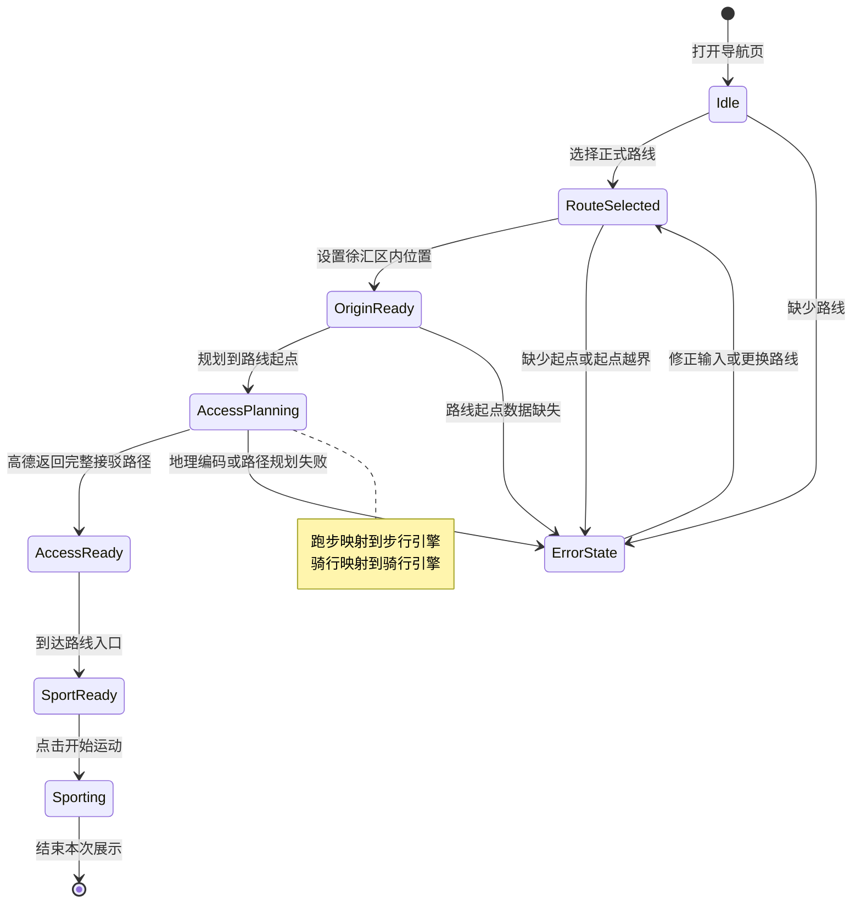

# 0813 路线添加与导航逻辑优化计划

_适用于 `xuhui_route_builder` 的路线扩充、真实性验收和接驳导航改造，制定日期：2026-08-13_

---

## 📋 核心判断

本轮工作沿两条主线同步推进：一条把正式路线库扩充到 90 条，另一条把导航流程收敛为“用户位置 → 已选路线起点 → 开始运动”。路线数量增长只有在真实性证据、轨迹质量和重复度验收同步提升后才有交付价值；导航界面也需要围绕用户到达运动入口这一真实任务重新组织。

当前网页目录展示 11 条路线，其中跑步 4 条、步行 4 条、骑行 3 条。原始候选共 15 条，现有验收报告记录 2 条 `accepted`，其余路线主要受目标距离误差、路网贴合率和节点质量影响。网页数据与最新发布规则存在历史产物不同步现象，后续统一从种子、原始响应和验收报告重新生成。

导航问题已经定位到前端数据流：`route-ui.js` 仍收集起点、途经点和终点；`map.js` 遇到步行或骑行途经点时，会按“起点到途经点”“途经点到终点”连续调用同一个高德绘图服务。后一次绘图覆盖前一次结果，地图最终只突出途经点到终点，因此途经点看起来成了起点。高德步行和骑行服务的稳定输入是起点与终点，本轮接驳导航将据此简化。[^1][^2]

## 🎯 交付目标

完成后的项目应达到以下状态：

- 正式路线共 90 条，步行、跑步、骑行各 30 条
- 所有路线沿真实公共道路、步道、绿道、公园开放道路或合法骑行道路生成
- 同一运动类型内的路线轨迹保持明显差异
- 90 条路线通过来源、边界、距离、路网贴合和重复度验收后统一发布
- 用户从徐汇区内位置出发，前往已选运动路线的真实起点
- 路线类型自动决定接驳方式，跑步使用高德步行规划引擎
- 到达入口后，用户点击“开始运动”，地图转为突出完整运动路线
- 本轮保留静态路线引导，不扩展语音播报、实时轨迹跟随和偏航重算

### 本轮边界

本轮聚焦路线数据、验收流水线和导航界面。PM2.5、噪声、花粉、路线综合评分、多 Agent 科研编排不在本轮改动范围内。高德 JS Key、WebService Key 和安全密钥继续放在本地配置文件中，仓库文档与数据文件只保留变量名。

## 🗺️ 路线数量与空间布局

### 里程配额

| 类型 | 数量 | 短线 | 中线 | 长线 |
| --- | ---: | --- | --- | --- |
| 步行 | 30 | 1–2 km，共 10 条 | 2–3.5 km，共 10 条 | 3.5–5 km，共 10 条 |
| 跑步 | 30 | 3–5 km，共 10 条 | 5–10 km，共 10 条 | 10–15 km，共 10 条 |
| 骑行 | 30 | 5–10 km，共 10 条 | 10–20 km，共 10 条 | 20–30 km，共 10 条 |

里程档用于控制路线库的使用场景。实际距离允许相对目标里程上下浮动 15%，通过高德返回距离和轨迹几何长度共同核对。

### 区域初始配额

| 区域 | 步行 | 跑步 | 骑行 |
| --- | ---: | ---: | ---: |
| 徐汇滨江及龙华滨江 | 4 | 8 | 9 |
| 上海植物园及周边 | 5 | 4 | 5 |
| 衡复风貌区 | 6 | 2 | 3 |
| 徐家汇及体育公园 | 5 | 5 | 3 |
| 龙华街区 | 4 | 3 | 2 |
| 康健—桂江绿廊 | 3 | 5 | 4 |
| 漕河泾—蒲汇塘—南部连接区 | 3 | 3 | 4 |
| 合计 | 30 | 30 | 30 |

徐汇滨江、桂江路、中环绿廊和蒲汇塘慢行空间已有官方资料支持；徐汇滨江“艺文智岸”公开骑行段约 2.7 km，可作为骑行母线的一部分，长线通过合法公共道路连接多个已核实母线。[^3][^4]

区域出现园区封闭、现场禁骑、入口坐标不稳定或道路证据不足时，将该名额移到相同里程档中数量较少的相邻区域，并在种子证据说明中记录原因。三类总量和各自短、中、长配额保持不变。

### 路线差异规则

同类型路线采用轨迹双向重合率去重，阈值为 90%，空间容差为 20 m。起终点顺序相反、名称不同或局部折返变化，都不足以单独构成新路线；只有主要轨迹形成明显差异时才保留。步行与跑步可共享适合两类运动的道路，页面分别显示运动时长、标签和使用情景。

## 🔍 来源与真实性验收

### 来源优先级

1. 上海市政府、徐汇区政府、上海市文化和旅游局、上海市体育局等官方资料
2. 公园、绿道、场馆和活动运营单位发布的路线资料
3. 城市规划机构或可信媒体给出的明确道路顺序
4. 从已核实母线派生的短线、折返线、闭环线和连接线

公开资料用于确认真实空间、节点顺序和通行语义，高德用于生成当前道路网络上的路径轨迹，OSM 用于独立检查轨迹是否贴合相应运动类型可通行的路段。单一来源只承担它能证明的部分，来源页面不会替代路径和通行验收。

### 每条路线需要保存的信息

| 信息组 | 字段内容 |
| --- | --- |
| 基本信息 | 路线编号、名称、运动类型、区域、里程档、目标距离 |
| 节点信息 | 有序节点、公开道路入口、高德 POI 编号、GCJ-02 坐标 |
| 来源信息 | 母线名称、来源机构、网址、访问日期、证据级别、派生理由 |
| 限制信息 | 开放时间、园内限制、骑行限制、施工或拥挤风险 |
| 路径证据 | 高德原始响应路径、轨迹、实际距离、预计时长 |
| 验收信息 | 徐汇区内比例、OSM 贴路率、距离误差、重复组、核验时间和路网版本 |

### 正式发布门槛

一条路线进入正式网页目录前需同时满足：

- 起点和终点落在徐汇区边界内
- 徐汇区内轨迹比例达到 90% 或以上
- OSM 可通行路网贴合率达到 98% 或以上
- 几何长度与高德 API 距离误差不超过 3%
- 实际距离与目标里程误差不超过 15%
- 同类型任意两条路线的双向轨迹重合率低于 90%
- 高德原始响应、来源网址、访问日期和节点证据齐全
- 验收状态为 `accepted`

### 路线生产流程



发布采用完整批次事务：90 条路线尚未全部通过时写入生成报告和验收报告，正式网页 GeoJSON 与目录继续保留上一版；达到 90 条、三类各 30 条、每档各 10 条后，同时更新两份网页数据。

## 🧭 导航产品逻辑

### 两阶段体验

接驳阶段解决“用户怎样到达运动入口”。用户先选择一条正式路线，再输入或点选徐汇区内的当前位置。系统从路线目录读取 `start_location`，自动锁定接驳模式，调用一次高德起终点路径规划。

运动阶段解决“到达入口后走哪条路线”。接驳结果显示后，页面提供“开始运动”操作。用户触发后，地图清理接驳路径的强调效果，突出已选路线的完整轨迹，并保留路线名称、距离和预计运动时间。

### 模式映射

| 路线类型 | 页面显示 | 高德服务 | 说明 |
| --- | --- | --- | --- |
| 步行 | 步行 | `AMap.Walking` | 按步行道路规划到入口 |
| 跑步 | 跑步 | `AMap.Walking` | 高德无单独跑步服务，沿步行道路计算 |
| 骑行 | 骑行 | `AMap.Riding` | 按骑行道路规划到入口 |

页面移除途经点、手工终点和驾车接驳选项。所选路线的起点自动成为接驳终点，用户无需再次填写。

### 导航状态流



### 路线目录接口

正式目录为每条路线增加稳定起点对象：

```json
{
  "start_location": {
    "name": "路线入口名称",
    "lng_gcj02": 121.0,
    "lat_gcj02": 31.0
  }
}
```

名称取第一个有序节点，坐标取已验收轨迹首点。导出阶段检查两者存在且与原始高德响应端点一致。前端导航直接使用该对象，不再依赖入口池关联失败后的回退链。

导航请求统一为：

```json
{
  "origin": {
    "lng_gcj02": 121.0,
    "lat_gcj02": 31.0
  },
  "destination": {
    "name": "路线入口名称",
    "lng_gcj02": 121.0,
    "lat_gcj02": 31.0
  },
  "routeId": "XH_RUN_0001",
  "routeMode": "run"
}
```

请求中不再出现 `waypoints`、用户填写的终点或用户选择的模式。调用方与地图模块同步升级，不保留旧请求分支。

### 错误反馈

| 场景 | 页面反馈 | 后续动作 |
| --- | --- | --- |
| 尚未选路线 | 提示先选择正式路线 | 保留路线下拉框焦点 |
| 用户起点为空 | 提示输入或点选当前位置 | 进入起点选择状态 |
| 起点在徐汇区外 | 提示本阶段只支持徐汇区内出发 | 重新点选 |
| 路线起点缺失 | 显示路线编号和数据异常 | 停止调用高德 |
| 地理编码失败 | 显示无法识别的地点文字 | 保留原输入供修改 |
| 路径规划无结果 | 提示检查起点或道路通行条件 | 允许重新规划 |
| 路线未验收 | 不进入正式路线下拉框 | 返回数据验收流程 |

## 🧱 实施拆分

### 第一阶段：路线调研

三个子 Agent 并行整理步行、跑步和骑行路线。每个 Agent 只返回结构化调研结果，不同时编辑 `route_seeds.json`。主 Agent 统一审查来源、数量、区域覆盖和同类型空间差异。

### 第二阶段：导航修复

先增加能够复现覆盖问题的测试，再调整实现：

1. 锁定旧逻辑会对含途经点的步行或骑行请求发起多次绘图调用
2. 建立新导航请求契约测试
3. 精简导航表单和状态
4. 把接驳规划收敛为一次 `search(origin, routeStart)`
5. 增加“开始运动”状态切换和路线高亮

### 第三阶段：数据模型和发布门槛

扩充目录导出、验证报告和发布事务：

- 导出 `start_location`
- 按运动类型执行轨迹去重
- 统计三类路线和各里程档数量
- 计算徐汇区内轨迹比例
- 90 条路线全部通过后更新正式网页数据

### 第四阶段：路线数据分批合并

| 批次 | 内容 | 目标数量 |
| --- | --- | ---: |
| 1 | 步行短线与中线 | 约 15 条 |
| 2 | 步行长线与补齐 | 约 15 条 |
| 3 | 跑步短线与中线 | 约 15 条 |
| 4 | 跑步长线与补齐 | 约 15 条 |
| 5 | 骑行短线与中线 | 约 15 条 |
| 6 | 骑行长线与补齐 | 约 15 条 |

每批先审查来源、节点、距离和通行限制，再串行合并到 `route_seeds.json`。共享数据文件、生成命令和 Git 暂存保持串行，降低覆盖和索引冲突风险。

## ✅ 测试与验收

### 导航测试

- 接驳规划只调用一次高德 `search`
- 请求只包含用户起点、路线起点、路线编号和路线类型
- 跑步路线调用步行服务，页面文字仍显示跑步
- 骑行路线调用骑行服务
- 徐汇区外起点得到清晰提示
- 缺少 `start_location` 时显示路线编号并停止规划
- 接驳阶段同时显示弱化的运动路线预览
- 点击“开始运动”后突出完整运动路线

### 路线数据测试

- 正式目录总数为 90
- `walk`、`run`、`bike` 各 30 条
- 每类短、中、长档各 10 条
- 全部路线状态为 `accepted`
- 全部路线含来源、访问日期、有序节点和高德原始响应
- 全部路线含合法 `start_location`
- 起点、终点和区内轨迹比例符合门槛
- 路网贴合率、API 距离误差和目标里程误差符合门槛
- 同类型无高重合路线，跨类型路线不参与互相淘汰
- 任一路线失败时，正式网页数据保持上一版

### 自动验证命令

```powershell
cd D:\SJTU\交大\揭榜挂帅\AI_Scientist\xuhui_route_builder
$env:PYTHONPATH="src"
python -m xuhui_route_builder.cli resolve-seeds
python -m xuhui_route_builder.cli generate-routes
python -m xuhui_route_builder.cli validate-routes
python -m pytest tests -q
node --test tests/web_navigation_contract.test.mjs
```

浏览器验收分别选择一条步行、跑步和骑行路线，检查用户起点、接驳终点与运动路线起点一致，接驳线与运动路线视觉区分清楚，“开始运动”后完整路线突出显示。

## 👥 多 Agent 协作安排

所有子 Agent 使用 `gpt-5.6-sol`，推理强度为 `medium`。

| 阶段 | 子任务 | 输出 | 共享文件策略 |
| --- | --- | --- | --- |
| 路线调研 | 步行、跑步、骑行各 30 条 | 结构化候选和来源 | 只回传结果 |
| 导航准备 | 契约测试与状态流 | 测试和前端改动 | 按文件边界串行交接 |
| 数据流水线 | 起点接口、统计和发布规则 | 模型、导出和验证改动 | 主 Agent 合并 |
| 路线生成 | 三类种子分批整理 | 90 条种子 | 主 Agent 串行写入 |
| 最终集成 | 测试、生成、浏览器验收 | 验收报告 | 主 Agent 统一执行 |

代码与文档审查单元控制在约 200–400 行。路线数据超过该规模时继续按类型和区域拆分。每个改动单元都附对应测试或数据验收证据。

## ⚠️ 边缘情况

- 公园内部道路在高德或 OSM 中缺失时，该路线进入人工复核，不使用直线补齐
- 骑行母线进入步行专用区时，节点调整到平行非机动车道路
- 闭环路线首尾节点名称相同但坐标偏差较大时，以已验收轨迹端点为准并记录偏差
- 高德 POI 名称变化时，优先用 POI 编号和坐标确认节点
- OSM 临时不可用时保留候选和原始响应，正式发布等待独立核验完成
- 高德配额或网络中断时生成失败报告，正式网页数据保持原状
- 用户输入地点文字解析出多个候选时，页面提示用户改用地图点选
- 路线入口临时封闭时，在限制字段记录并从当期推荐列表移出

## 📌 2026-08-13 执行记录

本轮已完成 90 条结构化路线调研、节点解析和高德轨迹生成，步行、跑步、骑行各 30 条，三类种子的短、中、长目标档各 10 条。导航表单、请求契约、地图图层和运动状态流也已完成改造。

严格验收结果为 6 条 `accepted`、84 条 `needs_review`、0 条 `rejected`。主要待办集中在目标里程偏差、OSM 贴路率、徐汇区边界比例、入口端点和 Overpass 超时。实际里程档分布如下：

| 类型 | 短线 | 中线 | 长线 | 档外 |
| --- | ---: | ---: | ---: | ---: |
| 步行 | 8 | 8 | 7 | 7 |
| 跑步 | 6 | 13 | 7 | 4 |
| 骑行 | 8 | 15 | 5 | 2 |

发布程序按 90 条全量验收门槛终止新版发布，正式网页目录继续使用上一版 11 条路线；这 11 条路线已经补齐 `start_location`，可进入新的接驳导航链路。下一轮按照验收报告逐条调整 84 条路线的节点和目标里程，重跑高德生成与 OSM 核验，达到 90 条全量 `accepted` 后再更新正式目录。

三类路线的第二轮修订稿已完成，覆盖模糊 POI、异常绕行、里程越档、区外端点和低区内比例等问题。重解析时高德 WebService 对全部既有 POI 统一返回 `status=0`，原子写入流程保留了上一轮 90 条已解析种子和轨迹。服务配额恢复后，从 `merge-research`、`resolve-seeds`、`generate-routes`、`validate-routes` 顺序续跑。

## 🔗 参考资料

[^1]: 高德开放平台. “地点关键字与步行路线规划，地图 JS API 2.0 示例.” 访问日期 2026-08-13. https://lbs.amap.com/demo/javascript-api-v2/example/walking-route/plan-route-according-to-name

[^2]: 高德开放平台. “路径规划参考手册.” 访问日期 2026-08-13. https://lbs.amap.com/api/javascript-api/reference/route-search

[^3]: 上海市文化和旅游局. “骑行浦江，寻踪徐汇‘艺文智岸’.” 2025-05-21，访问日期 2026-08-13. https://whlyj.sh.gov.cn/gqfc/20250521/6cd8a6e351814965b9b5f1cd515994d6.html

[^4]: 上海市道路运输事业发展中心. “2023 年上海市慢行交通品质提升工作情况.” 访问日期 2026-08-13. https://www.shanghai.gov.cn/cmsres/8f/8f342720baec4ef2a2368c3c2ecdc58d/6476cae1152b512ce10b8baff0d0967b.pdf

---

_计划维护人：ZJX 团队 · 最后更新：2026-08-13_
