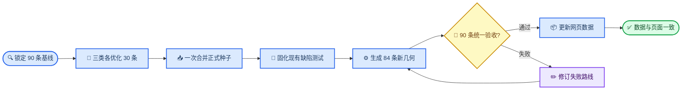

# 0815 徐汇区 90 条线路优化工作计划

_用于直接优化当前 `xuhui_route_builder` 中的 90 条徐汇健康路线，制定日期：2026-08-15_

---

## 📋 任务摘要

本轮把 `xuhui_route_builder` 现有 90 条路线作为一个整体统一优化，数量保持为步行 30 条、跑步 30 条、骑行 30 条。6 条已验收路线保留当前几何，其名称、起终点语义、真实途经点、POI 关联和前端展示仍按同一规则更新；其余 84 条同步优化路线结构与几何。最终每条路线都应具备明确起点、终点、连续行进逻辑、真实道路依据和沿线服务设施。

本计划直接作用于当前 `xuhui_route_builder` 代码、数据和网页。现有路线种子、几何、验收报告和网页数据作为优化起点，修改始终围绕同一套 90 条正式路线。写代码前先说明本轮修改范围、验证方式和失败场景，获得批准后连续完成优化。

### 核心判断

当前主要问题来自“有序景点逐段调用高德，再拼接分段结果”的生产方式。景点位于园区深处、道路尽端或独立入口时，连续分段容易产生共用入口段、原路退出、支叉和回头路。前端还会把途经点按折线长度平均放置，造成标记偏离真实节点。优化工作需同时修正路线几何、节点语义、POI 关联和地图表达。

### 截图确认的问题

| 截图场景 | 已确认缺陷 | 本轮处理 |
| --- | --- | --- |
| 植物园北区草坪线 | 地图缺少清晰起点，主线分出多条支叉，途经点无法说明完整行进顺序 | 重画为单一连续环路，起终点合并显示，节点按真实轨迹顺序定位 |
| 龙华红色记忆线 | 起点北侧仍有多余轨迹，纪念馆与烈士陵园附近出现进出共线和支叉，终点语义混乱 | 重排入口与节点，移除景点内部尽端段，形成严格闭环或清晰单程 |
| 23 km 骑行线 | 蓝色轨迹跨越范围大且多次折转，用户难以识别主干和方向 | 重建连续骑行骨架，控制节点数量，改用紫色并显示明确方向 |
| Keep 9.08 km 单程与 4.15 km 环线 | 真实用户路线分别展示清晰单程和干净闭环，起终点语义直观 | 借鉴路线形态和界面语义，轨迹仍按本项目路网、边界和通行规则复核 |

截图同时说明“标记位置正确”和“轨迹结构正确”需要分别验收：前者检查起终点、途经点、POI 的真实坐标，后者检查连续性、重复边、支叉、方向和路线形态。

### 当前基线

| 指标 | 当前值 | 本轮处理 |
| --- | ---: | --- |
| 路线总数 | 90 | 全部统一优化 |
| 步行路线 | 30 | 统一路线结构、POI 和展示 |
| 跑步路线 | 30 | 统一路线结构、POI 和展示 |
| 骑行路线 | 30 | 统一路线结构、POI 和展示 |
| 已验收路线 | 6 | 保留几何，更新其他字段和展示 |
| 需要重做几何 | 84 | 重新设计、生成和验收 |
| 骑行颜色 | 蓝色 | 调整为 `#7C3AED` |

### 本轮保留路线

下列 6 条路线保留现有几何。前端统一改色、起终点显示、真实途经点定位和 POI 展示仍会作用于这些路线。

| 路线编号 | 类型 | 路线名称 | 处理方式 |
| --- | --- | --- | --- |
| `XH_RUN_0033` | 跑步 | 西岸艺术文化中环 | 保留几何 |
| `XH_RUN_0036` | 跑步 | 西岸长跑节复原线 | 保留几何 |
| `XH_RUN_0053` | 跑步 | 东上澳塘滨水短线 | 保留几何 |
| `XH_BIKE_0066` | 骑行 | 植物园四号门—龙华历史风貌线 | 保留几何 |
| `XH_BIKE_0083` | 骑行 | 日晖港—华泾南北贯通长线 | 保留几何 |
| `XH_BIKE_0088` | 骑行 | 康健—植物园—华泾生态长环线 | 保留几何 |

## 🎯 目标与边界

### 交付目标

1. 90 条路线全部具有稳定的路线编号、运动类型、路线名称、起点、终点和有序途经点
2. 90 条路线统一采用连续单程或严格闭环逻辑，其中 84 条重新生成几何，6 条保留当前几何
3. 闭环路线采用单一“起终点”语义；单程路线采用独立起点和终点，并显示行进方向
4. 途经点落在真实轨迹附近，前端依据真实坐标定位
5. 三种运动类型均关联真实可核实的咖啡店、便利店、公共厕所、饮水点或其他补给设施
6. 骑行线路统一显示为紫色 `#7C3AED`
7. 路线生成、验证、网页导出和前端展示形成可复现流程
8. 控制联网次数、高德调用量、Overpass 调用量、重复测试和终端轮次

### 工作边界

本轮处理路线种子、路线几何、验收逻辑、POI 关联、网页导出和地图显示。PM2.5、噪声、花粉、综合健康评分、多目标排序和实时运动轨迹跟随留给后续阶段。用户当前位置到路线起点的接驳逻辑保持现有两阶段设计。

### 完成定义

一条路线进入最终目录前，需同时满足本文件中的路线结构、空间质量、POI 真实性、数据完整性和视觉验收标准。整批交付以 90 条路线数据一致、前端显示正确、相关测试通过为完成标志。

## 👥 统一执行方式

采用 1 个主 Agent 与 3 个子 Agent 并行执行。三个子 Agent 使用 `gpt-5.6-sol`、`medium` 推理强度，各自完成一种运动类型的 30 条路线优化；主 Agent 统一规则、合并正式数据、生成几何、修改代码并完成最终验收。子 Agent 的任务是形成可直接合入的完整路线方案，范围包括路线形态、起终点、节点顺序、连续道路骨架、真实 POI、来源证据、通行限制和风险，不停留在建议层。

| 角色 | 工作范围 | 交付内容 |
| --- | --- | --- |
| 主 Agent | 全部 90 条 | 锁定基线，统一字段，合并三类结果，生成路线，修改代码，验收和发布 |
| 步行子 Agent | 30 条步行路线 | 完整优化园区入口、街区点序、路线形态、步行 POI 与证据 |
| 跑步子 Agent | 30 条跑步路线 | 完整优化连续跑道、闭环结构、里程梯度、跑步 POI 与证据 |
| 骑行子 Agent | 30 条骑行路线 | 完整优化骑行道路骨架、长距离结构、禁骑风险、骑行 POI 与证据 |

为避免三个 Agent 同时编辑 `route_seeds.json`，每个子 Agent 只写一份按运动类型划分的 0815 工作结果，共 3 份结构化文件；每份固定包含 30 条路线。主 Agent 一次合并到正式种子，合并完成后依据审计价值决定保留或清理工作文件。全程不按路线拆出 90 份文件，也不建立新的研究管线。来源冲突、入口封闭或骑行限制进入同一失败清单，由主 Agent 判断；6 条已验收路线只保护几何，仍参与其他字段和前端展示优化。

### 0813 资料的处理判断

0813 清单保留为只读基线，提供路线编号、当前距离、验收状态、失败原因和 6 条保护几何。它不承担新一轮路线设计，也不形成独立执行阶段。

| 0813 资料 | 本轮用途 | 处理判断 |
| --- | --- | --- |
| `0813徐汇区90条路线验收与考证清单.md` | 确认 90 条现状、84 条失败项和 6 条保护路线 | 保留并只读使用 |
| `walk_route_candidates_0813.json` | 复用来源、证据、入口提示和通行限制 | 旧点序与旧里程设计不沿用 |
| `run_route_candidates_0813.json` | 复用来源、证据、跑道线索和通行限制 | 旧点序与旧里程设计不沿用 |
| `bike_route_candidates_0813.json` | 复用来源、证据、道路骨架和禁骑提示 | 旧点序与旧里程设计不沿用 |

当前 `data/seeds/route_seeds.json` 始终是 90 条正式路线的唯一数据源。执行中不调用旧的 0813 研究接入或合并流程；有价值的证据由子 Agent 直接写入 0815 工作结果，再由主 Agent 合入正式种子。

## 📚 统一路线规则

### 路线形态

每条路线只采用以下两类形态：

| 形态 | 起终点关系 | 适用场景 | 显示方式 |
| --- | --- | --- | --- |
| `one_way` | 起点与终点不同 | 滨江贯穿、街区走读、跨区域骑行 | 起点、终点、方向箭头 |
| `strict_loop` | 起点与终点重合 | 公园环路、街区环线、长距离城市环线 | 单一“起终点”标记 |

严格闭环只在起终点位置汇合。主轨迹不包含有实质长度的共用入口段、景点支叉或原路返回。道路吸附产生的极短重复边可作为几何噪声处理，累计重复比例上限为 2%，且单段长度低于 30 米；人工验收仍需确认地图上没有可感知折返。

### 起点与终点

- 起点选择地铁口、公园主入口、滨江入口、体育设施入口、公共广场或辨识度较高的街角
- 终点选择交通便利、空间清晰且具备安全停留条件的位置
- 单程线起终点直线距离建议高于 200 米，避免接近闭环却缺少闭合逻辑
- 严格闭环的轨迹首尾距离控制在 30 米以内，并在导出阶段合并为同一“起终点”语义
- 起终点名称、GCJ-02 坐标、入口类型和来源证据需完整
- 骑行起终点避开步行专用区、园内禁骑区和需要抬车通过的通道

### 途经点

途经点承担解释路线和确认方向的作用，不承担强迫轨迹进入景点内部的作用。节点顺序应沿主干连续展开；位于尽端道路、封闭园区内部或偏离主线较远的景点转为附近推荐。

- 步行和跑步途经点到轨迹的距离建议控制在 50 米以内
- 骑行途经点到轨迹的距离建议控制在 100 米以内
- 每条路线保留 2–6 个关键途经点，长距离骑行线可扩展到 8 个
- 途经点在前端按真实坐标或轨迹最近点显示
- 同一节点不重复出现，严格闭环的末节点与首节点仅用于闭合
- 节点顺序先经过空间检查，再进入高德路径生成

### 长距离路线

20 公里以上骑行线和 10 公里以上跑步线先确定连续骨架，再配置沿线节点。优先骨架包括徐汇滨江、龙腾大道、桂江绿廊、蒲汇塘、康健片区、植物园外围道路和华泾南部连接道路。长线避免通过密集景点堆叠里程，也避免为接近目标距离反复绕小街区。

### 官方母线

官方页面多提供点序、道路、里程或示意图，通常缺少可直接导入的 GPX。执行时采用官方母线确认空间语义，再用当前道路网络生成轨迹。优先来源包括：

- 徐汇 7 条红色文化主题行走路线[^1]
- 衡复音乐街区 Citywalk 路线[^2]
- 徐家汇体育公园周边 Citywalk 路线[^3]
- 徐汇滨江 8.4 公里滨水跑道[^4]
- 徐汇滨江长跑节 10 公里赛道[^5]
- 徐汇滨江“艺文智岸”2.7 公里骑行路线[^6]
- 上海植物园官方游园导览与四季导览[^7]

### Komoot 社区实骑证据

Komoot 路线用于识别经过真实骑行者验证的连续道路骨架、常见接入方向、路面构成和风险提示，证据等级按社区来源记为 B 或 C。其轨迹不直接覆盖高德生成结果；节点先经过坐标系转换、徐汇边界筛选、禁骑检查和道路连续性验证，再进入路线种子。

| 页面 | 页面数据 | 对本轮的价值 | 使用限制 |
| --- | --- | --- | --- |
| 交通大学出发龙腾大道闭环[^8] | 63.7 km、2 小时 33 分、爬升 180 m；自行车道 53.8 km、沥青路面 55.3 km；包含 484 m 轮渡 | 证明交大方向接入龙腾大道、黄浦江两岸与徐汇滨江南北骨架存在持续实骑使用 | 全线跨区且超过本轮 30 km 上限；含轮渡、临时限行和人车混行，只抽取徐汇区内骨架 |
| 徐家汇出发龙腾大道变体[^9] | 44.2 km、1 小时 54 分、爬升 170 m；自行车道 26.0 km、沥青路面 34.2 km | 支持“徐家汇公共交通节点 → 龙腾大道 → 徐汇滨江”的接入方向，并提供安福路咖啡补给候选 | 页面提示末段约 199 m 禁止骑行；跨区北段和轮渡段不进入正式徐汇路线 |
| 中山公园出发龙腾大道变体[^10] | 39.7 km、1 小时 38 分、爬升 110 m；自行车道 32.4 km、沥青路面 33.4 km | 关键点序包含徐家汇公园、龙腾大道南段、远望 1 号，可用于比较中心城区接入和滨江返回方向 | 页面提示约 90 m 禁止骑行；仅保留徐汇境内且通过高德与 OSM 复核的节点 |
| 上海城市骑行合集[^11] | 合集含 9 条实骑路线；将龙腾大道称为中心城区常用骑行线路，并记录黄浦滨江骑行道长距离贯通经验 | 用于发现龙腾大道往返骨架、黄浦滨江连续段和早间低交通时段等设计线索 | 作者经验具有时间性；交通、施工和开放状态以本轮核实结果为准 |

本轮优先派生三类候选：徐家汇或交通大学至龙腾大道的单程接入线、龙腾大道南北连续往返骨架改造的严格闭环、徐汇滨江至徐浦大桥附近的南向长线。Komoot 页面指出徐浦大桥北侧约 3.5 km 路段适合公路骑行，继续向北约 5 km 的部分骑行空间可能转入人行道；后者列为禁骑与人车混行重点复核段。页面给出的关键点坐标属于网页地理坐标，进入高德生成前统一转换为 GCJ-02，并核对轨迹最近点。

## 📍 真实 POI 与补给策略

### POI 类型

| 类型 | 数据标签 | 适用价值 | 核实重点 |
| --- | --- | --- | --- |
| 咖啡店 | `coffee` | 休息、饮水、会合 | 名称、营业状态、位置 |
| 便利店 | `convenience` | 饮料、能量补给 | 品牌、营业状态、位置 |
| 公共厕所 | `toilet` | 基础服务 | 公共属性、开放状态、位置 |
| 饮水点 | `drinking_water` | 免费饮水 | 设施类型、开放状态 |
| 运动驿站 | `sport_station` | 补给、休息、维修 | 服务项目、开放状态 |
| 自行车服务 | `bike_service` | 维修、打气、停车 | 服务项目、骑行可达性 |

### 覆盖目标

- 每条路线都执行一次沿线 POI 匹配
- 每种运动类型至少 18 条路线关联 1 个经核实的服务 POI
- 每种运动类型至少覆盖咖啡店、便利店和公共厕所三类中的两类
- 5 公里以上跑步线和 10 公里以上骑行线优先配置公共厕所或便利店
- POI 缺失不触发破坏路线结构的绕行，路线连续性优先级高于补给覆盖

### 空间关联

- 步行和跑步 POI 搜索走廊采用轨迹两侧 100 米
- 骑行 POI 搜索走廊采用轨迹两侧 200 米
- POI 只作为附近服务展示，不加入高德分段导航节点
- 相邻路线共享同一 POI 时复用记录，通过 `related_route_ids` 建立关联
- 地图标记展示真实坐标，并标注“沿线”或“附近”

### 真实性核实

POI 至少保存名称、类型、GCJ-02 坐标、来源、查询时间、营业或开放状态、关联路线和距离轨迹的最近距离。高德 POI 结果作为当前营业状态与坐标的主要核实入口；公共厕所和饮水设施可结合政府、公园或场馆公开信息。无法确认营业状态的点标记为 `needs_review`，暂不进入正式推荐。

## ⚙️ 正式数据与代码

### 路线字段

每条优化路线至少包含以下字段：

| 字段 | 含义 | 示例 |
| --- | --- | --- |
| `route_id` | 稳定路线编号 | `XH_RUN_0041` |
| `route_shape` | 路线形态 | `strict_loop` |
| `start_location` | 起点对象 | 名称与坐标 |
| `end_location` | 终点对象 | 名称与坐标 |
| `ordered_nodes` | 有序路线节点 | 入口与途经点 |
| `waypoint_names` | 前端展示点序 | 节点名称列表 |
| `amenity_ids` | 沿线服务点 | POI 编号列表 |
| `geometry_source` | 轨迹来源 | `amap_direction` |
| `evidence_note` | 来源与派生说明 | 官方母线与调整理由 |
| `access_restrictions` | 通行限制 | 开放时间、禁骑说明 |

`strict_loop` 的 `start_location` 与 `end_location` 使用相同地点语义，前端只绘制一个“起终点”标记。`one_way` 使用两个独立对象。

### 重点文件

| 文件 | 本轮用途 |
| --- | --- |
| `xuhui_route_builder/data/seeds/route_seeds.json` | 90 条路线的统一种子来源 |
| `xuhui_route_builder/data/seeds/research/*_route_optimization_0815.json` | 三个子 Agent 各自提交 30 条完整优化结果的工作文件 |
| `xuhui_route_builder/data/web/xuhui_routes.geojson` | 网页路线几何 |
| `xuhui_route_builder/data/web/route_catalog.json` | 路线名称、起终点、途经点和状态 |
| `xuhui_route_builder/data/web/poi_catalog.json` | 真实沿线服务 POI |
| `xuhui_route_builder/data/processed/route_validation_report.json` | 90 条路线统一验收结果 |
| `xuhui_route_builder/src/xuhui_route_builder/` | 路线生成、导出和验证逻辑 |
| `xuhui_route_builder/web/src/` | 地图颜色、标记、方向和 POI 展示 |
| `xuhui_route_builder/tests/` | 与本轮修改对应的自动化测试 |

实际修改按“路线设计与数据、生成与验收、前端展示”三个小任务推进，每个任务完成后运行对应测试。工作文件限定为按运动类型划分的 3 份结构化结果；正式交付只维护路线数据、必要代码、网页数据和验收报告。

## 🔄 执行流程

### 第一步：锁定基线并行优化

1. 一次读取 90 条路线种子、现有几何和验收结果
2. 记录 6 条保护几何的路线编号、几何摘要和哈希
3. 从 0813 资料中提取现状失败原因、来源证据和通行限制，跳过旧点序与旧里程设计
4. 创建步行、跑步、骑行三个 `gpt-5.6-sol medium` 子 Agent，各自完成 30 条完整优化结果
5. 主 Agent 检查数量、编号、字段和跨类型一致性，再一次合并到 `route_seeds.json`

### 第二步：固化缺陷并生成路线

1. 先补充能复现支叉、折返、标记错位和骑行颜色问题的最小测试
2. 修改路线生成、验收、导出和前端标记所需代码
3. 6 条路线沿用当前几何，84 条路线按新点序调用高德生成
4. 优先复用已有高德响应和真实 POI 缓存
5. 同一区域的道路节点和 POI 在多条路线间复用

### 第三步：验收和网页更新

1. 一次运行 90 条路线的结构、几何、OSM、边界、里程和 POI 检查
2. 只修订验收失败的路线，并重新运行相关检查
3. 更新 GeoJSON、路线目录、POI 目录和验收报告
4. 骑行路线与图例统一为紫色 `#7C3AED`
5. 闭环显示单一“起终点”，单程显示起点、终点和方向，途经点与 POI 使用真实坐标
6. 完成批量地图视觉复核，确认 90 条路线的数据与页面一致

## 🧪 验收标准

### 路线结构

- 路线形态为 `one_way` 或 `strict_loop`
- 起点、终点名称与坐标完整
- 轨迹为一条连续 `LineString`
- 地图上没有可感知的原路折返、支叉或断头
- 严格闭环首尾距离不高于 30 米
- 重复无向边累计比例不高于 2%，且单段低于 30 米
- 单程线起终点关系清晰，方向与节点顺序一致
- 途经点按路线行进顺序排列，并落在轨迹邻近范围

### 空间与距离

- 起点和终点位于徐汇区或已明确批准的跨区连接场景
- 徐汇区内轨迹比例达到 90% 或以上
- OSM 可通行路网贴合率达到 98% 或以上
- 高德距离与轨迹几何长度误差不高于 3%
- 实际距离与目标里程误差不高于 15%
- 同类型路线的双向轨迹重合率低于 90%
- 骑行轨迹避开已知禁骑道路和纯步行空间

### POI 与前端

- 正式 POI 具有名称、类型、坐标、来源和核实时间
- POI 坐标与路线走廊距离符合本计划阈值
- 页面展示名称与 POI 目录一致
- 闭环标记、单程起终点和途经点位置准确
- 骑行路线在筛选、选中、导航和高亮状态下均为紫色
- 图例颜色与地图颜色一致

### 自动化验证

先为现有缺陷补充复现测试，再调整实现。提交前运行与本轮相关的单元测试、前端测试、formatter、linter 和类型检查。测试按改动范围选择，整批发布前再运行完整相关测试集，避免每次局部数据调整都重复运行全套测试。

建议新增或扩展以下测试：

- `test_route_shape_contract.py`：路线形态、起终点和闭环语义
- `test_route_topology.py`：重复边、支叉、折返和首尾距离
- `test_route_amenities.py`：POI 字段、距离和真实性状态
- `test_web_export_schema.py`：起终点、途经点和 POI 导出
- `web_navigation_contract.test.mjs`：前端标记、颜色和导航请求

## ⚡ 时间与调用控制

### 调用原则

- 先处理本地文件和已有 `data/raw/amap` 响应
- 官方路线按区域集中核实，避免按 90 条路线重复搜索
- POI 按区域或轨迹走廊批量查询，并跨路线复用
- 高德路径请求以唯一节点对为缓存键
- 路线第一轮生成后，只对失败项发起第二轮请求
- Overpass 在本地结构检查通过后按批次运行
- API 返回 `429`、`504` 或连续异常时暂停该批次，保留上下文日志
- 已有可信缓存直接复用，新响应继续保存在现有原始数据目录

### 终端与测试控制

- 一次批量读取和审查 90 条路线，避免逐条重复打开文件
- 数据、验收和前端三个小任务分别运行相关测试
- 最终交付前运行一次完整相关测试集
- 视觉复核采用按区域或类型生成的批量截图清单
- 日志使用 `DEBUG`、`INFO`、`WARN`、`ERROR` 分级，并记录路线编号、节点对、API 状态和失败位置

### 预期节奏

| 阶段 | 主要工作 | 停止条件 |
| --- | --- | --- |
| 统一审查 | 一次检查 90 条路线 | 每条路线的处理方式明确 |
| 路线优化 | 修改统一种子并生成 84 条几何 | 90 条正式路线数据完整 |
| 统一验收 | 本地检查、OSM 和失败修订 | 失败清单清零或明确记录 |
| 网页更新 | 标记、POI、方向和紫色骑行线 | 数据与页面一致 |

### 风险与处理

| 风险 | 识别信号 | 处理方式 |
| --- | --- | --- |
| 园区道路吸附异常 | 路线穿绿地或出现支叉 | 改用公开入口与环路节点 |
| POI 位于尽端 | 进出共用同一路段 | 转为附近推荐 |
| 骑行禁行 | 公园内部或步行专用道 | 移到外围骑行道路 |
| 长线里程失控 | 大量小街区绕行 | 重建连续骨架 |
| API 限流 | `429` 或超时 | 使用缓存并延后批次 |
| Overpass 不稳定 | `504` 或空响应 | 保留本地结果并切换批次 |
| POI 营业状态不明 | 无近期记录 | 标记待复核 |
| 前端标记错位 | 途经点远离真实位置 | 使用真实坐标或最近点 |
| 多 Agent 冲突 | 同时修改正式种子 | 每类只写 1 份工作结果，主 Agent 一次合并 |

## ✍️ 新对话启动清单

新对话接手后按以下顺序推进：

1. 读取 `AGENTS.md` 和本计划全文
2. 检查当前分支、工作区状态和已有改动
3. 读取路线种子、生成报告、验收报告、GeoJSON 和前端地图文件
4. 向用户提交实施方案，说明预计修改文件、测试与失败场景，等待批准
5. 创建 3 个 `gpt-5.6-sol medium` 子 Agent，分别完成 30 条步行、跑步和骑行路线优化
6. 主 Agent 检查三份完整结果并一次合入正式路线种子
7. 生成 84 条新几何并保护 6 条现有几何
8. 完成统一验收、前端调整和视觉复核
9. 交付修改文件、验证结果、边缘情况、失败路线和剩余风险

### 启动时优先读取的文件

- `xuhui_route_builder/README.md`
- `xuhui_route_builder/0813徐汇区90条路线验收与考证清单.md`，读取路线编号、状态、失败原因和 6 条保护路线
- `xuhui_route_builder/data/seeds/research/*_route_candidates_0813.json`，只提取来源证据和通行限制
- `xuhui_route_builder/data/seeds/route_seeds.json`
- `xuhui_route_builder/data/processed/route_generation_report.json`
- `xuhui_route_builder/data/processed/route_validation_report.json`
- `xuhui_route_builder/data/web/xuhui_routes.geojson`
- `xuhui_route_builder/data/web/route_catalog.json`
- `xuhui_route_builder/data/web/poi_catalog.json`
- `xuhui_route_builder/src/xuhui_route_builder/routes.py`
- `xuhui_route_builder/src/xuhui_route_builder/validation.py`
- `xuhui_route_builder/src/xuhui_route_builder/exporters.py`
- `xuhui_route_builder/web/src/map.js`
- `xuhui_route_builder/web/src/route-ui.js`

### 最终交付清单

- [ ] 90 条路线数量和编号稳定
- [ ] 90 条路线全部完成统一结构和 POI 优化
- [ ] 6 条保留路线几何未发生变化，其他字段已统一更新
- [ ] 84 条路线完成新几何生成和验收
- [ ] 起点、终点和途经点语义完整
- [ ] 原路折返、支叉和断头清零
- [ ] 三种运动类型均有真实 POI 覆盖
- [ ] 骑行路线及图例统一为紫色
- [ ] 生成报告与验收报告更新
- [ ] 前端地图完成批量视觉复核
- [ ] 测试、formatter、linter 和类型检查通过
- [ ] 敏感信息、大文件和临时文件未进入提交
- [ ] 剩余风险和人工复核项记录完整

---

[^1]: 上海市文化和旅游局. (2024). “徐汇发布7条红色文化主题行走路线.” https://whlyj.sh.gov.cn/gqfc/20241021/eec3bb2c96504b059712ec348032212a.html

[^2]: 上海市文化和旅游局. (2026). “来衡复音乐街区解锁春日打卡清单.” https://whlyj.sh.gov.cn/gqfc/20260417/60c0fdc9b9f8481ab6be378451285604.html

[^3]: 徐汇区人民政府. (2024). “解锁徐汇Citywalk新玩法，探寻历史与体育的奇妙碰撞.” https://www.xuhui.gov.cn/xwzx_zwxx/20241115/547298.html

[^4]: 上海市体育局. (2021). “上海西岸滨水体育空间.” https://tyj.sh.gov.cn/gqfc/20210930/19e8d84a536a4a728d8598cba0179898.html

[^5]: 上海市人民政府. (2025). “徐汇滨江长跑节开跑，用脚步丈量西岸最美赛道.” https://www.shanghai.gov.cn/nw15343/20251229/3f98aa90344d45f88f046371f74c92c3.html

[^6]: 上海市文化和旅游局. (2025). “骑行浦江，寻踪徐汇艺文智岸.” https://whlyj.sh.gov.cn/gqfc/20250521/6cd8a6e351814965b9b5f1cd515994d6.html

[^7]: 上海植物园. (2021). “上海植物园语音导览上线.” https://www.shbg.org/sites/zhiwuyuan/InfoContent.aspx?ctgId=3c25f682-3f21-4cb3-994b-ab79489bacae&infoId=bc3ac58b-5775-4cb6-a921-53f179926c2b

[^8]: Komoot. (2026). “Longteng Avenue Cycling Route – Longteng Avenue loop from 交通大学.” https://www.komoot.com/smarttour/21800865 （访问日期：2026-08-15）

[^9]: Komoot. (2026). “Longteng Avenue Cycling Route – Guangfu 'Cobblestone' Road loop from 徐家汇.” https://www.komoot.com/smarttour/33993515 （访问日期：2026-08-15）

[^10]: Komoot. (2026). “Longteng Avenue Cycling Route – Longteng Avenue loop from 中山公园.” https://www.komoot.com/smarttour/33978468 （访问日期：2026-08-15）

[^11]: Gordon, Komoot. “Downtown riding and day tripping — Shanghai's cycling essentials.” https://www.komoot.com/collection/2180778/downtown-riding-and-day-tripping-shanghai-s-cycling-essentials （访问日期：2026-08-15）

---

_最后更新：2026-08-15 · 维护范围：`AI_Scientist/xuhui_route_builder`_
