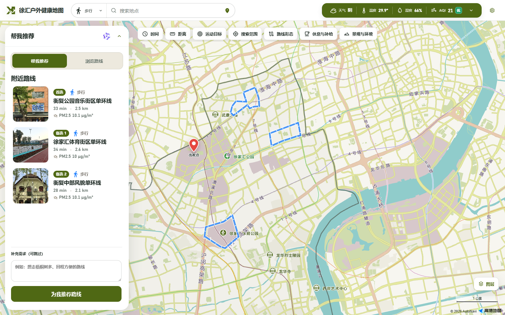
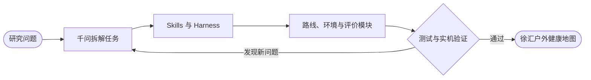
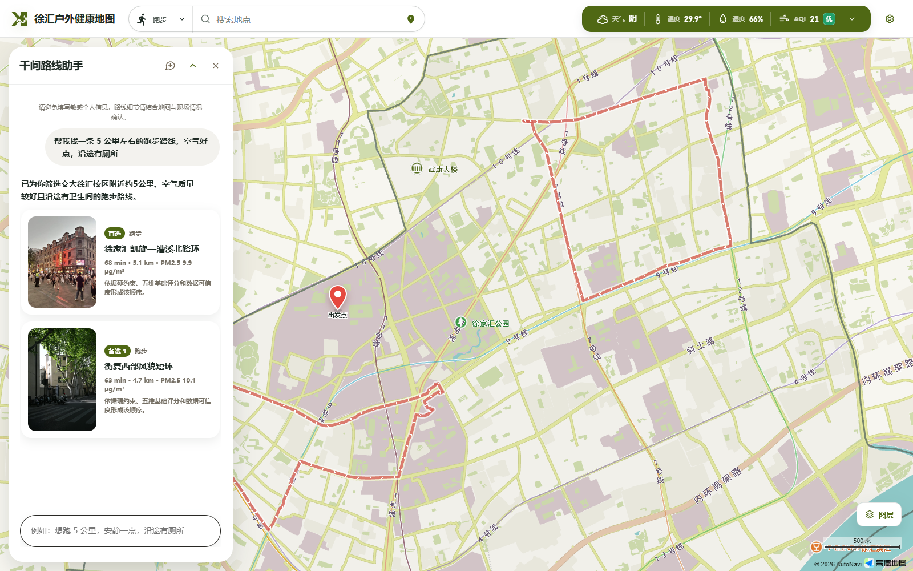
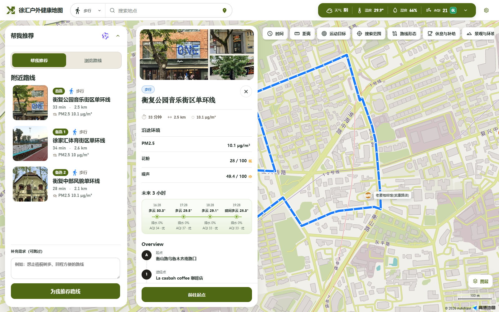

# 徐汇户外健康地图

_科研项目：面向上海城市户外运动的多源环境暴露感知与健康路线决策 AI Scientist_

---

## 在线体验

[徐汇户外健康地图——面向上海城市户外运动的多源环境暴露感知与健康路线决策AI Scientist](https://zion-johnson99.github.io/AI_Scientist_shanghai_route/)


_图 1：地图首页集中展示路线、环境信息与筛选入口。_

## 项目介绍

在碳达峰、碳中和战略背景下，步行、骑行等绿色出行方式正在成为城市低碳转型与健康生活的重要连接点。[《上海市加快推进绿色低碳转型行动方案（2024—2027 年）》](https://www.shanghai.gov.cn/nw12344/20240914/a33482feb8a24666ad745e95ef295f03.html?siteId=1)提出结合城市更新和“十五分钟生活圈”建设慢行交通体系，到 2027 年，中心城区绿色交通出行比例达到 75% 以上。慢行空间的持续改善为户外活动提供了基础，路线周边的空气污染、花粉、噪声、天气和道路环境也会直接影响运动体验与健康风险。

现有研究已经证明环境数据能够参与路线决策。2024 年发表于 *Environment International* 的[城市空气健康导航研究](https://pubmed.ncbi.nlm.nih.gov/38878652/)利用 PM2.5 预测和空间插值寻找低暴露路线；[北京跑步轨迹研究](https://pubmed.ncbi.nlm.nih.gov/39004371/)进一步说明跑步者的 PM2.5 暴露会随时间、地点和运动方式变化。此类工作为健康路线规划提供了重要基础，研究对象仍主要集中在 PM2.5。进入实际运动场景后，用户还会同时关注花粉过敏、交通噪声、温湿度、降雨、沿途绿地与水体、补给条件、目标距离以及个人健康偏好，多源信息之间缺少统一的分析与推荐流程。

徐汇户外健康地图围绕这一研究需求，构建了面向步行、跑步和骑行的多源环境暴露感知与健康路线决策系统。项目以徐汇区为首个应用区域，整理并验收三种运动方式各 30 条、共 90 条路线，将路线轨迹与天气、空气质量、PM2.5、花粉、噪声、绿地水体、沿途地点和接驳距离进行关联。用户输入运动方式、目标距离、出发位置和关注因素后，系统从路线库中生成一条首选路线和两条备选路线，并提供推荐理由、风险提醒、路线详情和前往起点的导航。

项目面向 XH-202619《基于国产开源大模型的 AI Scientist 的研发与应用》赛题，并参加[“挑战杯”揭榜挂帅专项赛](https://university.aliyun.com/action/tzbjbgs2026)，对应 **B. 科学实验任务规划与反馈迭代**。研究范围聚焦低碳出行中的健康路线决策，个人碳减排量暂未纳入核算。当前公开页面呈现项目现阶段的最终闭环实验结果与可视化产品。

## 项目研发与迭代

项目采用千问辅助的 AI Scientist 研发流程，围绕研究目标、模块开发、实验验证和反馈修改推进多轮迭代。仓库将数据源核查、路线生成与验收、环境数据刷新、推荐结果审查等方法沉淀为内置 Skills；Harness 负责组织 Skills 的执行顺序，衔接各模块的数据和结果，并完成质量检查与异常回退。千问根据阶段目标辅助拆解研发任务、评价实验结果和提出下一轮调整方向，使路线、环境数据、评价模型和网页展示能够沿同一条研究链路逐步完善。

| 迭代阶段 | 开发内容 | 当前成果 |
| --- | --- | --- |
| 路线规划模块 | 建立运动入口、候选路线、路线验收和接驳导航流程 | 三种运动各 30 条，共 90 条已验收路线，并完成地图展示与起点导航 |
| 环境数据模块 | 接入并统一不同时间尺度和空间尺度的环境信息 | 形成天气、空气质量、PM2.5、花粉和噪声数据，覆盖 54 个环境网格与全部路线 |
| 评价推荐模块 | 将环境风险、运动需求、到达成本和个人偏好纳入路线排序 | 建立硬约束和五维评分，由千问评价候选路线并生成推荐理由与风险提醒 |
| 系统整合与验证 | 将各模块结果接入网页，并根据测试结果修正数据、评分和交互 | 形成可公开访问的地图、推荐服务和自动化数据更新流程 |



产品运行阶段使用 `qwen3.8-flash` 整理专门对话中的路线需求，并审核排名靠前的候选路线。系统先通过 Python 检查安全条件、距离和用户偏好，对候选路线执行可复现的五维评分与相似路线过滤；千问随后生成首选、备选、推荐理由和风险提醒。模型服务临时异常时，页面会继续使用本地评分结果。


_图 2：路线助手展示首选路线、备选路线和推荐说明；本地排序与千问评价共用这套界面。_

## Qwen-Harness 闭环实验

Qwen-Harness 将闭环实验组织为“研究目标 → 证据与假设 → 实验设计 → 独立源码生成 → 模块执行与质量门禁 → 反馈与交付”。完整 `full-research` 工作流包含 19 个阶段，每轮源码、检查结果和报告均保存在独立的 `runtime/runs/<run-id>/` 目录。

| 轮次 | 闭环实验结果 |
| --- | --- |
| [第一轮](./Qwen-Harness/public-runs/run-20260902T035556Z-0a43adb5/) | 19 个阶段完成；7 项必需工程检查失败，科学状态为 `inconclusive`，形成第二轮缺陷基线 |
| [第二轮](./Qwen-Harness/public-runs/run-20260902T125247Z-d8922e23/) | 14 项工程门禁、90 条路线空间门禁、12 项产品矩阵和 7 项真实浏览器交互通过，科学状态为 `partially_supported` |

最小复现与核验命令如下，在线完整运行需要在 `Qwen-Harness/.env` 中配置自己的百炼服务信息；第二轮固定交付包可直接启动。

```powershell
powershell -ExecutionPolicy Bypass -File .\Qwen-Harness\scripts\setup-local.ps1
cd Qwen-Harness
uv run qwen-harness doctor
uv run qwen-harness run --offline --workflow reproduce-existing --goal-file examples/goals/multisource-route.json
uv run qwen-harness run --goal-file examples/goals/multisource-route.json --workflow full-research --allow-network --approval-mode critical
uv run qwen-harness status <run-id>
uv run qwen-harness report <run-id>
powershell -ExecutionPolicy Bypass -File .\public-runs\run-20260902T125247Z-d8922e23\publish\launch-local.ps1
```

两轮冻结材料、报告和检查记录见[公开成果目录](./Qwen-Harness/public-runs/)，第二轮候选评分明细见 [GitHub Release](https://github.com/Zion-Johnson99/AI_Scientist_shanghai_route/releases/tag/qwen-harness-runs-2026-09-03)。

## 产品功能

- 路线浏览：按步行、跑步、骑行和距离查看徐汇区路线，地图同步显示入口、轨迹与沿途地点
- 环境判断：查看当前天气、AQI、生活指数、24 小时趋势，以及路线对应的 PM2.5、花粉和噪声结果
- 个性化推荐：结合运动方式、距离、位置、健康关注和场景偏好，输出一条首选路线与两条备选路线
- 地图导航：支持地点输入、地图点选、当前位置定位，以及步行或骑行前往路线起点


_图 3：路线详情页展示轨迹、距离、沿途地点和环境信息。_

## 完成情况

| 模块 | 当前结果 |
| --- | --- |
| 路线与地点 | 步行、跑步、骑行各 30 条，共 90 条已验收路线 |
| 地图与导航 | 已完成路线筛选、地图展示、位置选择和接驳导航 |
| 环境数据 | 已接入天气、空气质量、CHAP PM2.5、Google 花粉和噪声风险数据 |
| 环境展示 | 已覆盖 54 个环境网格和 90 条路线，并提供当前状态与 24 小时趋势 |
| 评价与推荐 | 已完成硬约束、五维评分、千问评价、首选与备选推荐和异常回退 |
| AI Scientist 闭环 | 已采用千问辅助规划、Skills 与 Harness 组织实验任务，形成当前可视化结果 |
| 在线部署 | GitHub Pages 提供公开网页，自动化任务按计划更新环境数据 |

## 本地体验

本地运行需要 Python 3.10 或更高版本，并安装 [uv](https://docs.astral.sh/uv/getting-started/installation/)。以下流程以 Windows PowerShell 为例。

### 1. 安装三个模块

在仓库根目录运行：

```powershell
uv sync --directory .\xuhui_route_builder
uv sync --directory .\weather_api_data --extra chap
uv sync --directory .\evaluation_model_qwen
```

### 2. 创建本地配置

```powershell
Copy-Item .\xuhui_route_builder\.env.example .\xuhui_route_builder\.env
Copy-Item .\weather_api_data\.env.example .\weather_api_data\.env
Copy-Item .\evaluation_model_qwen\.env.example .\evaluation_model_qwen\.env
```

打开三个 `.env` 文件，按模板提示填写自己申请的服务信息：

| 配置位置 | 用途 |
| --- | --- |
| `xuhui_route_builder/.env` | 地图显示、地点搜索和接驳导航 |
| `weather_api_data/.env` | 天气、空气质量、花粉等环境数据更新 |
| `evaluation_model_qwen/.env` | 千问需求对话、评价与推荐，默认模型为 `qwen3.8-flash` |

各服务的 Key 只放在本机 `.env` 或云端加密 Secrets 中，仓库仅提交配置模板。

### 3. 启动完整应用

日常体验可直接启动本地评分模式：

```powershell
.\start-local-app.ps1
```

启用千问评价与个性化推荐：

```powershell
.\start-local-app.ps1 -UseQwen
```

启动完成后会自动打开 [http://127.0.0.1:8123/web/](http://127.0.0.1:8123/web/)。命令窗口保持运行，结束体验时按 `Ctrl+C`。启动时按数据新鲜度选择必要的刷新层级，运行期间每 30 分钟复查一次；上游请求异常时继续使用上一份可用数据。

macOS 或 Linux 使用：

```bash
bash ./start-local-app.sh
bash ./start-local-app.sh --use-qwen
```

更详细的首次配置和问题排查见各模块说明：

- [路线地图与导航](./xuhui_route_builder/README.md)
- [多源环境数据](./weather_api_data/README.md)
- [千问评价与推荐](./evaluation_model_qwen/README.md)

## 项目结构

| 目录 | 内容 |
| --- | --- |
| [`xuhui_route_builder/`](./xuhui_route_builder/) | 90 条路线、地图界面、地点搜索和接驳导航 |
| [`weather_api_data/`](./weather_api_data/) | 天气、空气质量、PM2.5、花粉、噪声与网页数据发布 |
| [`evaluation_model_qwen/`](./evaluation_model_qwen/) | 路线筛选、五维评分、千问评价、推荐服务与结果记录 |
| [`.agents/skills/`](./.agents/skills/) | AI Scientist 使用的项目 Skills 与验证工具 |
| [`上海路线规划项目方案/`](./上海路线规划项目方案/) | 研究问题、实验设计和早期项目方案 |
