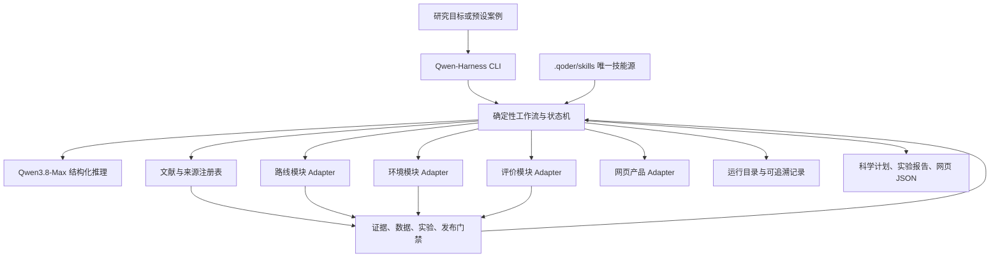
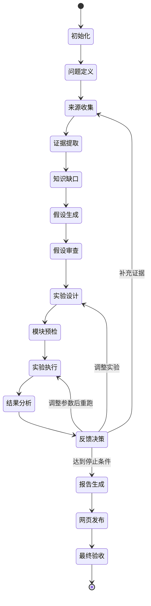

# Qwen-Harness 需求与总体架构

> 文档状态：施工基线 1.0
> 适用仓库：`Zion-Johnson99/AI_Scientist_shanghai_route`
> 基线日期：2026-09-01
> 目标实现环境：工作树 `D:\SJTU\交大\揭榜挂帅\AI_Scientist_develop`，分支 `Qwen_Harness_Build`，Qoder + `qwen3.8-max`，独立 Python CLI，阿里云百炼 OpenAI 兼容接口
> 权威设计文档：`docs/qwen-harness-build/00-需求与总体架构.md` 至 `docs/qwen-harness-build/04-Qoder执行总提示词.md`

---

## 1. 文档目的

本套设计用于指导 Qoder 在现有仓库中新增 `Qwen-Harness/`，把已经完成的路线、环境、评价与网页产品组织成一套可执行的 AI Scientist 科研闭环。

最终使用方式以一条 CLI 命令为主：

```powershell
qwen-harness run --goal "验证多源环境信息在有限附加距离约束下能否提升个性化健康路线效用"
```

该命令负责组织以下链路：

> 研究目标输入 → 文献与事实提取 → 知识缺口识别 → 候选假设生成 → 假设审查 → 实验设计 → 调用现有四个模块 → 结果分析 → 反馈迭代 → 科学计划与网页产品输出

本套文档提供明确的目录、数据协议、类与函数职责、CLI 设计、Skills 设计、实施阶段和验收门禁。Qoder 依据文档施工，Codex 在后续阶段进行独立代码审查与优化。

---

## 2. 已确认的项目决策

| 决策项 | 已确认内容 |
| --- | --- |
| Harness 形态 | 仓库内独立 Python 工程，目录名为 `Qwen-Harness/` |
| 启动方式 | 封装为 `qwen-harness` CLI，以 `run --goal` 作为主入口 |
| 模型 | Qoder 施工使用 `qwen3.8-max`；独立 CLI 通过百炼 API 调用 `qwen3.8-max`，各阶段默认 `reasoning_effort=medium` |
| 技能源 | 新 Harness 只读取 `.qoder/skills/`，新技能不复制到 `.agents/skills/` |
| 修改方式 | 已从 `main` 建立 `Qwen_Harness_Build` 分支，直接使用工作树 `D:\SJTU\交大\揭榜挂帅\AI_Scientist_develop` |
| 科学目标 | 在候选路线集合中找到综合最优路线，并在有限附加距离约束下提升个性化路线效用 |
| 实验边界 | 不开展用户问卷、人工盲评、移动传感器或线下实测；保留单元测试、契约测试、集成测试与离线复现实验 |
| 密钥管理 | 仓库只提交 `.env.example`，真实 Key 由体验者自行配置 |
| 运行安全 | 默认读取稳定产物；网络访问、模块刷新和产品发布分别显式授权 |
| 结果表述 | 使用“当前候选集中的约束最优路线”“环境暴露估计”“代理风险”，避免扩大到全路网全局最优或道路实测真值 |

---

## 3. 赛题要求与工程响应

XH-202619 的核心要求包括问题理解、文献挖掘与事实提取、逻辑驱动的假设生成、可行性论证、多轮迭代、人在回路，以及标准化《科学假设与研究计划》输出。标准字段涵盖：

- 待研究问题
- 解决思路
- 必要技术手段
- 数据集中的 Source 与 Target
- 论文标题与摘要
- 方法论
- 基线、指标与实验设计
- 实验结果
- 真实参考论文

Qwen-Harness 将这些要求转成可执行阶段和结构化文件。每个阶段均生成输入、输出、审计记录和质量门禁结果。最终成果同时包含人类可读 Markdown、机器可读 JSON 和网页展示数据。

赛题技术文档要求提交基于 Qwen 的多智能体或 Skills 架构、核心工作流代码、上下文工程、真实案例和可复现结果。本项目采用“角色化 Agent + 确定性工作流 + 现有模块工具调用”的组合：

- Qwen 负责研究问题归纳、证据关联、假设与实验计划、结果解释和反馈建议。
- Python Harness 负责状态、权限、数据协议、模块调用、质量门禁、运行记录和断点恢复。
- 现有业务模块负责路线、环境、评价和网页的真实计算与产品输出。

---

## 4. 当前仓库基础

### 4.1 路线与网页模块

目录：`xuhui_route_builder/`

当前能力：

- 90 条已验收路线，步行、跑步、骑行各 30 条。
- 路线入口、路线种子、路径生成、几何验收、重复检测、服务 POI、接驳导航和静态数据导出。
- 网页采用原生 HTML、CSS 和 JavaScript，已拆分地图、环境、推荐、位置、导航、路线卡片等模块。
- Python 测试与 Node.js 契约测试已存在。

稳定输入与产物包括：

```text
xuhui_route_builder/data/web/route_catalog.json
xuhui_route_builder/data/web/xuhui_routes.geojson
xuhui_route_builder/data/web/xuhui_entries.geojson
xuhui_route_builder/data/web/xuhui_boundary.geojson
xuhui_route_builder/data/web/poi_catalog.json
xuhui_route_builder/data/web/access_cases.json
```

现有命令包括：

```powershell
uv run --directory xuhui_route_builder xuhui-route-builder validate-seeds
uv run --directory xuhui_route_builder xuhui-route-builder validate-routes
uv run --directory xuhui_route_builder xuhui-route-builder export-candidates
```

路线重建属于高成本操作，Harness 默认只执行读取、快照和验收。仅在工作流明确提出路线修复且用户授权后进入生成流程。

### 4.2 多源环境模块

目录：`weather_api_data/`

主链路：

> 多源数据采集 → 54 个约 1 km 环境网格 → 路线路段匹配 → 90 条路线暴露汇总 → 网页发布

当前能力覆盖天气、AQI、PM2.5 融合、花粉、噪声代理、路线环境暴露、历史存储、分层刷新和 last-known-good 回退。重要命令包括：

```powershell
uv run --directory weather_api_data weather-api-data config-check
uv run --directory weather_api_data weather-api-data dry-run
uv run --directory weather_api_data weather-api-data scheduled-refresh --tier weather
uv run --directory weather_api_data weather-api-data scheduled-refresh --tier hourly
uv run --directory weather_api_data weather-api-data scheduled-refresh --tier daily
uv run --directory weather_api_data weather-api-data publish-web
```

Harness 无网络授权或缺少 Key 时，使用最近一份有效环境产物并记录 `partial`、`stale` 或数据缺口。结果报告需保留数据生成时间、空间尺度、估计标记和置信度。

### 4.3 评价与千问推荐模块

目录：`evaluation_model_qwen/`

当前推荐链路：

> 用户画像 → 风险暂停条件 → 硬约束 → 五维评分 → 候选多样性 → 千问审核 → Python 回退 → 审计记录

五个维度为：

1. `environment_health`
2. `sport_match`
3. `access_convenience`
4. `route_quality`
5. `interest_service`

现有命令：

```powershell
uv run --directory evaluation_model_qwen evaluation-model-qwen api-check
uv run --directory evaluation_model_qwen evaluation-model-qwen recommend --profile examples/profile_walk.json --offline --json
```

现有服务只向推荐流程暴露多样化后的前 5 条候选。Qwen-Harness 的实验矩阵需要完整可行候选，因此施工阶段会为评价模块补充一个窄接口 `score-candidates`，复用现有 `load_data`、`evaluate_risk` 和 `score_routes`，不复制评分逻辑。

### 4.4 在线产品与部署

当前在线产品由 GitHub Pages 发布，评价 API 通过独立服务部署。环境数据已有定时刷新与 Pages 构建流程。Qwen-Harness 只向网页发布一份脱敏、紧凑、版本化的研究结果 JSON；页面缺少该文件时保持现有产品功能。

---

## 5. 科学问题与可验证假设

### 5.1 研究问题

现有健康路线研究常以 PM2.5 或单一环境变量为重点。实际户外运动决策同时受到空气污染、花粉、噪声、温湿度、降雨、绿地水体、补给条件、目标距离、接驳成本和个人敏感项影响。项目需要验证：多源信息在明确的距离约束下，能否形成更稳定、更符合个人需求的路线选择。

### 5.2 核心假设

> 在满足运动方式、目标距离、安全阈值、搜索范围和有限附加距离约束的候选路线中，融合 PM2.5、花粉、噪声、天气、绿地水体、路线质量、接驳成本和用户偏好的模型，相较最短或单一 PM2.5 基线，能够降低环境风险并提高个性化匹配度。

### 5.3 “最优路线”的操作定义

项目中的最优路线限定为当前可用候选集上的约束最优解：

$$
r^* = \arg\max_{r \in \mathcal{R}_{\mathrm{feasible}}} U(r \mid p,t)
$$

其中：

- $\mathcal{R}_{\mathrm{feasible}}$ 为通过运动方式、距离、安全、区域、路线形态与数据可用性门禁的路线集合。
- $p$ 为用户画像与偏好。
- $t$ 为目标时段。
- $U$ 为综合效用。

建议效用表达为：

$$
U(r \mid p,t)=\sum_{k=1}^{K} w_k(p)s_k(r,t)-\lambda_d P_d(r)-\lambda_a P_a(r)-\lambda_q P_q(r)
$$

其中 $s_k$ 为独立维度得分，$P_d$ 为目标距离偏差惩罚，$P_a$ 为接驳成本惩罚，$P_q$ 为低可信数据惩罚。

### 5.4 有限附加距离

针对同端点路径，使用：

$$
\rho_{\mathrm{detour}}=\frac{d_{\mathrm{candidate}}-d_{\mathrm{shortest}}}{d_{\mathrm{shortest}}}
$$

针对预设运动路线库，使用目标距离偏差与接驳成本共同约束：

$$
\rho_{\mathrm{target}}=\frac{|d_{\mathrm{route}}-d_{\mathrm{target}}|}{d_{\mathrm{target}}}
$$

默认实验阈值建议为：

- 同端点附加距离上限：$\rho_{\mathrm{detour}} \le 0.20$
- 运动路线目标距离偏差：$\rho_{\mathrm{target}} \le 0.15$
- 接驳距离服从用户搜索半径与现有硬约束

阈值放入配置文件，研究报告记录实际取值和敏感性分析。

---

## 6. 总体架构



### 6.1 Qwen-Harness

职责：

- CLI 参数与运行模式
- 工作流状态机
- Agent 角色与结构化输出
- Skills 加载与上下文装配
- 文献和数据来源注册
- 四个模块的固定命令调用
- 实验矩阵与指标计算
- 质量门禁、反馈迭代和断点恢复
- 科学计划、实验报告和网页数据发布

### 6.2 `.qoder/skills/`

职责：

- 描述项目专属操作流程、输入输出契约、真实命令、修改边界和验收条件。
- 同时服务 Qoder IDE/CLI 与独立 Harness。
- Harness 通过固定 Skill 名称加载 `SKILL.md` 和显式引用文件，记录文件哈希。

新建六个核心 Skill：

1. `qwen-harness-orchestration`
2. `scientific-evidence-hypothesis`
3. `xuhui-route-builder-engineering`
4. `weather-environment-pipeline`
5. `evaluation-qwen-experiments`
6. `web-product-integration`

已有 `optimize-xuhui-routes` 继续负责路线几何与 POI 深度修复。新路线 Skill 引用其质量规则，避免重复维护数值门禁。

### 6.3 现有四个模块

四个模块仍是计算与产品事实来源。Harness 不重写模块内部算法，也不让模型生成任意 shell 命令。所有命令由 Adapter 以固定模板构造，参数经过类型和路径校验。

---

## 7. 完整运行流程



阶段输出均采用 Pydantic 模型和 JSON Schema。模型生成的引用只允许指向来源注册表中的 `source_id`。任何不存在的来源标识都会被引用门禁拒绝。

默认最大迭代次数为 2。每一轮只允许以下自动调整：

- 补充检索词或来源
- 切换已有实验变体
- 调整配置中的权重与约束
- 使用较新环境快照重跑

涉及源代码修改的建议写入 `change_proposal.json`，运行时不自动改写生产代码。

---

## 8. 运行模式与权限

| 模式 | 网络 | 现有模块写入 | 产品发布 | 用途 |
| --- | --- | --- | --- | --- |
| `offline` | 关闭 | 关闭 | 关闭 | CI、示例复现、无 Key 体验 |
| `research` | 可选 | 关闭 | 关闭 | 文献、假设和实验计划生成 |
| `experiment` | 可选 | 仅运行目录 | 关闭 | 使用现有模块产物开展实验 |
| `full` | 可选 | 受限 | 可选 | 完整科研闭环 |
| `publish` | 关闭 | 仅网页结果文件 | 开启 | 将已通过门禁的运行写入网页数据 |

CLI 参数分别控制：

- `--allow-network`
- `--refresh-environment`
- `--publish-web`
- `--approval-mode auto|critical|all`

v1 不公开通用参数 `--allow-module-write`。环境刷新与网页发布分别由 `--refresh-environment` 和 `--publish-web` 控制，其他生产模块写入保持关闭。默认值保持保守：网络关闭、网页发布关闭、关键门禁要求确认。

---

## 9. 交付物

一次完整运行至少生成：

```text
Qwen-Harness/runtime/runs/<run-id>/
├── run_manifest.json
├── state.json
├── events.jsonl
├── sources/source_registry.jsonl
├── sources/evidence_cards.jsonl
├── stages/*/input.json
├── stages/*/output.json
├── stages/*/audit.json
├── modules/route/result.json
├── modules/environment/result.json
├── modules/evaluation/result.json
├── experiments/experiment_results.json
├── experiments/metrics_summary.json
├── reports/scientific_plan.json
├── reports/scientific_plan.md
├── reports/experiment_report.md
├── reports/reproducibility.md
└── publish/research_harness_latest.json
```

《科学假设与研究计划》需完整覆盖赛题标准字段。网页 JSON 只保留脱敏摘要、关键指标、候选集约束最优路线、基线对比、迭代轨迹、引用链接和限制说明。

---

## 10. 成功标准

### 10.1 工程标准

- `qwen-harness doctor` 能明确报告环境、Key、Skills、模块和数据状态。
- `qwen-harness run --offline --goal-file ...` 在无网络、无 Key 环境完成示例闭环。
- `qwen-harness run --goal ... --allow-network` 可调用 `qwen3.8-max` 并得到结构化结果。
- 任意阶段失败后，`qwen-harness resume <run-id>` 从最近成功阶段继续。
- 运行目录保留模型、提示词、Skill、源文件、命令、Git HEAD、数据哈希和测试记录。
- CI 自动运行单元测试、契约测试、Ruff、Pyright 和离线端到端测试。

### 10.2 科学标准

核心假设只有在以下条件同时满足时标记为 `supported`：

1. 引用真实且可追踪，核心结论均有来源支持。
2. 实验使用预先声明的基线、指标和约束。
3. 个性化综合模型在大多数预设案例中满足附加距离门禁。
4. 多源环境指标和偏好匹配指标相较基线呈稳定改善。
5. 数据置信度、缺失率和代理变量限制进入结果解释。

证据不足时标记为 `inconclusive`；仅部分指标改善时标记为 `partially_supported`；结果方向相反时标记为 `unsupported`。

---

## 11. 范围限制

本阶段不纳入：

- 额外的 Skills 白名单配置与运行时校验
- 模型费用上限模块
- 多时段环境快照实验
- 系统性消融实验；保留验证核心假设所需的最小基线对比
- 用户问卷和人工主观评分
- 真实移动传感器采样
- 医疗诊断或个体健康处方
- 全上海道路网络的全局最优声明
- 自动修改生产源代码并直接合并
- 自动提交真实 API Key、工作区 ID 或云端密钥
- 付费全文的自动抓取与大段原文保存
- 扫描型 PDF 的 OCR

---

## 12. 设计依据

- 赛题文件：`XH-202619_基于国产开源大模型的AI Scientist的研发与应用.pdf`
- 初步方案：`上海路线规划项目方案.md`
- 仓库总览：`README.md`
- 路线模块：`xuhui_route_builder/README.md`
- 环境模块：`weather_api_data/README.md`
- 评价模块：`evaluation_model_qwen/README.md`
- Qoder Skills：https://docs.qoder.com/extensions/skills
- Qoder Better Harness：https://docs.qoder.com/user-guide/knowledge-engine/better-harness
- Qoder 大型仓库实践：https://docs.qoder.com/cli/best-practices
- Qwen3.8-Max：https://help.aliyun.com/en/model-studio/qwen3-8-max
- 百炼结构化输出：https://help.aliyun.com/en/model-studio/qwen-structured-output
- 百炼 OpenAI 兼容 Chat API：https://help.aliyun.com/en/model-studio/qwen-api-via-openai-chat-completions
