# 徐汇健康路线评价模型初步计划

_2026-08-28｜适用于 `evaluation_model_qwen` 第一阶段开发_

---

## 📋 目标与范围

第一阶段从现有 90 条已验收路线中选择最适合用户的一条，输出 1 条首选路线和 2–3 条差异化备选路线。系统复用当前高德接驳导航，评价模型只负责候选筛选、综合评分、排序、解释和未来运动计划。

本阶段固定以下范围：

- 路线库保持 30 条步行、30 条跑步、30 条骑行路线
- 路线几何、入口、终点和现有导航逻辑保持原状
- 推荐依据来自用户选择、路线属性、当前环境、目标时段天气与接驳距离
- 用户可跳过推荐问卷，直接浏览并选择感兴趣的路线
- 所有开发先放在 `evaluation_model_qwen`，验证完成后再接入网站

暂缓动态生成新路线、训练个性化推荐模型和改造高德导航。

## 📊 现有数据基础

| 数据 | 当前能力 | 第一阶段用途 |
| --- | --- | --- |
| `route_catalog.json` | 90 条路线，含运动方式、距离、形态、片区、入口、终点、标签和已核实 POI | 候选过滤与兴趣匹配 |
| `xuhui_routes.geojson` | 90 条路线几何，通过 `route_id` 关联 | 地图展示与空间计算 |
| `environment_dashboard.json` | 当前天气、AQI、24 小时天气与 AQI、5 日花粉、90 条路线环境结果 | 当前推荐和目标时段判断 |
| 路线 PM2.5 | 当前 1 km 格网估计，路线按路段长度加权 | 当前空气风险比较 |
| 路线噪声 | 约 100 m 路段的 0–100 风险代理 | 安静偏好与敏感用户排序 |
| 路线花粉 | 约 1 km 区域估计 | 花粉敏感用户提示 |
| 高德导航 | 已支持出发点到运动路线起点的接驳规划 | 选定路线后的导航 |

数据读取路径：

- `../xuhui_route_builder/data/web/route_catalog.json`
- `../xuhui_route_builder/data/web/xuhui_routes.geojson`
- `../xuhui_route_builder/data/web/environment_dashboard.json`

当前真实契约中，`route_catalog.json` 顶层为路线数组，路线距离字段为 `distance_m`；`environment_dashboard.json` 的路线环境记录位于 `routes.items`。

当前数据边界：路线 PM2.5 差异较小；花粉在同一天可能全区同值；噪声属于低置信度代理；未来 PM2.5 浓度暂缺。评价结果需要同时展示数据时间、空间尺度、估计标记和可信度。

## 🔄 产品主流程

路线选择与导航共享位置和路线对象，用户入口保留“智能推荐”和“自由浏览”。导航放在路线选定之后，现有高德接驳功能继续使用。

这一交互与成熟运动产品的常见路径一致：Strava 从位置和偏好生成路线，AllTrails 支持附近路线筛选，用户选定后再进入导航。[^3][^4]

```mermaid
flowchart LR
    accTitle: 健康路线推荐主流程
    accDescr: 用户从位置和选择题开始，经脚本筛选评分、千问解释和路线确认，随后进入现有高德接驳导航与运动路线导航。

    user_start([👤 进入健康路线]) --> choose_entry{📋 选择使用方式}
    choose_entry -->|智能推荐| answer_choices[📋 完成选择题]
    choose_entry -->|自由浏览| browse_routes[🔍 浏览 90 条路线]
    answer_choices --> filter_routes[⚙️ 执行硬约束筛选]
    filter_routes --> score_routes[📊 计算分项评分]
    score_routes --> explain_results[🧠 生成推荐解释]
    explain_results --> select_route[✅ 确认首选或备选]
    browse_routes --> select_route
    select_route --> access_navigation[🌐 规划前往路线起点]
    access_navigation --> sport_navigation([🏁 开始运动路线])

    classDef primary fill:#dbeafe,stroke:#2563eb,stroke-width:2px,color:#1e3a5f
    classDef decision fill:#fef9c3,stroke:#ca8a04,stroke-width:2px,color:#713f12
    classDef success fill:#dcfce7,stroke:#16a34a,stroke-width:2px,color:#14532d

    class answer_choices,browse_routes,filter_routes,score_routes,explain_results,access_navigation primary
    class choose_entry decision
    class select_route,sport_navigation success
```



### 智能推荐

用户允许定位后，当前位置作为默认出发点；地图选点、保存位置、片区选择作为替代入口。选择题提交后，脚本从 90 条路线中筛选和排序，返回：

1. 综合最适合路线
2. 环境更优路线
3. 接驳更近路线
4. 景观或补给更匹配路线

### 自由浏览

用户直接查看全部路线，按运动方式、片区、距离和标签筛选。选中路线后读取当前位置，再调用现有接驳导航前往路线起点。该流程无需进入完整画像问卷。

## 👤 选择题式用户画像

问卷采用卡片、单选和多选，默认选项覆盖常见需求。地点搜索文字框只作为定位失败后的补充方式。

| 维度 | 推荐选项 | 作用 |
| --- | --- | --- |
| 出发位置 | 当前位置、地图选点、保存位置、指定片区 | 计算搜索范围和接驳距离 |
| 搜索范围 | 2 km、5 km、10 km、指定片区、全徐汇 | 候选空间过滤 |
| 运动方式 | 步行、跑步、骑行 | 匹配路线类型 |
| 出发时间 | 现在、3 小时内、今晚、明天、未来几天 | 选择环境和天气数据 |
| 目标距离 | 按运动方式提供常用距离档 | 距离匹配评分 |
| 运动目标 | 放松、健康环境、固定距离训练、观景、亲子 | 调整评分权重 |
| 运动经验 | 入门、一般、经常运动 | 调整距离和强度容忍度 |
| 年龄区间 | 未满 18、18–39、40–59、60 及以上、暂不提供 | 设置默认提醒和问卷顺序 |
| 环境敏感 | 空气污染、花粉、高温、噪声、无明显敏感 | 提高相应风险权重 |
| 路线形态 | 环线、单程、均可 | 路线形态过滤或加分 |
| 兴趣与服务 | 滨水、公园、安静、咖啡、厕所、便利店 | 标签和已核实 POI 匹配 |

年龄仅用于默认提示；运动经验、目标距离和环境敏感标签拥有更高优先级。涉及身体不适或高风险天气时，系统提供风险提醒和更轻量方案，不输出医疗诊断。

## ⚙️ 评价模型

评价采用“硬约束筛选、五维评分、可信度修正、差异化备选”四步结构。

### 硬约束筛选

进入评分前先过滤以下条件：

- `validation_status` 为 `accepted`
- 运动方式符合用户选择
- 路线位于指定片区或搜索范围
- 距离位于用户容忍区间
- 用户指定环线时仅保留 `strict_loop`
- 严重天气预警触发时暂停高强度推荐
- 关键路线字段缺失时隔离该路线并记录原因

搜索范围先使用当前位置到路线起点的直线距离计算，避免为 90 条路线批量调用导航接口。用户确认路线后，再由当前高德导航给出准确接驳距离、时间和路径。

### 五维评分

| 评分维度 | 初始权重 | 主要字段 |
| --- | ---: | --- |
| 环境健康 | 35% | PM2.5、花粉、噪声、天气、预警 |
| 运动匹配 | 25% | 距离、预计时长、运动方式、经验、路线形态 |
| 到达便利 | 20% | 起点直线距离、片区范围、入口位置 |
| 路线质量 | 10% | 验收状态、连续性、路线形态、区内比例 |
| 兴趣与服务 | 10% | 滨水、公园、景观标签、已核实 POI |

初始总权重为 100%。用户画像只调整各维度内部占比和维度间权重，调整后重新归一化：

- 空气敏感提高 PM2.5 权重
- 花粉敏感提高花粉权重
- 安静、亲子或散步需求提高噪声权重
- 固定距离训练提高距离匹配权重
- 就近运动提高到达便利权重
- 观景放松提高滨水、公园和兴趣标签权重

### 指标处理原则

- PM2.5 使用固定健康区间转换为风险分，候选路线间差值只用于同等级路线的细微排序
- 噪声使用现有 0–100 风险代理，并清楚标记估计值和低置信度
- 花粉同值时只生成全局提醒，不参与路线间排序
- 天气影响目标时段是否适合运动，以及高温、降水、风力和滨水体感提示
- POI 只读取 `verification_status=verified` 的结果
- 缺失指标退出当次加权，并对剩余有效权重重新归一化
- `partial` 数据保留参与计算，同时降低最终数据可信度
- `stale`、`no_data` 和 `error` 数据退出对应评分

### 输出结构

每条候选路线返回：

- `total_score`：综合推荐分，范围 0–100
- `dimension_scores`：五个维度分数
- `matched_preferences`：命中的用户偏好
- `constraint_notes`：距离、范围和路线形态说明
- `environment_summary`：当前或目标时段环境摘要
- `data_confidence`：高、中、低
- `recommendation_reason`：推荐理由
- `risk_notes`：风险、数据限制和注意事项

当两条路线总分差距小于 2 分时，优先选择数据可信度更高、接驳更近的路线。备选路线需要体现不同优势，减少同片区、同形态和同标签路线的重复。

## 🌐 现有导航衔接

推荐引擎输出 `route_id`、`start_location` 和用户出发位置。网站继续调用当前 `planNavigation()` 完成高德接驳规划，评价模块不复制导航实现。

推荐与导航的衔接规则：

1. 推荐阶段以直线距离估计到达便利度
2. 用户确认路线后调用现有高德接驳导航
3. 接驳完成后进入现有运动路线预览与分步导航
4. 单程路线展示终点位置和结束片区，后续再扩展返程导航

用户在地图上直接选择某条路线时，系统跳过综合推荐，直接进入第 2 步。

## 🧠 千问与脚本分工

| 模块 | 负责内容 | 输出 |
| --- | --- | --- |
| 前端问卷 | 收集选择题和位置 | `UserProfile` JSON |
| Python 脚本 | 数据合并、约束筛选、评分、排序 | 可复现的候选路线和分项分数 |
| 千问 | 检查需求冲突、概括用户目标、解释前三名、生成计划文本 | 严格 JSON 结果 |
| 高德导航 | 计算出发点到路线起点的准确接驳 | 距离、时间、路径和分步提示 |

千问不计算路线分数，也不修改硬约束。一次普通推荐只安排一次千问调用：脚本先完成排序，再把用户画像、前三名分项结果和数据限制传给千问。

API 建议使用百炼 OpenAI 兼容接口和非思考模式，通过 JSON Schema 固定输出结构。[^1][^2] 配置仅从环境变量读取：

- `DASHSCOPE_API_KEY`
- `DASHSCOPE_BASE_URL`
- `QWEN_MODEL`

开发阶段使用支持严格 JSON Schema 的 `qwen3.7-plus`，正式实验记录具体模型版本、提示词版本、请求时间和返回状态。千问超时、限流、返回格式异常或密钥缺失时，脚本继续输出排序结果，并使用固定模板生成简短解释。

## ⏰ 未来运动计划

未来计划采用滚动推荐：

1. 用户选择计划周期、每周次数、可用日期、时间段、运动方式和单次目标
2. 脚本枚举可用时间窗，先按天气、AQI、花粉和运动指数筛选
3. 对每个时间窗从 90 条路线中选择合适路线和备选路线
4. 千问把结构化结果整理成简洁的运动安排与调整理由
5. 每次运动前重新读取最新环境数据并更新当天路线

当前未来 PM2.5 浓度缺失，未来计划使用区域级 AQI、天气、花粉和路线静态特征。计划中的路线属于暂定结果，临近出发时以最新环境数据重新评分。

## 📦 目录设计

```text
evaluation_model_qwen/
├── pyproject.toml
├── .env.example
├── config/
│   ├── default_weights.json
│   └── questionnaire.json
├── src/evaluation_model_qwen/
│   ├── models.py
│   ├── loaders.py
│   ├── constraints.py
│   ├── features.py
│   ├── scoring.py
│   ├── ranking.py
│   ├── qwen_client.py
│   ├── service.py
│   ├── future_planner.py
│   └── cli.py
├── tests/
│   ├── fixtures/
│   ├── test_loaders.py
│   ├── test_constraints.py
│   ├── test_scoring.py
│   ├── test_qwen_contract.py
│   └── test_future_plan.py
└── 相关文档/
    └── 0828评价模型初步计划.md
```

依赖控制建议：优先使用 Python 标准库和项目已有稳定依赖；千问接入新增官方 OpenAI Python SDK前，单独记录用途、替代方案和版本。API 密钥只保存在本地 `.env`。

## 🧪 开发任务与验收

每个小任务控制在三个主要文件内，完成后独立验证。

| 任务 | 主要文件 | 验收结果 |
| --- | --- | --- |
| 1. 数据契约 | `models.py`、`loaders.py`、`test_loaders.py` | 正确读取并关联 90 条路线和环境记录 |
| 2. 候选过滤 | `constraints.py`、`features.py`、`test_constraints.py` | 运动方式、距离、范围和形态过滤稳定 |
| 3. 评分排序 | `scoring.py`、`ranking.py`、`test_scoring.py` | 分项可解释、同输入结果稳定、缺失数据处理正确 |
| 4. 千问接入 | `qwen_client.py`、`service.py`、`test_qwen_contract.py` | JSON Schema 合法，异常时本地降级成功 |
| 5. 未来计划 | `future_planner.py`、`cli.py`、`test_future_plan.py` | 超出预报范围时明确降级，出发前支持重算 |

首轮测试至少覆盖：

- 用户拒绝定位或当前位置位于徐汇区外
- 筛选后没有候选路线
- PM2.5、花粉或噪声为 `partial`、`stale` 或 `no_data`
- 90 条路线花粉同值
- 用户选择单程、环线或直接浏览路线
- 多条路线分数接近时排序稳定
- 千问 API 超时、限流、无密钥或返回非法 JSON
- 目标日期超出天气和环境预报覆盖范围
- 高温、降雨或环境预警触发风险提示

提交前运行单元测试、Ruff、格式检查、Pyright 和 `git diff --check`。网站集成阶段另行验证智能推荐、自由浏览、路线替换和现有高德导航的完整链路。

## 🔗 参考资料

[^1]: 阿里云百炼. “OpenAI 兼容 Chat API.” https://help.aliyun.com/zh/model-studio/qwen-api-via-openai-chat-completions

[^2]: 阿里云百炼. “千问结构化输出.” https://help.aliyun.com/zh/model-studio/qwen-structured-output

[^3]: Strava. “Generated Community Routes.” https://support.strava.com/en-us/articles/15401756-generated-community-routes

[^4]: AllTrails. “How to use filters to find trails.” https://support.alltrails.com/hc/en-us/articles/37227964040852-How-to-use-filters-to-find-trails
