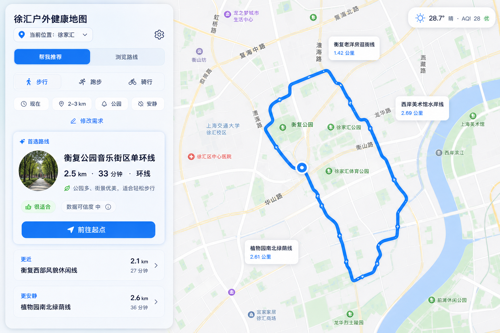

# 0828 评价模型前端接入与 UI 美化方案

> 日期：2026-08-28
> 状态：视觉方向已确认，等待进入前端实现
> 范围：现有 90 条徐汇路线、当前评价模型、现有高德地图与导航页面

---

## 📌 核心判断

当前项目已经适合进入前端接入阶段。`evaluation_model_qwen` 已完成用户画像、硬约束、五维评分、风险判断、千问结构化审核、Python 降级和推荐结果持久化；本轮本地验证为 **48 项测试全部通过**。下一步的主要工作集中在浏览器与 Python 服务之间增加稳定接口，并重排现有页面的信息层级。

首版产品形态已经确定：

- 先确定用户当前位置，再进入“帮我推荐”或“浏览路线”。
- “帮我推荐”通过选择题形成个性化条件，返回 1 条首选路线和 2 条备选路线。
- “浏览路线”保留当前地图路线标签，用户可直接查看和选择。
- 导航放在路线选定之后，继续复用现有高德接驳导航。
- 推荐完成后，地图只绘制当前首选路线；点击备选路线后替换地图上的当前路线。
- 左侧卡片保持第一版的结构、比例、层级和玻璃质感，只增加一张真实圆形路线图片。

## 🎯 产品目标与首版边界

首版目标是让用户在一分钟内完成“确定位置 → 提供偏好 → 获得路线 → 前往起点”的闭环，并清楚看懂推荐理由、距离、时间和主要环境风险。

首版范围：

- 路线来源限定为当前 90 条已验收路线。
- 用户获得 1 条首选路线和 2 条差异明确的备选路线。
- 环境信息优先展示当前可行动判断，详细数据进入路线详情。
- 千问负责偏好冲突检查和个性化解释，Python 负责筛选、评分和稳定排序。
- 未来运动计划保留为后续入口，临近出发时重新读取最新环境数据并推荐路线。

首版暂缓内容：

- 动态生成全新路线。
- 长对话式路线助手。
- 在地图上同时强调多条推荐路线。
- 将缺失的未来 PM2.5 从 AQI 推导出来。
- 使用路线图片参与健康评分。

## 👤 首次使用与个人档案

首次进入网站时，页面中央显示一张简洁的引导卡，完成后收起。用户可通过左上角设置按钮随时修改。

建议保留四项基础档案：

| 字段 | 选项建议 | 用途 |
| --- | --- | --- |
| 年龄 | 18 岁以下、18–39、40–59、60 岁以上、暂不填写 | 调整运动强度提示和高温风险表达 |
| 性别 | 男、女、暂不填写 | 保留用户档案字段，首版暂不直接改变路线分数 |
| 运动经验 | 初学者、日常运动、运动达人 | 调整距离、时长和强度匹配 |
| 敏感情况 | 空气、花粉、高温、噪声，可多选 | 调整对应风险权重和提醒优先级 |

设计原则：

- 每个问题只呈现 3–5 个大选项，支持键盘和触控操作。
- 顶部进度只显示当前步骤，不展示冗长说明。
- 档案保存在浏览器本地；后续若增加账号体系，再迁移到服务端。
- 缺少画像时仍可使用“浏览路线”。
- 性别字段先保留，待评分依据和使用场景明确后再决定是否参与模型。

## 🧭 页面入口与主流程

主链路采用一条连续路径：

`确定位置 → 选择帮我推荐或浏览路线 → 选定路线 → 查看详情 → 前往起点 → 开始运动`

### 帮我推荐

左侧按顺序展示少量选择题：

1. 运动方式：步行、跑步、骑行。
2. 计划时间：现在、今天稍后、自定义时间。
3. 距离或时长：使用适合运动方式的快捷档位。
4. 主要目标：综合、健康环境、训练、放松、景观、亲子、就近。
5. 搜索范围：当前位置附近、指定片区、全徐汇区。
6. 路线形态：不限、环线、单程。
7. 兴趣需求：滨水、公园、安静、咖啡、厕所、补给。

片区、距离和途经点进入问题选项，左侧不再并排堆放筛选器。常用选项使用胶囊按钮；只有片区列表和自定义时间使用下拉或弹层。

底部保留一句可选的补充需求，例如“想走梧桐树多、回程方便的路线”。用户可全程只点选项；这句话为空时不会影响推荐。

### 浏览路线

- 保留当前地图上的路线标签卡，方便用户直接探索。
- 左侧只保留运动方式、距离和片区三个核心筛选。
- 点击地图标签后显示该路线详情，并将“前往起点”作为主操作。
- 地图图例默认隐藏；需要辨认边界或运动类型时，通过轻量图层按钮展开。

## ✨ 已确认的视觉方向

视觉主线沿用第一版：浅蓝玻璃侧栏、地图占据主要空间、清楚的首选卡片、克制的环境信息和高对比主按钮。第三版只贡献圆形实景图片这一项元素，卡片结构继续使用第一版。

_图 1：首选路线卡片保持第一版布局，只在标题区加入圆形实景图；推荐状态下地图只聚焦一条路线。_

### 首选卡片

- 卡片宽度、圆角、间距、玻璃层和主按钮保持第一版。
- 圆形图片建议为 60–64 px，位于路线名称左侧。
- 图片内容优先使用公园步道、滨江绿道、梧桐街区等路线真实场景。
- 图片缺失时直接收起图片区，文字区域自动补位，页面不显示伪造占位图。
- 标题下只保留距离、时间、路线形态和一句推荐理由。
- 环境状态使用短标签，例如“适合”“留意花粉”“高温谨慎”。
- 数据可信度保留为次要标签，点击后查看数据来源、时间和空间尺度。
- “前往起点”是卡片内唯一高强调按钮。

图 1 中的圆形图片用于表达版式位置。正式页面应接入来源明确、允许使用的真实路线照片，并记录图片来源和更新时间。

### 备选路线

- 只展示两条，分别说明差异，例如“更近”“更安静”。
- 每条只显示路线名、距离、时间和差异标签。
- 点击备选后，该路线升为当前路线，地图立即替换路线几何，详情栏同步更新。
- 备选路线保留在左侧，不与首选路线同时绘制在地图上。

### 天气与环境

- 右上角默认显示天气、温度、AQI 和一个行动状态。
- 气象预警压缩为一行提示；高风险时使用醒目但克制的颜色。
- 点击天气胶囊后展开“现在、24 小时、指数”。
- 路线详情继续使用“概览、环境、途经点”三个标签。
- PM2.5、花粉和噪声优先给出状态与行动建议，数据口径放在详情中。

## 🔷 XH Logo 方向

Logo 参考第二版的简洁字母标志，采用 `XH` 组合。`X` 表达路线交汇，`H` 对应徐汇英文首字母组合中的第二个识别字符，中间留白形成一条轻微弯曲的路径。

_图 2：XH 字母标志方向稿，深海军蓝为主色，电光蓝用于路径终点强调。_

使用建议：

- 页面左上角使用 28–32 px 图标，右侧排列“徐汇户外健康地图”。
- 浏览器图标使用纯图形版本。
- 正式制作阶段重绘为 SVG，并检查 24、32、48 px 下的辨识度。
- 保留单色深蓝版本，适配浅色底、打印和答辩材料。
- 当前图片属于方向参考，最终字形仍可继续收紧比例和负空间。

## 🗺️ 地图状态与路线切换

地图需要明确区分三个状态：

| 状态 | 地图内容 | 左侧内容 |
| --- | --- | --- |
| 初始状态 | 徐汇边界、基础 POI、当前位置 | 入口选择和简短说明 |
| 浏览状态 | 多条路线标签，按筛选减少数量 | 精简筛选器和当前路线详情 |
| 推荐结果 | 只绘制当前首选路线，自动缩放到完整路线 | 首选卡片和两条备选 |

推荐结果的切换规则：

1. 接口返回前三名后，地图清除浏览状态中的路线预览。
2. 绘制首选路线并适配视野，显示起点和终点。
3. 备选路线只存在于左侧卡片中。
4. 用户点击备选后，清除上一条路线并绘制新路线。
5. 当前路线继续使用已有底部信息条，包含“概览、环境、途经点”。
6. 点击“前往起点”后进入现有高德接驳规划，目的地取当前路线起点。

这套状态管理能同时保留地图探索感和推荐结果的视觉焦点。

## 🧠 千问在前端中的位置

首版不设置常驻聊天窗口。千问通过以下三处出现：

- 可选的一句话补充需求，用于补足选择题覆盖不到的偏好。
- 首选卡片中的一句个性化推荐理由。
- 偏好存在冲突时给出一条调整提示，例如距离目标与搜索半径冲突。

前端只提交结构化 `UserProfile`。Python 完成硬约束、环境风险和五维评分后，将前 5 名候选交给千问审核；千问返回结构化排序、理由和提醒。千问超时、鉴权失败或输出校验失败时，前端使用 Python 排序和模板解释，并以轻量状态提示“个性化解释暂时简化”。

## 🔌 前端接入方案

### 当前基础

`evaluation_model_qwen` 当前已经提供：

- `UserProfile`、`RecommendationResult` 等严格数据模型。
- 路线与环境数据加载。
- 风险暂停、无候选、正常和降级状态。
- Python 基础排序和千问结构化审核。
- 推荐记录持久化和本地 CLI。
- 48 项通过的自动化测试。

现有网页已经提供：

- 90 条路线目录与地图几何。
- 路线筛选、选择和详情。
- 当前环境数据展示。
- 路线底部信息条。
- 高德起点接驳规划和运动路线预览。

真正缺少的一层是浏览器可调用的推荐 HTTP 接口。

### 接口形态

建议在 `evaluation_model_qwen` 增加轻量 API 服务：

- `GET /api/v1/questionnaire`：返回选择题配置。
- `POST /api/v1/recommendations`：接收 `UserProfile`，返回 `RecommendationResult`。
- `GET /api/v1/health`：供前端确认服务状态。

开发阶段可让静态网页继续运行在 `8123`，推荐 API 运行在 `8124`；正式部署时通过同一域名转发 `/api`。千问密钥始终留在 Python 服务端，浏览器只接收推荐结果。

推荐使用稳定版 FastAPI 和 Uvicorn，原因是可直接复用现有 Pydantic 模型、自动校验请求、错误信息清楚。替代方案包括 Python 标准库 HTTP 服务或独立 Node 服务；前者需要自行维护校验和路由，后者会重复定义模型。新增依赖前应单独确认版本、体积和维护范围。

### 前端与地图的连接

前端收到推荐结果后只使用 `route_id` 连接现有数据：

1. 从 `final_routes[0]` 读取首选 `route_id`。
2. 在已加载的 `route_catalog.json` 和 `xuhui_routes.geojson` 中找到路线详情与几何。
3. 复用现有地图方法绘制单条路线并显示路线底部信息条。
4. 将 `final_routes[1:3]` 渲染为备选卡片。
5. 点击备选时重复单路线替换流程。
6. 点击“前往起点”时复用现有 `buildNavigationRequest()` 和高德导航逻辑。

## 📁 建议新增与修改位置

为控制每次改动范围，前端接入拆成五个小任务，每个任务控制在 3 个文件内。

### 任务一：推荐 API

- 新增 `evaluation_model_qwen/src/evaluation_model_qwen/api.py`
- 修改 `evaluation_model_qwen/pyproject.toml`
- 新增 `evaluation_model_qwen/tests/test_api.py`

交付：问卷、推荐和健康检查接口；覆盖正常、降级、暂停、无候选和非法输入。

### 任务二：基础档案弹层

- 新增 `xuhui_route_builder/web/src/profile-store.js`
- 修改 `xuhui_route_builder/web/index.html`
- 新增 `xuhui_route_builder/tests/profile_store_contract.test.mjs`

交付：首次弹层、本地保存、设置按钮和档案更新。

### 任务三：推荐问卷与卡片

- 新增 `xuhui_route_builder/web/src/recommendation-ui.js`
- 新增 `xuhui_route_builder/web/styles/recommendation.css`
- 新增 `xuhui_route_builder/tests/recommendation_ui_contract.test.mjs`

交付：帮我推荐问卷、首选卡片、圆形实景图、两条备选和加载/失败状态。

### 任务四：接口与地图状态

- 新增 `xuhui_route_builder/web/src/recommendation-api.js`
- 修改 `xuhui_route_builder/web/src/main.js`
- 新增 `xuhui_route_builder/tests/recommendation_map_contract.test.mjs`

交付：API 调用、单路线聚焦、备选切换和路线详情同步。

### 任务五：现有页面收口

- 修改 `xuhui_route_builder/web/src/route-ui.js`
- 修改 `xuhui_route_builder/web/src/environment-ui.js`
- 修改 `xuhui_route_builder/web/styles/main.css`

交付：浏览路线入口、精简天气卡、隐藏固定图例、统一玻璃层级和响应式布局。此任务可再按路线 UI 与环境 UI 拆成两个小提交。

## 🧪 边缘情况与测试

| 场景 | 预期表现 |
| --- | --- |
| 用户拒绝定位 | 支持搜索上海地点或选择徐汇片区 |
| 位置在徐汇区外 | 允许推荐，清楚展示到路线起点的接驳距离 |
| 当前约束无候选 | 提示扩大范围、距离或放宽路线形态 |
| 千问调用失败 | 使用 Python 排序，页面仍返回完整卡片 |
| 环境预警触发暂停 | 不展示户外路线，给出暂停原因和稍后再看入口 |
| 环境数据过期或缺失 | 降低可信度，隐藏无支撑的数值结论 |
| PM2.5 差异很小 | 使用“接近”或“差异有限”，避免强调健康优劣 |
| 花粉全区同值 | 作为统一提醒，不参与路线间排序 |
| 噪声代理置信度低 | 显示风险代理标签，详情解释空间尺度 |
| 路线图片缺失 | 收起图片区域，保持卡片完整 |
| 用户点击备选 | 地图清除上一条路线，只绘制新路线 |
| 用户返回浏览路线 | 恢复路线标签和精简筛选器 |
| 导航规划失败 | 保留已选路线，显示带上下文的错误提示并支持重试 |
| 小屏设备 | 地图全屏，左侧栏改为底部抽屉，主按钮始终可见 |

## ✅ 验收标准

- 首次用户可完成基础档案，之后可从设置入口修改。
- 定位失败时仍能通过地点搜索或片区继续。
- “帮我推荐”全程可只用选择题完成。
- 推荐结果包含 1 条首选和 2 条差异清楚的备选。
- 首选卡片沿用第一版样式，并加入一张真实圆形路线图片。
- 推荐完成后地图只显示当前路线。
- 点击备选后地图、详情和导航目标同步更新。
- 点击“前往起点”复用现有高德接驳导航。
- 天气默认只占一个紧凑区域，环境详情按需展开。
- 千问密钥不进入网页源代码、日志或推荐结果。
- API 失败、千问失败、无候选和环境暂停均有明确页面状态。
- 自动化测试、格式检查、类型检查和现有网页契约测试全部通过。

## 🚧 数据表达边界

- 路线 PM2.5 为约 1 km 网格估计，并按路线段长度加权。
- 花粉为日级约 1 km 区域估计；全区同值时只生成统一提醒。
- 噪声为约 100 m 路段的 0–100 风险代理，数值不代表实测分贝。
- 接驳距离在推荐阶段先使用起点直线距离，准确路径由高德导航计算。
- 未来 PM2.5 缺值继续保留，页面不从 AQI 补算。
- 推荐分和数据可信度分别展示，避免用高分掩盖低置信度数据。
- 圆形照片用于路线识别和情绪表达，不作为环境证据。

## 📝 推荐实施顺序

1. 先完成 API 服务和契约测试，打通 `UserProfile → RecommendationResult`。
2. 再完成首次档案、推荐问卷和首选卡片，使用固定测试数据验证视觉状态。
3. 接入真实推荐接口，并通过 `route_id` 连接地图几何。
4. 完成单路线聚焦、备选切换和现有高德导航复用。
5. 最后精简天气、图例和旧筛选器，并进行桌面与小屏验收。

前端接入难度属于中等偏低。评价逻辑、数据模型、路线地图和导航均已有基础，主要风险集中在跨服务接口、页面状态切换、真实路线图片来源和现有 UI 的渐进式重排。按上述小任务推进，可以在保留当前功能的同时逐步替换视觉和交互。

## 🔗 参考

- [Mobbin Corner 页面](https://mobbin.com/apps/corner-ios-59299513-be08-4409-95f2-9db957b978ed/d41ee732-5f6c-4ded-96aa-58ac61967ec7/screens)
- [Mobbin 最新产品界面](https://mobbin.com/discover/apps/ios/latest)
- [`0828评价模型初步计划.md`](0828评价模型初步计划.md)
- [`0828初步的一个交互.md`](0828初步的一个交互.md)
