# 0830 帮我推荐部分 UI 优化计划

_面向新开发会话的实施说明，默认使用“选项 + 一句话”，并提供可进入、可关闭的千问聊天工作区_

---

## 🎯 目标与范围

本轮沿着一条主链路改造：**统一顶部入口 → 默认填写“选项 + 一句话” → 按需点击千问图标进入聊天 → 汇总偏好并筛选 → 总览三条路线 → 悬停预览 → 点击聚焦并查看详情**。

目标是让页面更像城市运动路线产品：地图占据主视觉，操作入口集中，文案简短，三条路线关系清楚，环境信息和个人档案按需展开。Komoot 的列表与地图协同选路、按运动方式调整规划、地图承担主要工作区等做法作为交互参考。[^1][^2]

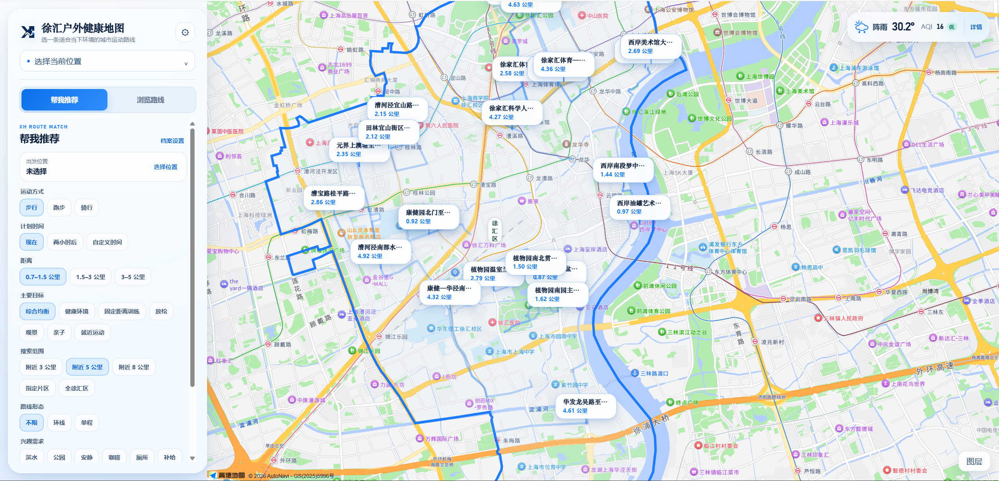
_图 1：当前页面的完整状态，用于核对重复位置、密集标签、左侧信息层级和地图占比。_

本轮范围包括：

- “帮我推荐”快捷选择模式
- “问问千问”短对话模式
- 顶部位置、运动方式、环境和个人档案入口
- 推荐筛选进度和偏好摘要
- 三条路线总览、悬停联动、点击聚焦和详情面板
- 右上角环境弹层与右下角图层控件
- 桌面端、小屏端、键盘操作和动效降级

本轮暂缓：

- “浏览路线”页面的完整重构
- 动态生成路线几何
- 账号体系与跨设备档案同步
- 路线照片采集与版权授权流程
- 导航算法、环境数据生成和评分公式调整
- 远程发布、GitHub 推送与生产部署

## 📋 已确认的产品决策

| 决策 | 确认方案 | 页面结果 |
| --- | --- | --- |
| 推荐入口 | 默认展示“选项 + 一句话”，左侧工作台标题栏右侧加入千问图标 | 点击图标进入聊天，关闭后回到原表单 |
| 快捷选择 | 保留选项与一句补充需求 | 核心条件首屏展示，高级偏好折叠 |
| 千问对话 | 独立聊天工作区 | 示例开场，缺项时追问，右上角叉号关闭 |
| 位置 | 全站只保留顶部一个入口 | 搜索地点、地图选点共用同一状态 |
| 运动方式 | 放入顶部位置右侧 | 步行、跑步、骑行持续可见 |
| 环境 | 顶部右侧紧凑状态按钮 | 点击后展开当前、24 小时、指数详情 |
| 档案 | 首次填写后保存在本机 | 后续进入页面不重复弹出，可从顶部手动修改 |
| 推荐结果 | 初始同时展示三条路线 | 地图自动容纳全部路线，列表顺序固定 |
| 悬停 | 当前路线增强，其余路线降低强调 | 只做预览，不缩放、不打开详情 |
| 点击 | 地图聚焦当前路线 | 打开独立详情面板，原卡片保持原位置 |
| 返回 | 提供“返回路线总览” | 关闭详情并恢复三条路线完整视野 |
| 推荐解释 | 短句与可核验优势 | 移除长段模型判断、可信度徽标和全区同值提醒 |

> 📌 **稳定规则：** 三条推荐路线始终按接口的 `final_rank` 排列。点击第二或第三条路线只改变 `selectedRouteId`，不会重排卡片，也不会把该路线移入“首选路线”区域。

## 📍 页面结构与视觉系统

### 桌面端结构

页面分成四层：

1. **顶部工具栏**：品牌、位置、运动方式、环境状态、个人档案
2. **左侧推荐工作台**：默认选项表单、一句话补充、标题栏千问图标、聊天工作区、筛选进度或三条结果列表
3. **地图主画布**：路线几何、当前位置、起终点和地图控件
4. **路线详情面板**：用户点击路线后从结果列表右侧展开

顶部工具栏建议排列：

```text
[XH 标志] [上海交通大学徐汇校区 ▾] [步行 | 跑步 | 骑行]        [阵雨 30.2° · AQI 16 ▾] [个人档案 ⚙]
```

- 位置输入框宽度约 `300–380px`，地点名称保持单行省略
- 运动方式使用三个等宽图标按钮，点击后同步选项推荐与千问聊天
- 环境按钮显示天气、温度、AQI 和状态色，详情放入锚定弹层
- 档案按钮使用更精致的齿轮图标；悬停或键盘聚焦时，左侧滑出“个人档案”标签
- 位置辅助句、品牌副标题、第二处位置卡片、第二处档案入口全部移除

### 环境、档案与图层

- **环境弹层**参考 Komoot 顶部 `NEW` 菜单的锚定关系：按钮下方展开、圆角白底、轻阴影、点击外部或按 `Escape` 收起
- 环境内容继续复用“现在 / 24 小时 / 指数”，保留数据状态、业务时间和有效期
- 环境按钮在预警时显示一枚小状态点，常态不增加说明文字
- 档案已保存时只展示摘要，如“日常运动 · 空气敏感”；点击后进入手动编辑
- 右下角图层入口改为白色紧凑按钮，点击后向上展开图层菜单，收起状态只保留图层图标与“图层”两字
- 环境弹层、档案弹层和图层菜单同一时刻只展开一个

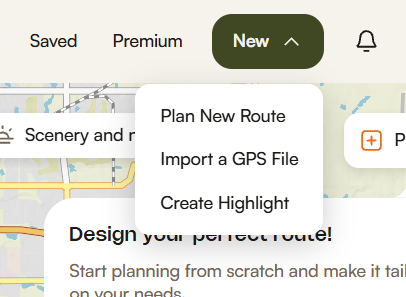
_图 2：顶部按钮与锚定菜单的层级参考，环境详情可沿用这一打开关系。_

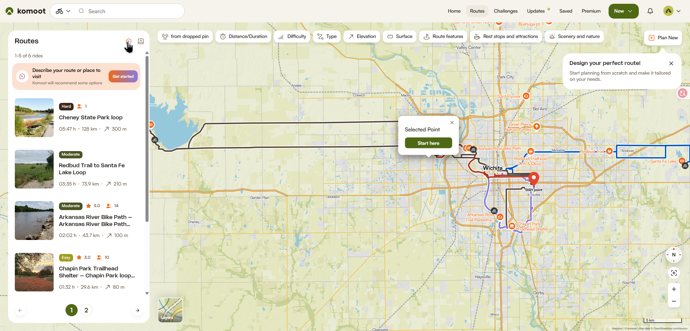
_图 3：地图选点后出现轻量确认卡，位置搜索和地图选点可汇入同一个顶部位置状态。_

### 视觉令牌

| 用途 | 建议值 |
| --- | --- |
| 主表面 | `#FFFFFF` |
| 页面浅底 | `#F4F7FA` |
| 主文字 | `#10233F` |
| 次文字 | `#607089` |
| 边框 | `#DCE5EF` |
| 品牌蓝 | `#1477F8` |
| 健康绿 | `#168B64` |
| 面板圆角 | `24px` |
| 卡片圆角 | `18px` |
| 控件圆角 | `12–14px` |

字体栈建议为 `MiSans Variable, HarmonyOS Sans SC, Source Han Sans SC, PingFang SC, Microsoft YaHei, sans-serif`。正式接入 MiSans 前先核对字体资产和许可；当前阶段直接使用系统回退栈，不新增字体脚本依赖。

背景与地图的分界通过不透明白色任务面板、清楚边框和轻阴影完成。品牌蓝只承担选中状态、路线聚焦和主按钮，减少整屏蓝色带来的厚重感。

动效时长控制在 `150–300ms`，主要使用 `transform` 与 `opacity`。系统开启 `prefers-reduced-motion: reduce` 时关闭位移、旋转和循环动画，仅保留即时状态变化。

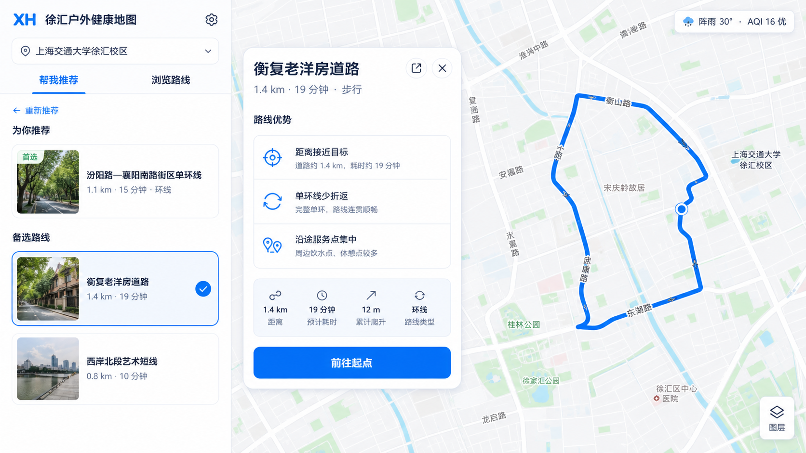
_图 4：指定 session 生成的结果态方向稿，采用 Komoot 风格的稳定列表、独立详情面板与地图聚焦关系。该图属于视觉方向参考，最终实现以本文交互规则与真实数据为准。_

## 🧭 用户状态流

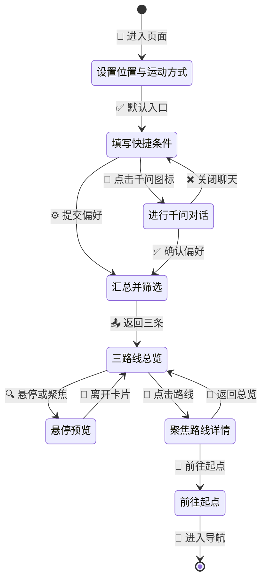
```mermaid
stateDiagram-v2
    accTitle: 帮我推荐交互状态
    accDescr: 用户从顶部确定位置和运动方式后默认进入选项推荐，也可打开千问聊天并随时关闭返回，筛选完成后总览三条路线并进入单路线详情

    state "设置位置与运动方式" as Setup
    state "填写快捷条件" as QuickInput
    state "进行千问对话" as ChatInput
    state "汇总并筛选" as Matching
    state "三路线总览" as Overview
    state "悬停预览" as HoverPreview
    state "聚焦路线详情" as FocusedDetail
    state "前往起点" as Navigate

    [*] --> Setup: 👤 进入页面
    Setup --> QuickInput: ✅ 默认入口
    QuickInput --> ChatInput: 💬 点击千问图标
    ChatInput --> QuickInput: ❌ 关闭聊天
    QuickInput --> Matching: ⚙️ 提交偏好
    ChatInput --> Matching: ✅ 确认偏好
    Matching --> Overview: 📤 返回三条
    Overview --> HoverPreview: 🔍 悬停或聚焦
    HoverPreview --> Overview: 🔄 离开卡片
    Overview --> FocusedDetail: 👤 点击路线
    FocusedDetail --> Overview: 🔄 返回总览
    FocusedDetail --> Navigate: 📍 前往起点
    Navigate --> [*]: 🏁 进入导航
```

### 状态持久化

- `location`、`route_mode`、快捷偏好和对话解析出的偏好进入同一个页面状态
- 进入千问聊天或点击叉号返回时保留已经填写的内容
- 从详情返回总览时保留三条结果和当前滚动位置
- 点击“重新推荐”时保留位置、运动方式、档案和上一次偏好，只展开可调整区域
- 页面刷新后恢复已保存档案并回到默认选项推荐；临时聊天记录和推荐结果按当前会话处理

## 💬 默认选项推荐与千问入口

### 快捷选择

顶部位置与运动方式已经确定后，左侧默认显示选项推荐。首屏只显示三个核心问题：

- **计划时间**：现在、两小时后、自定义
- **距离**：根据步行、跑步或骑行切换对应档位
- **主要目标**：综合均衡、健康环境、固定距离训练、放松、风景、亲子、就近

“更多偏好”折叠区继续保留：搜索范围、路线形态和兴趣需求。表单末尾持续保留一句补充需求输入框。敏感情况来自个人档案，不在每次推荐时重复询问。

左侧工作台标题栏右侧加入一个 `32–36px` 的千问图标按钮，位置参考 Komoot 路线列表右上角的小型聊天入口。按钮可使用千问标志，默认仅显示图标，避免占用表单空间：

```text
[帮我推荐]                                      [千问图标]

[计划时间] [距离] [主要目标]
[更多偏好]
[用一句话补充你的需求……]
[为我推荐路线]
```

千问图标提供 `aria-label="问问千问"`，悬停或键盘聚焦时显示同名短提示。点击后左侧工作台切换到聊天视图。页面首次打开、刷新页面以及关闭聊天后都显示“选项 + 一句话”。默认视图不放置大尺寸千问引导卡。

提交前在按钮上方显示一行摘要，例如：

```text
上海交大徐汇校区 · 步行 · 1–2 公里 · 公园放松 · 偏好安静
```

### 问问千问

千问聊天是面向路线任务的独立工作区，整体替换左侧选项表单。顶部显示“问问千问”和右上角叉号；点击叉号立即回到“选项 + 一句话”，顶部位置、运动方式、档案和已整理偏好保持原状。

聊天开场只保留一句问题、三个示例和一个输入框。用户点选示例后直接填入输入框，仍可继续修改。

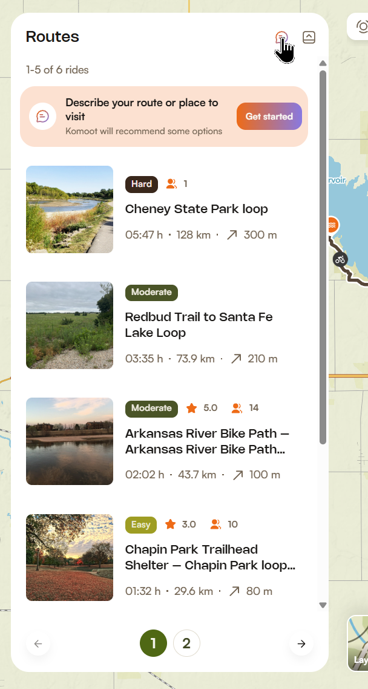
_图 5：鼠标所指的小型聊天图标是“问问千问”入口位置参考；实现时可替换为千问标志，点击后进入独立聊天工作区。_


_图 6：聊天初始态参考，主要学习独立工作区、示例短句、底部输入框和右上角关闭按钮。_

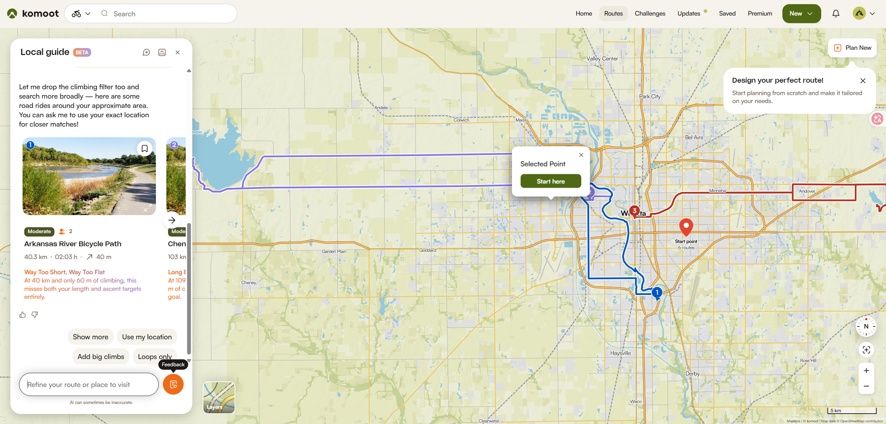
_图 7：聊天结果与地图联动参考，右上角叉号持续可见，关闭后返回默认选项推荐。_

建议示例：

- “从交大徐汇校区出发，散步一小时，想走安静、有树荫的环线”
- “帮我找一条 5 公里左右的跑步路线，空气好一点，沿途有厕所”
- “周末骑行 10 公里左右，想看滨江风景，最后回到出发点”

对话规则：

1. 顶部已有的位置和运动方式直接进入上下文，千问避免重复询问
2. 千问把自然语言转换为结构化偏好补丁，如距离、时间、目标、路线形态和兴趣
3. 缺少关键条件时每轮只追问一个问题，最多追问两轮
4. 条件齐全后显示“我理解的是”偏好摘要，用户确认后开始筛选
5. 用户随时可修改摘要中的单个条件，也可点击叉号回到选项推荐继续完成

示例对话：

```text
用户：想在附近跑一会儿，安静一点。
千问：你更希望跑 3–5 公里，还是 5–8 公里？
用户：5 公里左右。
千问：已整理：当前位置附近 · 跑步 · 约 5 公里 · 偏好安静。开始推荐？
```

千问回复保持两句以内，避免开放式闲聊、长篇分析和重复复述。每条回复优先推进一个决策。

### 两种入口共用的进度状态

开始推荐后，左侧用真实阶段替代空白加载卡：

1. **汇总偏好**：展示位置、运动方式、距离、目标和档案敏感项
2. **匹配路线**：显示正在应用距离、区域、形态与环境条件
3. **准备结果**：整理前三条路线并计算地图视野

阶段按真实任务完成事件推进，不显示推测百分比。千问审核发生降级时，仍使用 Python 排序并在结果顶部显示一条轻量提示。

指定 session 已生成匹配态方向稿，执行时保留“阶段进度 + 已选偏好 + 档案摘要”的信息结构，地图只承担轻量等待反馈，避免大面积空白。

## 🗺️ 三路线总览与详情

### 结果列表

左侧固定显示三张同级路线卡，第一张带“首选”小标签，第二、第三张只显示序号。每张卡保留：

- 路线名称
- 距离、预计时间、环线或单程
- 两项最有区分度的优势，如“滨江视野”“公园绿荫”“沿途厕所”“接驳较近”
- 一句不超过约 `36` 个中文字符的匹配说明

删除以下内容：

- 大段千问判断
- “数据可信度 53%”一类徽标
- “花粉全区同值”一类无法区分路线的标签
- “更近”“更长”这类缺少产品价值的单词标签
- 无来源的圆形占位图片

有来源且获准使用的真实路线照片才展示图片；图片缺失时收起图片区，文字自动补位。

### 地图联动规则

| 事件 | 地图表现 | 列表表现 | 详情表现 |
| --- | --- | --- | --- |
| 结果返回 | `fitView` 容纳三条路线 | 三张卡全部可见 | 关闭 |
| 悬停卡片 | 当前线加粗，其余线降至约 `0.16–0.24` 透明度 | 当前卡抬升并增强边框 | 关闭 |
| 离开卡片 | 恢复三条路线原始强调 | 恢复三张卡 | 关闭 |
| 聚焦卡片 | 效果等同悬停 | 显示键盘焦点 | 关闭 |
| 点击卡片 | `fitView` 聚焦当前路线，其余线隐藏或极弱显示 | 原顺序保留，当前卡选中 | 打开 |
| 关闭详情 | 恢复三条路线完整视野 | 保留原顺序 | 关闭 |

地图路线本身也支持悬停和点击，状态同步到左侧对应卡片。触屏设备没有悬停，第一次点击卡片直接进入聚焦详情。

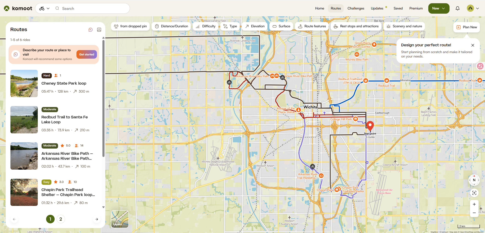
_图 8：多路线初始总览参考，列表和地图同时保留多条候选，用户先比较再选择。_


_图 9：点击路线后才出现独立详情列，地图同步聚焦当前路线。_

现有 `showRouteResults()`、`highlightRoute()`、`focusSportRoute()`、`showSingleRoute()` 和 `clearRouteResults()` 可作为实现基础。建议新增一个推荐地图控制器，集中维护：

```text
recommendedRouteIds
hoveredRouteId
selectedRouteId
mapMode = overview | preview | focused
```

### 路线详情面板

点击路线后，在结果列表右侧展开详情面板。内容顺序建议为：

1. 路线名称与关闭按钮
2. 距离、时间、路线形态和运动方式
3. 两至三项有数据依据的路线优势
4. 简洁路线概览或途经区域
5. 环境状态与必要提醒
6. “前往起点”主按钮
7. “返回路线总览”次按钮

详情面板继续复用现有接驳导航入口。推荐理由来自 `matched_preferences`、路线标签、接驳距离和有区分度的环境指标；千问只负责压缩为短句。原始环境值、时间和空间尺度放在可展开详情中。

## 🔌 千问接口与数据边界

### 现有链路

当前已有：

- `GET /api/v1/questionnaire`
- `POST /api/v1/recommendations`
- `GET /api/v1/health`
- 严格的 `UserProfile` 与 `RecommendationResult`
- Python 硬约束、评分、排序和千问审核降级
- 浏览器端 `recommendation-api.js`

新的对话模式增加一层**意图解析**，随后继续调用现有推荐接口：

```text
用户消息 → 千问结构化解析 → 偏好摘要确认 → UserProfile → Python 筛选与排序 → 千问审核前三候选 → RecommendationResult
```

### 新增接口建议

新增 `POST /api/v1/recommendation-intent`，每次提交当前消息、有限对话历史和顶部上下文。

请求示例：

```json
{
  "message": "想跑 5 公里，安静一点，沿途有厕所",
  "history": [],
  "context": {
    "location": {
      "label": "上海交通大学徐汇校区",
      "lng_gcj02": 121.433,
      "lat_gcj02": 31.200
    },
    "route_mode": "run",
    "profile": {
      "experience": "regular",
      "sensitivities": ["air"]
    },
    "preferences": {}
  }
}
```

响应示例：

```json
{
  "reply": "已整理为约 5 公里的安静跑步路线，并优先考虑沿途厕所。开始推荐？",
  "ready": true,
  "missing_fields": [],
  "preference_patch": {
    "distance_min_m": 4000,
    "target_distance_m": 5000,
    "distance_max_m": 6000,
    "interests": ["quiet", "toilet"]
  }
}
```

### 约束与降级

- Qwen 输出使用 Pydantic 严格模型校验，枚举和值域与 `UserProfile` 对齐
- 单条消息限制 `500` 字，对话历史限制最近 `6` 条，前端与服务端同时校验
- 对话阶段只生成偏好补丁，不生成路线 ID，也不改写 Python 的硬约束与排序
- 性别、密钥和原始档案文本不进入浏览器请求；只发送推荐所需的经验与敏感项
- 千问密钥始终保留在 Python 服务端
- 原始对话不写入普通日志；审计只记录请求 ID、耗时、模型、状态和错误类型
- 超时、鉴权失败、结构校验失败时保留已解析条件，提示用户切换快捷选择继续
- 环境暂停、无候选和服务异常沿用现有业务状态与错误卡片

## ✍️ 分阶段实施与文件边界

执行前先复核指定 session 已生成的三张预览图，并在用户确认后进入代码修改：

1. **快捷选择态**：顶部工具栏、核心条件、更多偏好
2. **千问对话态**：示例问题、短对话、偏好确认
3. **结果态**：三路线总览、悬停效果和展开详情

三张预览已经放入 `assets/0830-recommendation-ui-references/`。其中结果态以图 4 为主要方向；快捷选择态与匹配态收录在文末图库。新会话先基于这三张图确认版式，再进入实现。

每个代码任务控制在三个文件内，每个 PR 约 `200–400` 行改动。共享文件由主代理统一合并，子代理避免同时写入同一文件。

### 任务一：先锁定行为测试

文件：

- `xuhui_route_builder/tests/recommendation_ui_contract.test.mjs`
- `xuhui_route_builder/tests/recommendation_map_contract.test.mjs`（新增）
- `evaluation_model_qwen/tests/test_api.py`

先写当前会失败的测试，覆盖默认“选项 + 一句话”、千问图标跳转、叉号关闭、卡片顺序、悬停与点击状态、返回总览、偏好保留、档案不重复弹出和意图解析接口。

### 任务二：顶部工具栏与视觉基础

文件：

- `xuhui_route_builder/web/index.html`
- `xuhui_route_builder/web/styles/main.css`
- `xuhui_route_builder/tests/test_web_static.py`

完成单一位置入口、运动方式、环境按钮、档案齿轮、图层菜单和页面级视觉令牌。清理重复标题、副标题、位置说明和第二档案入口。

### 任务三：环境与档案弹层

文件：

- `xuhui_route_builder/web/src/environment-ui.js`
- `xuhui_route_builder/tests/environment_ui_contract.test.mjs`
- `xuhui_route_builder/tests/profile_store_contract.test.mjs`

将环境详情改为顶部锚定弹层，补齐点击外部、`Escape`、焦点返回和互斥展开。验证档案首次保存后不再自动弹出，手动修改入口仍可用。

### 任务四：千问意图解析模型

文件：

- `evaluation_model_qwen/src/evaluation_model_qwen/models.py`
- `evaluation_model_qwen/tests/test_qwen_contract.py`
- `evaluation_model_qwen/tests/test_api.py`

先定义请求、响应、对话消息、偏好补丁和缺失字段模型，再补正常、追问、非法输出、超时和敏感数据测试。

### 任务五：千问意图解析实现

文件：

- `evaluation_model_qwen/src/evaluation_model_qwen/api.py`
- `evaluation_model_qwen/src/evaluation_model_qwen/qwen_client.py`
- `evaluation_model_qwen/src/evaluation_model_qwen/intent_service.py`（新增）

实现结构化解析提示、服务调用、校验、日志脱敏和统一错误响应。现有路线审核提示与新意图解析提示使用独立版本号。

### 任务六：双入口前端

文件：

- `xuhui_route_builder/web/src/recommendation-ui.js`
- `xuhui_route_builder/web/styles/recommendation.css`（新增）
- `xuhui_route_builder/web/index.html`

实现默认“选项 + 一句话”表单、标题栏千问图标、聊天跳转与关闭、偏好摘要、真实阶段进度和三张稳定结果卡，并在页面中加载独立样式。任务一新增的契约测试作为本任务验收。`main.css` 只放页面壳层，推荐模块样式迁入独立文件。

### 任务七：前端接口

文件：

- `xuhui_route_builder/web/src/recommendation-api.js`
- `xuhui_route_builder/tests/recommendation_api_contract.test.mjs`

增加 `interpretIntent()`，沿用当前超时、网络错误、无效 JSON 和业务错误封装。意图解析与路线推荐可设置不同超时时间。

### 任务八：推荐地图控制器

文件：

- `xuhui_route_builder/web/src/map.js`
- `xuhui_route_builder/web/src/main.js`
- `xuhui_route_builder/tests/recommendation_map_contract.test.mjs`

实现三线 `fitView`、卡片与路线双向悬停、点击聚焦、详情开关、返回总览和浏览状态恢复。整合时只通过明确回调连接 UI 与地图。

### 多代理执行方案

执行阶段采用一名主代理与三名子代理并行，全部使用 `gpt-5.6-sol`，推理强度设置为 `high`。

| 角色 | 第一阶段任务 | 文件所有权 |
| --- | --- | --- |
| 主代理 | 预览确认、行为契约、最终集成 | 共享文件与验收 |
| 子代理 A | 顶部工具栏、环境、档案、图层 | `index.html`、`main.css`、`environment-ui.js` |
| 子代理 B | 千问意图模型、接口与测试 | `evaluation_model_qwen` 指定文件 |
| 子代理 C | 三路线地图状态与测试 | `map.js`、地图契约测试 |

第二阶段调整：

- 子代理 A 完成后复核桌面与小屏视觉
- 子代理 B 完成后复核结构化输出、超时与脱敏
- 子代理 C 完成后协助检查键盘、触屏和快速悬停
- 主代理独占 `main.js` 与最终 `recommendation-ui.js` 合并，降低并行冲突

子代理提交内容需包含：修改摘要、文件列表、测试命令、测试结果、边缘情况和仍待主代理处理的集成点。主代理逐项读取差异后再合并，不直接接受覆盖式写入。

## ✅ 测试、边缘情况与验收

### 自动化测试

前端至少运行：

```powershell
node --test xuhui_route_builder/tests/*.test.mjs
```

Python 服务至少运行：

```powershell
cd evaluation_model_qwen
.\.venv\Scripts\python.exe -m pytest
.\.venv\Scripts\python.exe -m ruff check .
.\.venv\Scripts\python.exe -m pyright
```

静态页面检查：

```powershell
.\evaluation_model_qwen\.venv\Scripts\python.exe -m pytest xuhui_route_builder/tests/test_web_static.py
```

### 浏览器验收

- `1440 × 900`：顶部入口完整，左栏与详情面板不遮挡路线主体
- `2560 × 1200`：地图保持主视觉，面板宽度不随屏幕过度拉伸
- `500 × 700`：顶部控件可横向收纳，结果与详情改为底部抽屉
- 键盘：`Tab` 可到达卡片，`Enter` 或空格进入详情，`Escape` 关闭弹层或详情
- 动效降级：`prefers-reduced-motion` 下无旋转、滑动和循环闪烁
- 触屏：点击卡片直接聚焦，返回按钮恢复三线总览

### 边缘情况

| 场景 | 预期处理 |
| --- | --- |
| 未选择位置 | 顶部位置控件获得焦点，保留已填偏好 |
| 地点搜索失败 | 支持地图选点与重试 |
| 千问问题含糊 | 每轮追问一个关键字段 |
| 千问超时或输出非法 | 保留已识别内容，引导切换快捷选择 |
| 推荐少于三条 | 展示实际数量，地图适配现有路线 |
| 三条路线高度重叠 | 使用线宽、描边与序号区分，悬停仍保持同步 |
| 快速移过多张卡 | 只采纳最后一个 `hoveredRouteId` |
| 点击备选路线 | 卡片顺序和“首选”标签保持原样 |
| 关闭详情 | 恢复全部推荐路线与原列表滚动位置 |
| 档案已保存 | 页面加载时不弹窗，顶部入口可手动打开 |
| 环境数据过期 | 显示状态与时间，避免当前实时口吻 |
| 路线照片缺失 | 收起图片区，无占位圆形 |
| 环境风险暂停 | 停留在暂停状态，不绘制可出发路线 |
| 导航失败 | 保留当前路线和详情，提供重试入口 |

### 完成标准

- 页面中只有一个位置入口和一个档案入口
- 位置、步行/跑步/骑行、环境和档案位于同一顶部工具栏
- 页面默认显示“选项 + 一句话”，左侧标题栏持续提供千问图标
- 点击千问图标进入独立聊天工作区，点击右上角叉号返回原表单
- 选项推荐与千问聊天均可生成同一种 `UserProfile`
- 进入聊天、关闭聊天、重新推荐和详情返回均保留偏好
- 推荐返回后地图初始同时容纳最多三条路线
- 悬停只改变强调层级，不触发缩放、重排或详情
- 点击路线后地图聚焦并打开详情，卡片仍在原位置
- “返回路线总览”恢复三条路线完整视野
- 环境详情继续提供“现在 / 24 小时 / 指数”
- 档案首次保存后不再自动弹出
- 页面不展示长段千问判断、可信度徽标和无区分度环境标签
- 千问失败时 Python 推荐链路仍可完成
- 密钥、原始聊天内容和敏感日志均未进入前端资源或审计输出
- 单测、静态检查、linter、formatter、类型检查和浏览器验收全部通过

## 🔗 参考与交付说明

内部参考：

- [`0830ui美化.md`](0830ui美化.md)
- [`0828评价模型前端接入+ui美化.md`](0828评价模型前端接入+ui美化.md)
- 用户在本轮提供的 Komoot 结果总览、Local guide、路线详情和顶部菜单截图

### 视觉参考图库

图库清单直接来自 `codex://threads/01a050d3-3991-7190-b6cd-e9ac76130cec`：31 张用户图片与 3 张该 session 生成的预览图均已收录；另外保留 XH 标志方向稿和 21st.dev 风格截取，共 36 张图。重复截图也按原始消息保留，方便新会话核对完整上下文。截图中的文字、按钮名称和推荐内容只作视觉与交互参考；执行依据以本文“已确认的产品决策”为准。所有临时截图已经复制到 `assets/0830-recommendation-ui-references/`，后续会话可直接读取。

<details>
<summary><strong>📋 当前页面现状补充图</strong></summary>

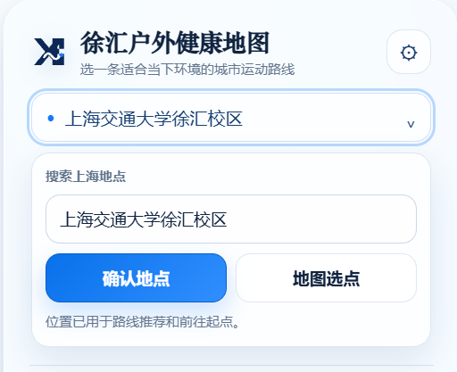
_图 10：当前地点编辑状态，辅助句和大面积卡片造成额外视觉重量。_

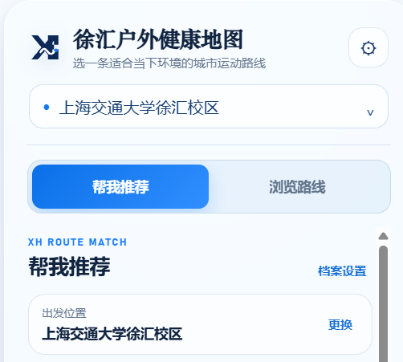
_图 11：顶部位置与左侧出发位置重复，档案入口也重复出现。_

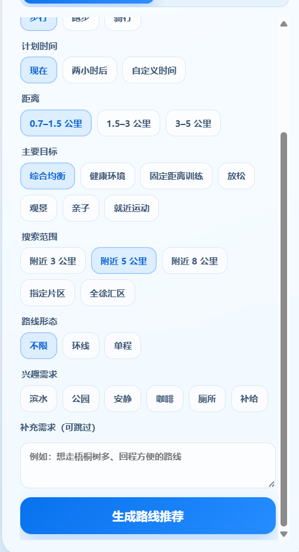
_图 12：当前选项一次性全部展开，首屏更接近问卷。_

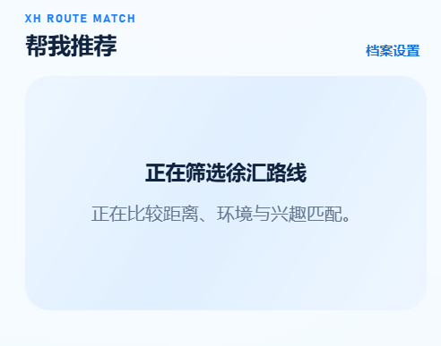
_图 13：当前加载态下半部分留白，缺少偏好汇总和真实阶段反馈。_

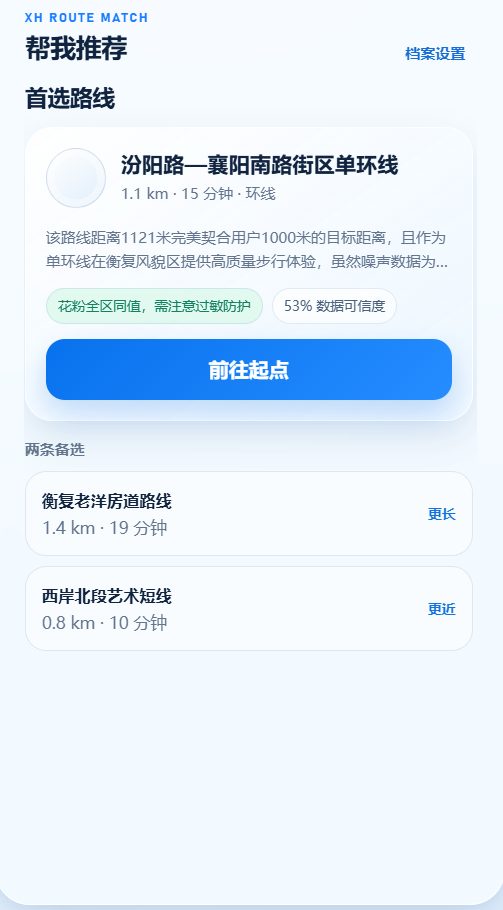
_图 14：当前首选与两条备选的层级、空白和差异标签参考。_

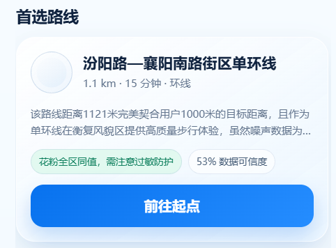
_图 15：当前卡片含长段判断、全区同值提醒和可信度徽标。_


_图 16：同一结果状态的第二张原始截图，留作尺寸与文字密度核对。_

</details>

---

<details>
<summary><strong>🗺️ Komoot 路线列表、总览与详情</strong></summary>

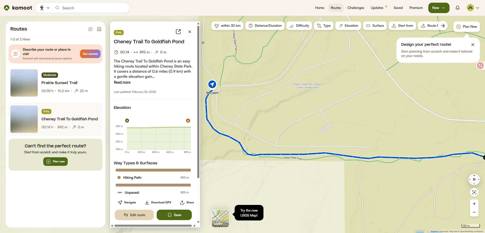
_图 17：路线列表、独立详情列和地图主画布的整体关系。_

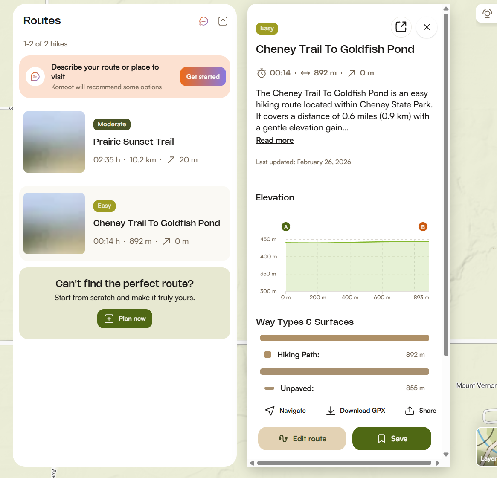
_图 18：路线卡片、详情面板、数据图表和底部操作的近景。_

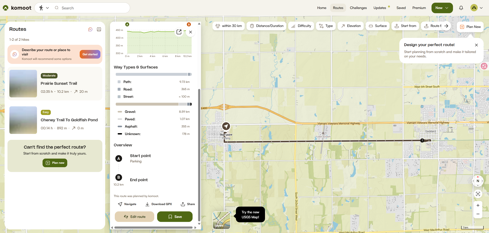
_图 19：选中路线后的长详情、地图聚焦与起终点表达。_


_图 20：顶部条件栏、左侧路线列表和地图多路线总览。_

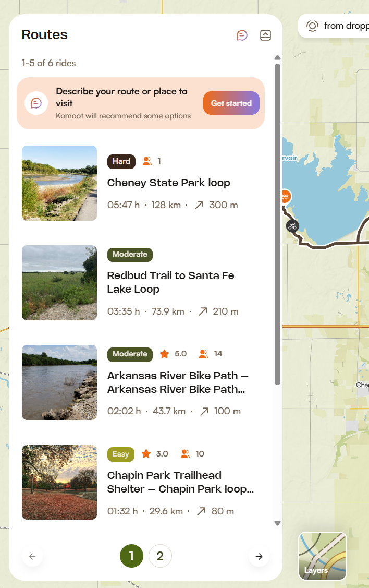
_图 21：重点参考左侧工作台标题栏右侧的小型聊天图标；默认表单不沿用下方大尺寸引导卡。_

</details>

---

<details>
<summary><strong>💬 Komoot 聊天过程补充图</strong></summary>


_图 22：提交需求后的短消息、搜索状态和固定输入区。_


_图 23：聊天回复、横向路线卡片和地图多路线联动。_


_图 24：相同推荐结果的另一视野，辅助核对路线强调层级。_

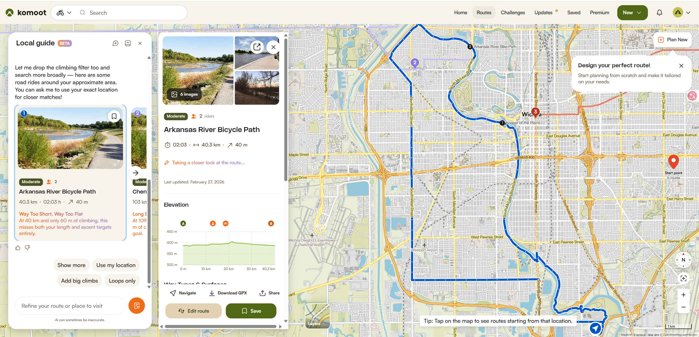
_图 25：点击聊天结果后展开详情列，聊天工作区继续保留。_

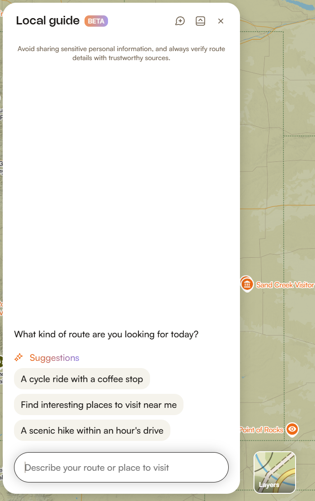
_图 26：初始聊天的第二张原始截图，用于核对开场留白和示例位置。_

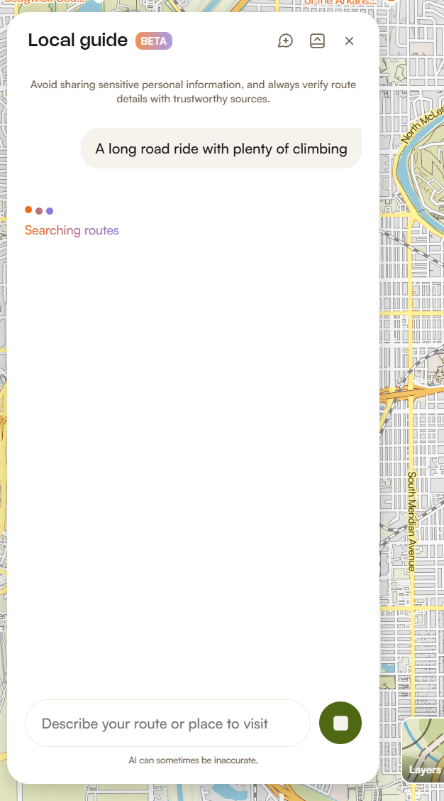
_图 27：搜索状态的第二张原始截图，用于核对加载点与底部输入框。_

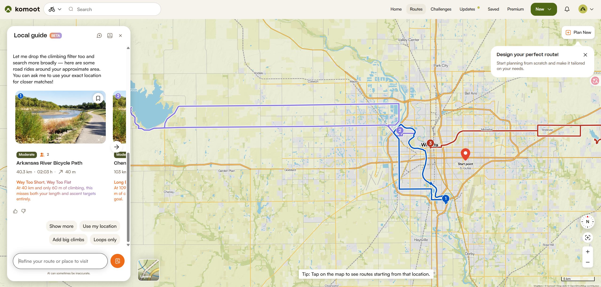
_图 28：多条聊天推荐路线在地图上同时展示。_

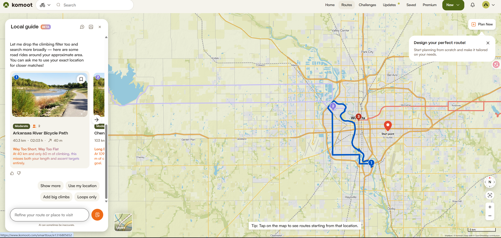
_图 29：多路线结果的第二张视野，用于核对路线重叠与选中颜色。_

</details>

---

<details>
<summary><strong>🎨 已生成素材与补充风格参考</strong></summary>


_图 30：此前生成的 XH 标志方向稿，后续需重绘为清晰 SVG。_

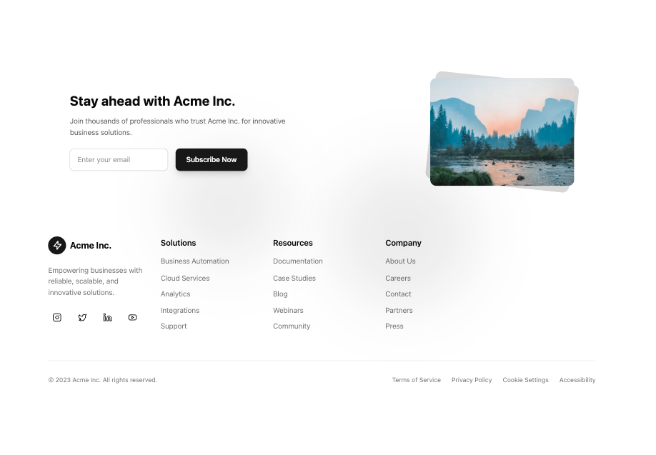
_图 31：21st.dev 组件页面的局部风格截取，用于参考白色表面、圆角和留白。_

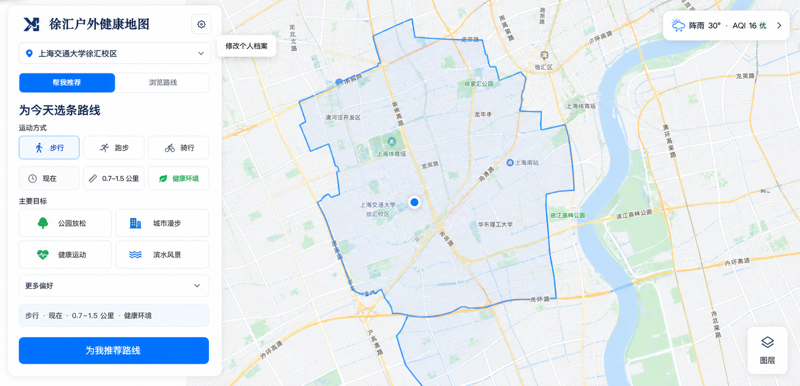
_图 32：指定 session 生成的快捷选择态，作为白色工作台、顶部单一位置、选项卡与一句话补充需求的版式参考。_

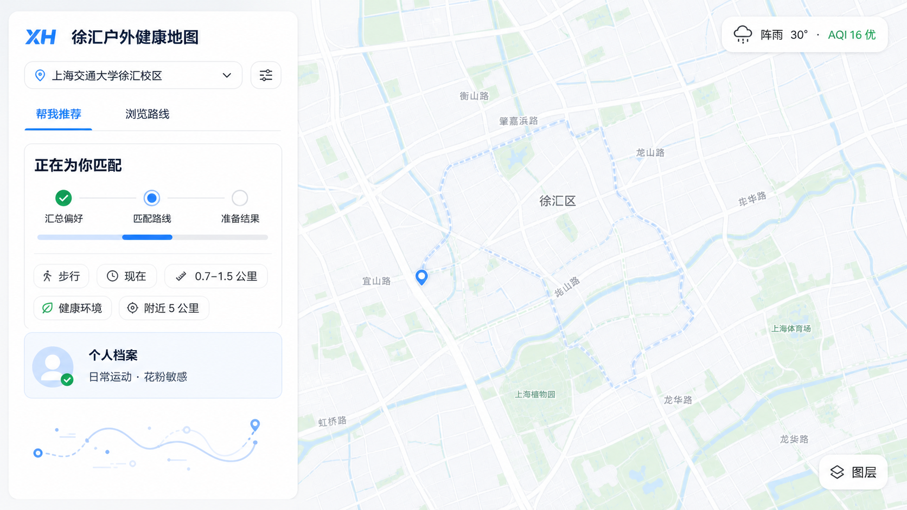
_图 33：指定 session 生成的匹配态，作为阶段进度、偏好汇总与档案摘要的版式参考。_


_图 34：用户在本次校正中再次确认的结果态截图，方向与图 4 一致，重点是备选原位选中、独立详情面板和单路线地图聚焦。_

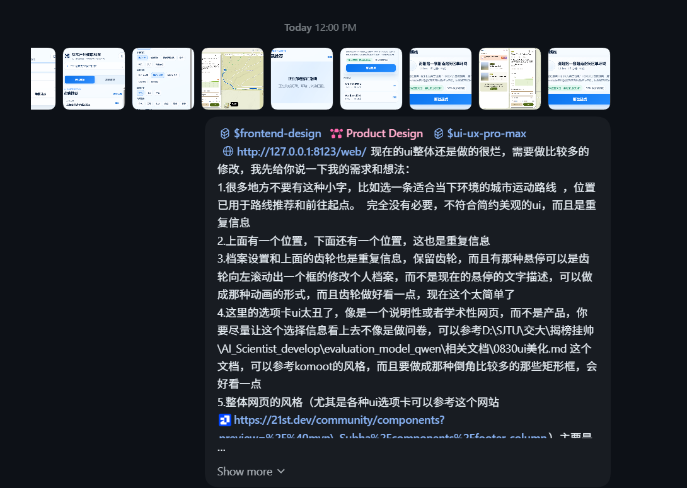
_图 35：指定 session 的原始需求与用户图片缩略图总览，用于核对素材来源。_

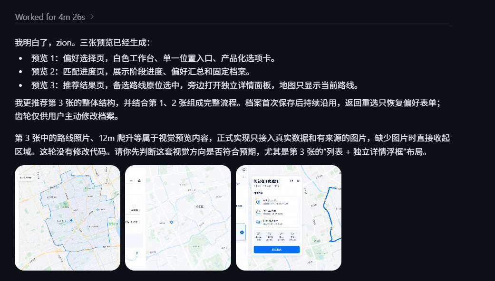
_图 36：指定 session 的生成结果总览，用于核对三张预览的来源与顺序。_

</details>

---

外部参考：

- 用户指定的 [Komoot 路线发现页面](https://www.komoot.com/discover/Selected_location_on_map/@37.6746140,-97.2762190/tours?sport=racebike&map=true&startLocation=37.6746140%2C-97.2762190&max_distance=30000&pageNumber=1)
- Komoot 官方说明中，路线建议支持从搜索框或地图探索，路线会以不同颜色显示，并可从地图或列表选择。[^1]
- Komoot 官方网页规划说明中，运动方式会影响路径选择，地图承担主要工作区，侧栏汇总路线信息。[^2]

该文档只定义实施计划。新会话应先读取本文与两份内部参考，检查当前分支和工作区，再生成三张预览图；获得用户确认后进入代码修改。提交与推送需要单独授权。

[^1]: Komoot. (2026). “Find routes and inspiration on komoot.” 访问日期：2026-08-30. https://support.komoot.com/hc/en-us/articles/10207999797530-Find-routes-and-inspiration-on-komoot

[^2]: Komoot. (2026). “Plan routes on the website.” 访问日期：2026-08-30. https://support.komoot.com/hc/en-us/articles/10194270667034-Plan-routes-on-the-website
