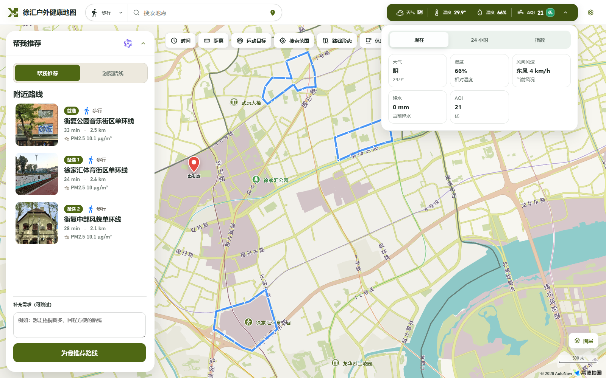

# 多源环境数据：让路线推荐看见天气与暴露风险

`weather_api_data` 为“徐汇户外健康地图”持续准备环境数据。它把天气、空气质量、PM2.5、花粉和噪声风险整理成统一结果，再计算 90 条步行、跑步和骑行路线的环境暴露，为路线评分、千问审核和推荐理由提供依据。

数据进入产品的主链路为：

> 多源数据采集 → 54 个约 1 km 环境网格 → 路线路段匹配 → 90 条路线暴露汇总 → 评分与千问推荐 → 网页展示

## 模块能做什么

| 能力 | 在产品中的作用 |
| --- | --- |
| 天气与预警 | 提供当前天气、未来 24 小时天气、生活指数和有效预警 |
| 空气质量 | 提供徐汇当前 AQI、未来 24 小时 AQI 和污染物信息 |
| PM2.5 空间估计 | 融合和风天气、上海空气质量站点与 CHAP 背景数据，形成 54 个约 1 km 网格 |
| 花粉风险 | 按网格整理当天及未来数日的花粉背景，并结合天气条件修正 |
| 噪声风险 | 按约 100 m 路段计算 0–100 风险代理，反映道路、交通和周边空间特征 |
| 路线环境暴露 | 按实际经过长度汇总每条路线的 PM2.5、花粉和噪声结果 |
| 网页数据发布 | 生成地图直接读取的数据包，让环境面板和路线详情保持更新 |

这些数据会进入评价模块的环境维度，并交给千问大模型参与候选路线审核、推荐理由生成和风险提示。



## 快速配置

以下流程在 `weather_api_data` 目录执行，Python 版本需为 3.10 或更高。

### 1. 安装

Windows PowerShell：

```powershell
python -m venv .venv
.\.venv\Scripts\python.exe -m pip install -e ".[chap]"
Copy-Item .env.example .env
```

macOS 或 Linux：

```bash
python3 -m venv .venv
./.venv/bin/python -m pip install -e '.[chap]'
cp .env.example .env
```

### 2. 填写 Key

用文本编辑器打开 `.env`。完整刷新至少需要和风天气与 Google Pollen 两组配置：

```dotenv
QWEATHER_API_KEY=你的和风天气Key
QWEATHER_API_HOST=https://你的专属域名.qweatherapi.com

POLLEN_ENABLED=true
POLLEN_API_KEY=你的Google_Pollen_Key
```

`QWEATHER_API_HOST` 来自和风天气控制台分配的专属 API Host。上海噪声在线观测属于可选增强项；保持模板中的 `SHANGHAI_NOISE_ENABLED=false` 时，系统仍会使用历史校准与空间特征生成噪声代理。

真实 Key 只写入本地 `.env`，请勿放入文档、截图或提交记录。

### 3. 检查配置

Windows：

```powershell
.\.venv\Scripts\weather-api-data.exe config-check
```

macOS 或 Linux：

```bash
./.venv/bin/weather-api-data config-check
```

看到 JSON 结果中的配置状态后即可继续。若提示缺少和风配置，请检查 Key、专属 Host 和当前命令所在目录。

## 刷新并发布到本地网页

Windows：

```powershell
.\.venv\Scripts\weather-api-data.exe refresh-all
.\.venv\Scripts\weather-api-data.exe publish-web
```

macOS 或 Linux：

```bash
./.venv/bin/weather-api-data refresh-all
./.venv/bin/weather-api-data publish-web
```

`refresh-all` 完成天气、空气质量、54 格 PM2.5、花粉、噪声代理和 90 条路线暴露刷新。`publish-web` 随后生成地图读取的数据包。

回到仓库根目录启动完整应用：

```powershell
.\start-local-app.ps1
```

浏览器会打开 [http://127.0.0.1:8123/web/](http://127.0.0.1:8123/web/)。macOS 或 Linux 使用 `bash ./start-local-app.sh`。

## 在线更新方式

公开网站采用分层更新：Cloudflare 每 15 分钟触发天气主刷新，并在刷新未推进时进行检查；GitHub Actions 提供错峰备份，以及小时级空气质量更新和每日完整更新。每日完整任务还会构建并发布 GitHub Pages，网页持续读取最近一次通过校验的环境数据。

单个来源暂时异常时，系统保留上一份可用结果并标注状态，避免网页因一次请求失败而失去全部环境信息。

## 数据边界

- PM2.5 网格属于空间估计，同一网格内的相邻道路会共享背景值；它不等同于道路旁的实时监测仪读数。
- 和风天气中国空气质量预报当前提供未来 AQI，缺少未来污染物浓度。系统保留未来 PM2.5 缺值，不从 AQI 反推浓度。
- 花粉结果属于约 1 km 网格的日级背景，适合比较日期与区域风险，难以描述一株植物附近的瞬时浓度。
- 噪声结果属于 0–100 风险代理，依据道路类型、交通邻近、POI、路口、绿地和水体等特征计算，不等同于实时分贝值。
- 接驳路径当前只负责导航，环境暴露尚未汇总；路线库中的 90 条运动路线已有环境结果。
- `partial` 表示部分来源或字段暂缺，`stale` 表示正在沿用上一份有效快照。

## 常见问题

### `config-check` 提示缺少和风配置

确认 `.env` 位于 `weather_api_data` 目录，`QWEATHER_API_KEY` 已填写，`QWEATHER_API_HOST` 为控制台提供的完整 HTTPS 专属域名。

### `refresh-all` 返回 `partial`

这通常表示某个来源暂时不可用，或未来 PM2.5 等上游字段缺失。当前可用数据仍会保留；先查看命令输出中的 `status` 和错误信息，再重试对应刷新。

### 网页没有出现最新数据

先运行 `publish-web`，再从仓库根目录重新执行本地启动脚本。网页显示的数据时间以环境面板中的更新时间为准。

### 只想重建现有数据，不调用花粉接口

已有花粉结果时，可运行下面的本地重建命令：

```powershell
.\.venv\Scripts\weather-api-data.exe build-static-exposure
.\.venv\Scripts\weather-api-data.exe publish-web
```

## 开发验证

安装开发依赖后执行：

```powershell
.\.venv\Scripts\python.exe -m pip install -e ".[dev,chap]"
.\.venv\Scripts\python.exe -m pytest tests -q
.\.venv\Scripts\python.exe -m ruff format --check .
.\.venv\Scripts\python.exe -m ruff check .
.\.venv\Scripts\python.exe -m pyright --pythonpath .\.venv\Scripts\python.exe
```

相关入口：[项目总览](../README.md) · [路线与地图](../xuhui_route_builder/README.md) · [评价与千问推荐](../evaluation_model_qwen/README.md)
