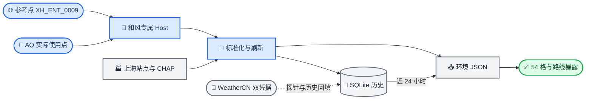

# 0826 和风天气 API 替换方案

_适用于 `weather_api_data` 的天气与空气质量活动数据源迁移，日期：2026-08-26_

---

## 📋 核心判断

活动提供方已切换为 `qweather`。正常 `refresh` 使用和风账户专属 API Host，并通过请求头 `X-QW-Api-Key` 认证；参考点固定为 `XH_ENT_0009`。天气实况、未来 24 小时天气、3 日生活指数和天气预警只请求该参考点，空气质量只请求 11 区输出实际引用的和风坐标来源。

过去 24 小时天气由本地 SQLite 滚动生成。WeatherCN 标准 Key 与进阶 Key/Secret 两套凭据继续保留，服务独立探针和 2025 年日级天气回填。2025 年 CHAP、上海站点、Google 花粉、噪声代理及路线文件维持现有链路。

## 🎯 已实施的数据范围

| 业务需求 | 活动来源与处理 | 输出 | 空间范围 |
| --- | --- | --- | --- |
| 天气实况 | 和风当前天气[^3] | `current_weather` | 参考点 `XH_ENT_0009` |
| 过去 24 小时天气 | SQLite 最近 24 个上海本地整点 | `weather_history_24h` 与摘要 | 参考来源 |
| 未来 24 小时天气 | 和风小时天气，固定 24 小时[^3] | `weather_forecast_24h` | 参考来源 |
| 3 日生活指数 | 和风 `GET /v7/indices/3d`，参数 `type=0`[^6] | `daily_indices_3day` | 参考来源 |
| 天气预警 | 和风实时天气预警[^5] | `active_alerts` | 参考来源 |
| 当前 AQI 和污染物 | 和风实时空气质量与上海站点 | `xuhui_aqi`、`point_air_quality` | 11 区实际使用点 |
| 未来 24 小时 AQI、PM2.5 | 和风空气质量小时预报[^4] | `xuhui_aqi_forecast_24h`、`xuhui_pm2_5_forecast_24h` | 11 区实际使用点与参考来源 |
| 当前与未来 PM2.5 网格 | 和风参考来源、CHAP 与上海站点融合 | 两个 PM2.5 网格文件 | 54 个 1 km 网格及 11 区 |
| 2025 年日级天气 | WeatherCN 气候实况回填 | SQLite 气候实测表 | 原有 LocationKey |

和风时光机提供近期历史天气，当前项目采用本地滚动观测，能够覆盖含当天的最近 24 个整点，并减少额外在线调用。[^7]

## 🔄 当前数据链路



## ⚙️ 配置与凭据

和风客户端使用控制台分配的账户专属 API Host，并在请求头写入 `X-QW-Api-Key`。[^1][^2] Host 校验要求 HTTPS、域名后缀 `.qweatherapi.com`，且不带路径、端口或查询参数。

`.env.example` 已包含以下活动配置：

```dotenv
WEATHER_PROVIDER=qweather
QWEATHER_ENABLED=true
QWEATHER_API_KEY=
QWEATHER_API_HOST=
QWEATHER_MAX_CALLS_PER_RUN=80
QWEATHER_CONNECT_TIMEOUT_SECONDS=5
QWEATHER_READ_TIMEOUT_SECONDS=20
QWEATHER_MAX_RETRIES=2
QWEATHER_MIN_INTERVAL_SECONDS=0.1
QWEATHER_REFERENCE_POINT_ID=XH_ENT_0009
```

用户需要在本地 `.env` 填写 `QWEATHER_API_KEY` 和 `QWEATHER_API_HOST`。这两项留空时仍可执行 fixture 测试与静态检查，真实和风探针和刷新会在配置门禁停止。

WeatherCN 配置继续保留：

```dotenv
WEATHERCN_ADVANCED_API_KEY=
WEATHERCN_ADVANCED_SECRET=
WEATHERCN_ADVANCED_ENV=test
WEATHERCN_STANDARD_API_KEY=
WEATHERCN_STANDARD_ENABLED=false
WEATHERCN_HISTORY_ENABLED=true
```

正常 `refresh` 只调用和风。`probe-standard`、`probe-advanced` 和 `backfill` 保持独立入口；认证失败、权限不足或限流会写入运行报告，不会触发静默换源。

## 📍 参考点与空气质量范围

`XH_ENT_0009` 为龙华烈士陵园一号门采样点。运行时按两位小数 WGS84 坐标生成稳定的 `qweather:纬度,经度` 来源标识，并写入三个环境文档的 `reference_source_id`。

参考点承担 4 类请求：当前天气、未来 24 小时天气、3 日生活指数、天气预警。若该点同时被 11 区空气质量配置引用，还会按空气质量范围请求当前和未来 24 小时空气质量。

11 区策略保持 6 个 `qweather_direct`、3 个 `district_blend` 和 2 个 `shanghai_station`。和风请求集合由这些区实际引用的点位生成，未进入区级配置的路线入口只保留采样元数据，不发起空气质量请求。空气质量输出记录真实来源、业务时间、获取时间、单位、完整度与估算标记；区级或网格结果均不表述为道路实测。[^4]

## 📊 调用预算

`weather-api-data dry-run` 当前报告：

| 命令 | 估算和风调用 | 说明 |
| --- | ---: | --- |
| `discover` | 0 | 本地坐标生成稳定来源标识 |
| `probe-qweather` | 2 | 单参考点受控探针 |
| `refresh` | 约 28 | 参考点天气业务与 AQ 实际使用点 |

和风预算独立于 WeatherCN 和 Google Pollen，`QWEATHER_MAX_CALLS_PER_RUN=80` 为单轮硬上限。基准刷新余量约 52 次，重试也计入调用数，第 81 次尝试前受控停止。缓存命中会降低实际调用数，HTTP 429 会结束本轮和风刷新并保存 `Retry-After`。

## 💾 近 24 小时历史

每次成功获取参考点天气实况后，标准化记录写入 `runtime/history/weather.sqlite`。导出阶段以当前时刻换算上海时间，取当前整点及之前 23 个整点槽：

- 排除未来记录与窗口外记录
- 同一小时优先选择 `business_time` 较新的记录
- `business_time` 相同时选择 `fetched_at` 较新的记录
- 只返回真实记录，不执行插值
- 摘要包含 `status`、`expected_hours`、`available_hours` 和 `missing_hours`

24 个整点均有记录时状态为 `ok`，部分记录时为 `partial`，没有记录时为 `no_data`。WeatherCN 已入库旧记录继续保留；活动窗口按当前和风 `reference_source_id` 查询，新来源需要随刷新逐小时积累。

## 📤 导出与下游契约

- `environment_regions.json`：`provider=qweather`、参考点、参考来源、采样点和 11 区配置
- `environment_latest.json`：参考点天气实况、3 日生活指数、当前预警、参考 AQI 与 11 区污染物
- `environment_hourly.json`：未来 24 小时天气、未来 24 小时 AQI/PM2.5、近 24 小时本地天气及摘要
- `pm25_grid_latest.json`：参考来源校准的当前 54 格 PM2.5 估计
- `pm25_grid_forecast_24h.json`：同一参考来源的 24 条唯一逐小时预报，以及每小时 54 格和 11 区预测估计

PM2.5 当前融合从 `environment_regions.json` 读取 `reference_source_id`，再按该值查询 SQLite。未来融合校验 24 条唯一连续时刻及来源一致性。输出统一记录 `provider=qweather`、真实 `source_id` 和和风参考点校准说明；54 格、11 区和上海站点完整性门禁保持原值。

和风响应中的来源声明会进入标准化来源信息，页面使用相关数据时同步展示来源声明。[^8]

## 🧪 验证与启用顺序

代码与文档阶段在空 Key 状态下完成以下验证：

1. fixture 单测覆盖专属 Host、认证头、六类响应、单位与时间、错误码和空预警
2. `ruff format --check .`、`ruff check .` 与 `pyright` 检查
3. 密钥扫描覆盖 `QWEATHER_API_KEY` 与 `X-QW-Api-Key`

用户填入 `QWEATHER_API_KEY` 和 `QWEATHER_API_HOST` 后，先执行：

```powershell
weather-api-data config-check
weather-api-data dry-run
weather-api-data probe-qweather --point-id XH_ENT_0009 --confirm-qweather-probe
```

单点探针通过后再执行 `refresh` 与 `export`。首次完整刷新需要重点核对专属 Host 权限、空气质量指数层级、污染物单位、24 条预报唯一时刻、来源声明和调用计数。

2026 年 8 月 26 日真实验证记录：参考点天气与当前空气质量探针成功；完整刷新发出 28 次和风请求，12 个 AQ 坐标均返回 24 条逐小时 AQI，污染物数组均为空。当前 54 格 PM2.5 融合成功；未来 PM2.5 与 54 格预测保留为不可用，未从 AQI 反推污染物浓度。`refresh` 继续交付成功结果，合并状态为 `partial`；同名旧预测文件移入 `runtime/exports/stale/` 留档。

## ⚠️ 边缘情况

- Key 已填写且 Host 为空、格式错误或并非账户专属域名：配置检查停止
- 参考点 ID 在采样配置中缺失：发现阶段停止，避免选择任意替代点
- 某个 AQ 点同时服务多个区：按稳定来源标识去重后请求，区级输出继续保留各自策略
- 某类接口未授权：对应端点记录失败上下文，其他已成功数据保留
- 空气质量指数标准或污染物单位变化：按响应字段与 `unit` 解析，数组位置不参与契约
- 预警成功且 `zeroResult=true`：记录为正常无预警
- 和风超时或 `5xx`：在 80 次硬上限内有限重试；`401/403` 结束对应端点
- 生活指数只返回部分类型：保留已返回类型并记录缺失字段
- 历史窗口小时缺失：摘要列出缺口，保持真实记录数量
- PM2.5 预报少于 24 条、时刻重复或来源混合：融合停止写出

## 🔗 参考资料

[^1]: 和风天气开发者服务. “身份认证.” https://dev.qweather.com/docs/configuration/authentication/

[^2]: 和风天气开发者服务. “API Host.” https://dev.qweather.com/docs/configuration/api-host/

[^3]: 和风天气开发者服务. “实时天气、小时天气预报.” https://dev.qweather.com/docs/api/weather/weather-current/ · https://dev.qweather.com/docs/api/weather/weather-hourly-forecast/

[^4]: 和风天气开发者服务. “实时空气质量、空气质量小时预报.” https://dev.qweather.com/docs/api/air-quality/air-current/ · https://dev.qweather.com/docs/api/air-quality/air-hourly-forecast/

[^5]: 和风天气开发者服务. “实时天气预警.” https://dev.qweather.com/docs/api/warning/weather-alert/

[^6]: 和风天气开发者服务. “天气指数预报.” https://dev.qweather.com/docs/api/indices/indices-forecast/

[^7]: 和风天气开发者服务. “天气时光机.” https://dev.qweather.com/docs/api/time-machine/time-machine-weather/

[^8]: 和风天气开发者服务. “注明来源.” https://dev.qweather.com/docs/terms/attribution/
