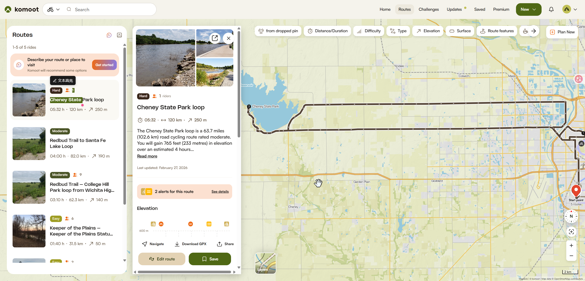
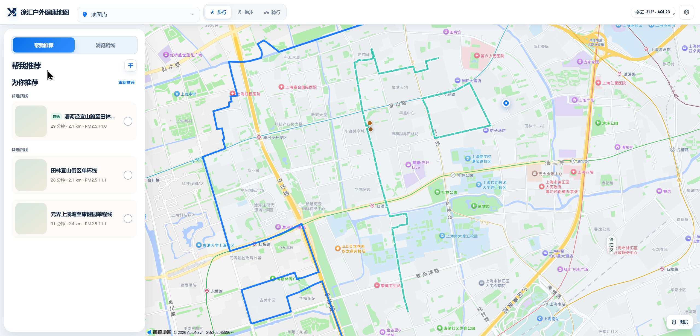
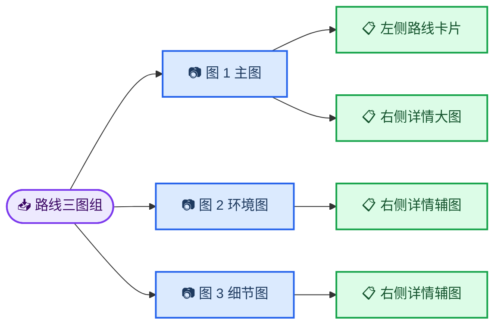

# 徐汇区 90 条路线实景图片检索清单

_用于组织路线卡片与路线详情页的实景图片查找、核验、授权记录和后续接入，更新日期：2026-08-30。_

---

## 📋 文档目的与当前基线

本文档覆盖徐汇路线库现有 90 条路线，目标是为每条路线准备约 3 张真实沿线图片，并形成可持续维护的图片来源记录。图片任务与路线几何保持分离，路线名称、距离、起终点和形态继续以项目正式数据为准。

当前核验基线：

| 项目 | 当前值 | 数据依据 |
| --- | ---: | --- |
| 路线总数 | 90 | `data/web/route_catalog.json` |
| 步行路线 | 30 | `route_mode=walk` |
| 跑步路线 | 30 | `route_mode=run` |
| 骑行路线 | 30 | `route_mode=bike` |
| 严格环线 | 43 | `route_shape=strict_loop` |
| 单程线 | 47 | `route_shape=one_way` |
| 当前验收状态 | 90 条 accepted | `validation_status=accepted` |

`route_catalog.json` 与 `xuhui_routes.geojson` 中的 90 个 `route_id` 已逐项对应，当前没有重复或缺失编号。图片研究只记录场景、来源和使用状态，不修改路线几何与导航数据。

## 🎯 三图组与界面使用关系

每条路线设置 3 个图片槽位，共形成 270 个路线—图片分配关系。多条路线经过同一真实场景时，可引用同一图片资产；同一推荐结果中的几张卡片优先采用不同主图，减少视觉混淆。

### 界面参考截图

_图 1：Komoot 的路线列表、卡片封面、详情页三图墙与地图联动参考。左侧卡片使用一张主图，右侧详情复用主图并补充两张辅图。_

_图 2：徐汇户外健康地图当前页面参考。左侧路线卡片已经预留图片区域，后续使用图 1主图填充；路线详情打开后使用同一三图组填充详情图片墙。_

| 图片槽位 | 主要内容 | 左侧路线卡片 | 右侧详情页 | 推荐文件名 |
| --- | --- | --- | --- | --- |
| 图 1：主图 | 最有辨识度的沿线场景 | 方形卡片封面 | 左侧大图 | `{route_id}_01_cover.jpg` |
| 图 2：环境图 | 起点、园路、滨水或街区环境 | — | 右上辅图 | `{route_id}_02_context.jpg` |
| 图 3：细节图 | 终点、路面、建筑、绿化或沿线节点 | — | 右下辅图 | `{route_id}_03_detail.jpg` |

界面使用关系如下：

### 图片尺寸与构图

- 原始图片优先保留横向大图，短边建议达到 800 像素以上
- 图 1 需要同时适配方形卡片裁切和详情大图裁切，主体放在画面中部安全区域
- 图 2、图 3保持不同视角，优先组合“整体空间 + 路面或建筑细节”
- 图片保持自然实景风格，减少大面积文字、水印、活动海报和明显的人脸特写
- 每条路线达到 3 张地点已核验、授权状态清楚的图片后，再进入界面接入阶段

## 🔍 找图与核验方案

### 高效检索主线

90 条路线存在明显空间重合。查找工作先建立共享场景库，再把场景分配到各路线，可以减少重复搜索和重复存储。西岸、龙华、植物园、衡复、徐家汇、康健、漕河泾、华泾是首轮场景分组。

```mermaid
flowchart LR
    accTitle: 路线图片检索核验流程
    accDescr: 从正式路线数据出发，经过锚点选择、坐标转换、候选检索、地点和授权核验，最终登记为可用于界面的图片资产

    route_data([📥 读取正式路线]) --> choose_anchor[📍 选择三个图片锚点]
    choose_anchor --> convert_coord[⚙️ 转换为 WGS84]
    convert_coord --> find_candidate[🔍 检索图片候选]
    find_candidate --> verify_place{🔍 地点位于路线?}
    verify_place -->|通过| verify_rights{🔐 授权信息清楚?}
    verify_place -->|待复核| find_candidate
    verify_rights -->|通过| register_asset[📝 登记图片资产]
    verify_rights -->|仅供参考| record_reference[📝 保留来源页面]
    register_asset --> assign_ui([✅ 分配卡片与详情页])

    classDef input fill:#ede9fe,stroke:#7c3aed,stroke-width:2px,color:#3b0764
    classDef process fill:#dbeafe,stroke:#2563eb,stroke-width:2px,color:#1e3a5f
    classDef decision fill:#fef9c3,stroke:#ca8a04,stroke-width:2px,color:#713f12
    classDef success fill:#dcfce7,stroke:#16a34a,stroke-width:2px,color:#14532d

    class route_data input
    class choose_anchor,convert_coord,find_candidate,register_asset,record_reference process
    class verify_place,verify_rights decision
    class assign_ui success
```

### 三个锚点的选择方法

1. 图 1选择路线中辨识度最高的公园、滨水空间、风貌街区、文化建筑或慢行廊道
2. 图 2选择起点附近或路线前段的环境，帮助用户判断出发空间和道路氛围
3. 图 3在单程线中优先选择终点，在严格环线中选择与主图距离较远的另一侧路段

路线内部名称往往没有公开网页索引，检索时使用真实地点名称和中英文组合。例如：

| 路线内部主题 | 优先检索词 |
| --- | --- |
| 西岸艺术路线 | `上海 西岸美术馆 Long Museum West Bund route photo` |
| 植物园路线 | `上海植物园 温室 园路 Shanghai Botanical Garden` |
| 衡复风貌路线 | `衡复风貌区 武康路 复兴西路 Former French Concession` |
| 龙华路线 | `龙华滨江 龙华塔 龙华会 Longhua Shanghai` |
| 徐家汇路线 | `徐家汇公园 上海体育场 Xujiahui Park running` |
| 康健与桂江路线 | `康健园 桂江绿廊 上海 实景` |
| 漕河泾路线 | `漕河泾 蒲汇塘 桂江路 骑行 实景` |
| 华泾路线 | `华泾滨江 龙吴路 上海 跑步 骑行` |

### Komoot 查找方式

Komoot 的 Routes 页面支持按地点、路线名称、关键词、运动类型、距离和地图范围缩小候选范围。[^1] 检索时优先打开沿线 Highlight；Highlight 通常包含社区图片、现场提示和运动类型信息。[^2] Trail View 图片来自带 GPS 数据的公开活动，可用于核对照片与路段的位置关系。[^3]

建议操作顺序：

1. 从路线起点、累计里程中点或标志性节点生成 WGS84 坐标入口
2. 在 Komoot 地图中选择步行、跑步或公路骑行，缩放到目标路线覆盖范围
3. 先查看 Highlight 和 Trail View，再查看附近路线卡片与上海主题合集
4. 记录稳定的 Highlight、Tour 或 Collection 页面，图片直链只作为补充字段
5. 站内结果较少时，使用 `site:komoot.com/highlight 上海 地点英文名` 补充定位

项目路线坐标采用 GCJ-02，Komoot 地图入口使用 WGS84。坐标入口生成前需要完成转换；直接写入 GCJ-02 会造成位置偏移，影响附近图片筛选。

### 地点准确性验收

| 核验项 | 通过条件 | 记录内容 |
| --- | --- | --- |
| 点位照片 | 图片点位距离路线几何约 100 米以内 | 锚点名、坐标、最近路线距离 |
| 公园或场馆 | 路线进入场馆边界或经过公开入口 | 场馆名、入口名、路线节点 |
| 滨水或长廊 | 图片所属路段与路线实际重合 | 路段名、起止范围、方向 |
| 街区照片 | 道路、建筑或街景可由节点和地图交叉核验 | 道路名、交叉口、可见地标 |
| 长距离路线 | 三张图覆盖至少两个明显不同的沿线区域 | 主图区域、辅图区域 |

地点来源缺少坐标时，采用“图片说明、道路名称、可见地标、路线节点”四项交叉核验。仅有城市名称或通用上海天际线的图片暂缓进入正式资产库。

## 📚 图片来源与版权记录

### 来源优先级

| 优先级 | 来源 | 推荐用途 | 授权处理 |
| ---: | --- | --- | --- |
| 1 | 团队自采照片 | 正式界面 | 记录拍摄者和拍摄日期 |
| 2 | 政府、场馆、赛事或公共空间官方页面 | 候选与正式界面 | 核对页面使用条款或取得许可 |
| 3 | 明确开放许可的图片平台 | 正式界面 | 保存许可类型和署名要求 |
| 4 | Komoot Highlight、Trail View、Tour | 位置参考与候选 | 记录作者，核对许可或采用平台嵌入方式 |
| 5 | 普通社交媒体和聚合图片 | 线索发现 | 追溯原作者与原始页面 |

Komoot 支持分享和嵌入 Route、Collection、Highlight 等公开内容，同时提醒发布者关注内容所有权与持续可访问性。[^4] 社区图片的公开可见状态与项目复制使用权限属于两个字段，授权信息缺失时只保留来源页面和候选说明。

### 已发现的上海 Komoot 线索

| 场景 | Komoot 页面 | 可支持的路线组 |
| --- | --- | --- |
| 上海公路骑行 | [Shanghai cycling essentials](https://www.komoot.com/collection/2180778/downtown-riding-and-day-tripping-shanghai-s-cycling-essentials) | 西岸、龙腾大道、跨区骑行 |
| 龙美术馆西岸馆 | [Long Museum](https://www.komoot.com/highlight/5507700) | 西岸艺术、滨江跑步与骑行 |
| 西岸艺术中心 | [West Bund Art Center](https://www.komoot.com/highlight/6534509) | 西岸文化艺术走廊 |
| 西岸美术馆 | [West Bund Museum](https://www.komoot.com/highlight/5507699/) | 美术馆大道与滨水路线 |
| 上海植物园温室 | [Shanghai Botanical Garden Greenhouse](https://www.komoot.com/highlight/7706656) | 植物园步行与跑步路线 |
| 衡复风貌区 | [Former French Concession](https://www.komoot.com/highlight/262368) | 衡复街区和历史建筑路线 |
| 徐家汇公园 | [Xujiahui Park](https://www.komoot.com/highlight/6307679) | 徐家汇步行、跑步和骑行 |
| 龙华寺 | [Longhua Temple](https://www.komoot.com/highlight/741223) | 龙华街区路线参考 |

这些页面是候选发现入口。实际选图仍要核对图片点位、作者、发布时间、原始页面和授权状态。

### 建议状态字段

`待检索 → 候选已记录 → 地点已核验 → 授权已核验 → 已下载原图 → 已生成缩略图 → 可接入`

仅用于位置与构图参考的图片使用 `reference_only`；正在联系作者或场馆时使用 `permission_pending`；已确认开放许可时使用 `reusable`；团队拍摄时使用 `self_shot`。

## 📍 90 条路线与三图选题

以下清单由当前 `route_catalog.json` 生成。图 1选题强调路线识别度，图 2和图 3分别覆盖起点、终点或环线另一侧路段。选题是检索起点，入库前仍需按照路线几何逐张核验。

### 步行路线（30 条）

| 路线与概况 | 图 1：卡片主图 | 图 2：详情环境图 | 图 3：详情细节图 | 状态 |
| --- | --- | --- | --- | --- |
| **XH_WALK_0001 · 西岸油罐艺术短线** 单程线 · 0.97 km 西岸梦中心 → 西岸美术馆 | 西岸油罐艺术中心与滨水空间 卡片与详情主图 | 西岸梦中心起点环境 | 西岸美术馆终点环境 | 待检索 |
| **XH_WALK_0002 · 漕宝路桂平路街区单环线** 严格环线 · 2.86 km 桂平路与漕宝路交叉口 → 桂平路与漕宝路交叉口 | 漕河泾开发区代表性沿线场景 卡片与详情主图 | 桂平路与漕宝路交叉口起点环境 | 虹漕南路与钦州南路交叉口沿线路段细节 | 待检索 |
| **XH_WALK_0003 · 植物园兰室盆景北区短线** 单程线 · 0.87 km 上海植物园2号门 → 上海植物园4号门售票处 | 上海植物园温室、兰室或盆景园 卡片与详情主图 | 上海植物园2号门起点环境 | 上海植物园4号门售票处终点环境 | 待检索 |
| **XH_WALK_0004 · 汾阳路—襄阳南路街区单环线** 严格环线 · 1.12 km 汾阳路与复兴中路交叉口 → 汾阳路与复兴中路交叉口 | 衡复风貌区梧桐街道与历史建筑 卡片与详情主图 | 汾阳路与复兴中路交叉口起点环境 | 襄阳南路与淮海中路交叉口沿线路段细节 | 待检索 |
| **XH_WALK_0005 · 衡复中部风貌单环线** 严格环线 · 2.13 km 岳阳路与肇嘉浜路交叉口 → 岳阳路与肇嘉浜路交叉口 | 衡复风貌区梧桐街道与历史建筑 卡片与详情主图 | 岳阳路与肇嘉浜路交叉口起点环境 | 嘉善路与建国西路交叉口沿线路段细节 | 待检索 |
| **XH_WALK_0006 · 田林宜山街区单环线** 严格环线 · 2.12 km 桂林路与宜山路交叉口 → 桂林路与宜山路交叉口 | 田林街区与宜山路沿线城市景观 卡片与详情主图 | 桂林路与宜山路交叉口起点环境 | 田林路与柳州路交叉口沿线路段细节 | 待检索 |
| **XH_WALK_0007 · 徐家汇体育街区单环线** 严格环线 · 2.58 km 零陵路与天钥桥路交叉口 → 零陵路与天钥桥路交叉口 | 徐家汇体育公园与上海体育场周边 卡片与详情主图 | 零陵路与天钥桥路交叉口起点环境 | 中山南二路与漕溪北路交叉口沿线路段细节 | 待检索 |
| **XH_WALK_0008 · 龙华滨江北部街区单环线** 严格环线 · 1.63 km 中山南二路与宛平南路交叉口 → 中山南二路与宛平南路交叉口 | 徐汇滨江与西岸文化艺术走廊 卡片与详情主图 | 中山南二路与宛平南路交叉口起点环境 | 龙华路与东安路交叉口沿线路段细节 | 待检索 |
| **XH_WALK_0009 · 康健园社区单环线** 严格环线 · 2.00 km 康健园北门外桂林西街 → 康健园北门外桂林西街 | 康健园与桂江绿廊社区景观 卡片与详情主图 | 康健园北门外桂林西街起点环境 | 桂林路与冠生园路交叉口沿线路段细节 | 待检索 |
| **XH_WALK_0010 · 漕河泾宜山路至田林路单程线** 单程线 · 2.15 km 宜山路桂平路口 → 田林路虹漕路口 | 漕河泾开发区、蒲汇塘或沿线绿廊 卡片与详情主图 | 宜山路桂平路口起点环境 | 田林路虹漕路口终点环境 | 待检索 |
| **XH_WALK_0011 · 西岸北段艺术短线** 单程线 · 0.76 km Station1907启点 → 龙美术馆(西岸馆) | 徐汇滨江与西岸文化艺术走廊 卡片与详情主图 | Station1907启点起点环境 | 龙美术馆(西岸馆)终点环境 | 待检索 |
| **XH_WALK_0012 · 植物园南园主游线** 单程线 · 1.62 km 上海植物园1号门 → 上海植物园3号门售票处 | 上海植物园园路、花园与入口景观 卡片与详情主图 | 上海植物园1号门起点环境 | 上海植物园3号门售票处终点环境 | 待检索 |
| **XH_WALK_0013 · 植物园温室兰室南北单环线** 严格环线 · 2.79 km 植物园北侧罗城路口 → 植物园北侧罗城路口 | 上海植物园温室、兰室或盆景园 卡片与详情主图 | 植物园北侧罗城路口起点环境 | 石龙路与东泉路交叉口沿线路段细节 | 待检索 |
| **XH_WALK_0014 · 衡复公园音乐街区单环线** 严格环线 · 2.48 km 衡山路乌鲁木齐南路口 → 衡山路乌鲁木齐南路口 | 衡复风貌区梧桐街道与历史建筑 卡片与详情主图 | 衡山路乌鲁木齐南路口起点环境 | 常熟路与五原路交叉口沿线路段细节 | 待检索 |
| **XH_WALK_0015 · 衡复西部风貌长环线** 严格环线 · 4.74 km 乌鲁木齐南路与肇嘉浜路交叉口 → 乌鲁木齐南路与肇嘉浜路交叉口 | 衡复风貌区梧桐街道与历史建筑 卡片与详情主图 | 乌鲁木齐南路与肇嘉浜路交叉口起点环境 | 嘉善路与复兴中路交叉口沿线路段细节 | 待检索 |
| **XH_WALK_0016 · 衡复东部风貌长环线** 严格环线 · 3.99 km 岳阳路与肇嘉浜路交叉口 → 岳阳路与肇嘉浜路交叉口 | 衡复风貌区梧桐街道与历史建筑 卡片与详情主图 | 岳阳路与肇嘉浜路交叉口起点环境 | 嘉善路与复兴中路交叉口沿线路段细节 | 待检索 |
| **XH_WALK_0017 · 徐家汇科学人文贯穿线** 单程线 · 4.27 km 中山南二路与龙吴路交叉口 → 淮海中路与乌鲁木齐中路交叉口 | 徐家汇公园与核心街区公共空间 卡片与详情主图 | 中山南二路与龙吴路交叉口起点环境 | 淮海中路与乌鲁木齐中路交叉口终点环境 | 待检索 |
| **XH_WALK_0018 · 龙华滨江南北长环线** 严格环线 · 4.63 km 肇嘉浜路与宛平南路交叉口 → 肇嘉浜路与宛平南路交叉口 | 徐汇滨江与西岸文化艺术走廊 卡片与详情主图 | 肇嘉浜路与宛平南路交叉口起点环境 | 龙华路与东安路交叉口沿线路段细节 | 待检索 |
| **XH_WALK_0019 · 康健园北门至柳州路单程线** 单程线 · 0.92 km 康健园北门外桂林西街 → 柳州路冠生园路口 | 康健园与桂江绿廊社区景观 卡片与详情主图 | 康健园北门外桂林西街起点环境 | 柳州路冠生园路口终点环境 | 待检索 |
| **XH_WALK_0020 · 元界上澳塘至康健园单程线** 单程线 · 2.35 km 漕河泾田林路虹漕路口 → 虹漕南路上澳塘入口 | 康健园与桂江绿廊社区景观 卡片与详情主图 | 漕河泾田林路虹漕路口起点环境 | 虹漕南路上澳塘入口终点环境 | 待检索 |
| **XH_WALK_0021 · 西岸美术馆大道北段线** 单程线 · 2.69 km Station1907启点 → 西岸美术馆 | 西岸美术馆与龙腾大道滨水步道 卡片与详情主图 | Station1907启点起点环境 | 西岸美术馆终点环境 | 待检索 |
| **XH_WALK_0022 · 西岸南段梦中心滨水线** 单程线 · 1.44 km 西岸美术馆 → 龙华码头 | 西岸梦中心与龙华滨江 卡片与详情主图 | 西岸美术馆起点环境 | 龙华码头终点环境 | 待检索 |
| **XH_WALK_0023 · 植物园南北贯穿线** 单程线 · 1.50 km 上海植物园4号门售票处 → 上海植物园3号门售票处 | 上海植物园园路、花园与入口景观 卡片与详情主图 | 上海植物园4号门售票处起点环境 | 上海植物园3号门售票处终点环境 | 待检索 |
| **XH_WALK_0024 · 衡复风貌纵贯长环线** 严格环线 · 4.34 km 乌鲁木齐南路与肇嘉浜路交叉口 → 乌鲁木齐南路与肇嘉浜路交叉口 | 衡复风貌区梧桐街道与历史建筑 卡片与详情主图 | 乌鲁木齐南路与肇嘉浜路交叉口起点环境 | 襄阳南路与复兴中路交叉口沿线路段细节 | 待检索 |
| **XH_WALK_0025 · 衡复老洋房道路线** 单程线 · 1.42 km 武康路与湖南路交叉口 → 东平路与岳阳路交叉口 | 衡复风貌区梧桐街道与历史建筑 卡片与详情主图 | 武康路与湖南路交叉口起点环境 | 东平路与岳阳路交叉口终点环境 | 待检索 |
| **XH_WALK_0026 · 徐家汇海派寻源至龙华单程线** 单程线 · 4.41 km 徐家汇公园衡山路入口外 → 龙华会外龙华路口 | 徐家汇公园与核心街区公共空间 卡片与详情主图 | 徐家汇公园衡山路入口外起点环境 | 龙华会外龙华路口终点环境 | 待检索 |
| **XH_WALK_0027 · 徐家汇体育—龙华纵贯长环线** 严格环线 · 4.36 km 中山南二路与宛平南路交叉口 → 中山南二路与宛平南路交叉口 | 徐家汇体育公园与上海体育场周边 卡片与详情主图 | 中山南二路与宛平南路交叉口起点环境 | 肇嘉浜路与天钥桥路交叉口沿线路段细节 | 待检索 |
| **XH_WALK_0028 · 华发龙吴路至龙耀滨江贯穿线** 单程线 · 4.61 km 华发路与龙吴路交叉口 → 龙耀路与龙腾大道交叉口 | 徐汇滨江与西岸文化艺术走廊 卡片与详情主图 | 华发路与龙吴路交叉口起点环境 | 龙耀路与龙腾大道交叉口终点环境 | 待检索 |
| **XH_WALK_0029 · 康健—华泾南向贯穿线** 单程线 · 4.32 km 石龙路与老沪闵路交叉口 → 华发路与龙吴路交叉口 | 康健园与桂江绿廊社区景观 卡片与详情主图 | 石龙路与老沪闵路交叉口起点环境 | 华发路与龙吴路交叉口终点环境 | 待检索 |
| **XH_WALK_0030 · 漕河泾南部水岸至华泾单程线** 单程线 · 4.92 km 东上澳塘虹漕南路入口 → 华展路龙吴路口 | 漕河泾开发区、蒲汇塘或沿线绿廊 卡片与详情主图 | 东上澳塘虹漕南路入口起点环境 | 华展路龙吴路口终点环境 | 待检索 |

### 跑步路线（30 条）

| 路线与概况 | 图 1：卡片主图 | 图 2：详情环境图 | 图 3：详情细节图 | 状态 |
| --- | --- | --- | --- | --- |
| **XH_RUN_0031 · 西岸艺术滨江短线** 单程线 · 2.56 km 龙美术馆西岸馆 → 油罐艺术中心 | 徐汇滨江与西岸文化艺术走廊 卡片与详情主图 | 龙美术馆西岸馆起点环境 | 油罐艺术中心终点环境 | 待检索 |
| **XH_RUN_0032 · 龙华滨江—传媒港短线** 单程线 · 1.14 km 龙华滨江休闲广场 → 西岸传媒港 | 徐汇滨江与西岸文化艺术走廊 卡片与详情主图 | 龙华滨江休闲广场起点环境 | 西岸传媒港终点环境 | 待检索 |
| **XH_RUN_0033 · 西岸滨水—云锦路单环** 严格环线 · 5.75 km 瑞宁路与云锦路交叉口 → 瑞宁路与云锦路交叉口 | 徐汇滨江与西岸文化艺术走廊 卡片与详情主图 | 瑞宁路与云锦路交叉口起点环境 | 龙耀路与龙腾大道交叉口沿线路段细节 | 待检索 |
| **XH_RUN_0034 · 龙华—徐家汇南缘内陆单环** 严格环线 · 7.76 km 龙华路与云锦路交叉口 → 龙华路与云锦路交叉口 | 徐家汇公园与核心街区公共空间 卡片与详情主图 | 龙华路与云锦路交叉口起点环境 | 肇嘉浜路与天钥桥路交叉口沿线路段细节 | 待检索 |
| **XH_RUN_0035 · 日晖港—自然艺术公园滨江线** 单程线 · 9.25 km 日晖港滨江入口 → 西岸自然艺术公园 | 西岸自然艺术公园与黄浦江岸线 卡片与详情主图 | 日晖港滨江入口起点环境 | 西岸自然艺术公园终点环境 | 待检索 |
| **XH_RUN_0036 · 植物园外围公共道路单环** 严格环线 · 6.65 km 老沪闵路与百色路交叉口 → 老沪闵路与百色路交叉口 | 上海植物园园路、花园与入口景观 卡片与详情主图 | 老沪闵路与百色路交叉口起点环境 | 石龙路与龙吴路交叉口沿线路段细节 | 待检索 |
| **XH_RUN_0037 · 龙美术馆—自然艺术公园滨江长线** 单程线 · 7.97 km 龙美术馆西岸馆 → 西岸自然艺术公园 | 龙美术馆西岸馆与滨江步道 卡片与详情主图 | 龙美术馆西岸馆起点环境 | 西岸自然艺术公园终点环境 | 待检索 |
| **XH_RUN_0038 · 日晖港—华泾滨江贯通线** 单程线 · 9.18 km 日晖港滨江入口 → 华泾路龙吴路口 | 徐汇滨江与西岸文化艺术走廊 卡片与详情主图 | 日晖港滨江入口起点环境 | 华泾路龙吴路口终点环境 | 待检索 |
| **XH_RUN_0039 · 植物园北区主园路单程线** 单程线 · 1.50 km 上海植物园4号门 → 上海植物园3号门 | 上海植物园园路、花园与入口景观 卡片与详情主图 | 上海植物园4号门起点环境 | 上海植物园3号门终点环境 | 待检索 |
| **XH_RUN_0040 · 植物园南区花园单程线** 单程线 · 1.14 km 上海植物园3号门 → 上海植物园1号门 | 上海植物园园路、花园与入口景观 卡片与详情主图 | 上海植物园3号门起点环境 | 上海植物园1号门终点环境 | 待检索 |
| **XH_RUN_0041 · 植物园北缘公共道路短环** 严格环线 · 2.84 km 龙川北路与罗城路交叉口 → 龙川北路与罗城路交叉口 | 上海植物园园路、花园与入口景观 卡片与详情主图 | 龙川北路与罗城路交叉口起点环境 | 石龙路与东泉路交叉口沿线路段细节 | 待检索 |
| **XH_RUN_0042 · 徐家汇南侧街区短环** 严格环线 · 1.95 km 零陵路与宛平南路交叉口 → 零陵路与宛平南路交叉口 | 徐家汇公园与核心街区公共空间 卡片与详情主图 | 零陵路与宛平南路交叉口起点环境 | 斜土路与天钥桥路交叉口沿线路段细节 | 待检索 |
| **XH_RUN_0043 · 徐家汇凯旋—漕溪北路环** 严格环线 · 5.09 km 淮海西路与凯旋路交叉口 → 淮海西路与凯旋路交叉口 | 徐家汇公园与核心街区公共空间 卡片与详情主图 | 淮海西路与凯旋路交叉口起点环境 | 宜山路与漕溪北路交叉口沿线路段细节 | 待检索 |
| **XH_RUN_0044 · 衡复西部风貌短环** 严格环线 · 4.74 km 复兴西路与乌鲁木齐中路交叉口 → 复兴西路与乌鲁木齐中路交叉口 | 衡复风貌区梧桐街道与历史建筑 卡片与详情主图 | 复兴西路与乌鲁木齐中路交叉口起点环境 | 肇嘉浜路与嘉善路交叉口沿线路段细节 | 待检索 |
| **XH_RUN_0045 · 龙华会—徐家汇公园单程线** 单程线 · 3.44 km 龙华会北侧路口 → 徐家汇公园衡山路入口 | 徐家汇公园与核心街区公共空间 卡片与详情主图 | 龙华会北侧路口起点环境 | 徐家汇公园衡山路入口终点环境 | 待检索 |
| **XH_RUN_0046 · 漕河泾开发区—康健园单程线** 单程线 · 3.72 km 漕河泾开发区站入口 → 康健园北门外 | 康健园与桂江绿廊社区景观 卡片与详情主图 | 漕河泾开发区站入口起点环境 | 康健园北门外终点环境 | 待检索 |
| **XH_RUN_0047 · 徐家汇体育文化中环** 严格环线 · 7.01 km 淮海西路与凯旋路交叉口 → 淮海西路与凯旋路交叉口 | 徐家汇体育公园与上海体育场周边 卡片与详情主图 | 淮海西路与凯旋路交叉口起点环境 | 中山南二路与天钥桥路交叉口沿线路段细节 | 待检索 |
| **XH_RUN_0048 · 徐家汇肇嘉浜路—零陵路短环** 严格环线 · 3.30 km 肇嘉浜路与宛平南路交叉口 → 肇嘉浜路与宛平南路交叉口 | 徐家汇公园与核心街区公共空间 卡片与详情主图 | 肇嘉浜路与宛平南路交叉口起点环境 | 零陵路与天钥桥路交叉口沿线路段细节 | 待检索 |
| **XH_RUN_0049 · 植物园—康健—漕河泾绿廊单程线** 单程线 · 6.41 km 上海植物园3号门外 → 漕河泾开发区站入口 | 上海植物园园路、花园与入口景观 卡片与详情主图 | 上海植物园3号门外起点环境 | 漕河泾开发区站入口终点环境 | 待检索 |
| **XH_RUN_0050 · 华泾—上海南站生态单程线** 单程线 · 5.46 km 华泾路龙吴路口 → 上海南站北广场外 | 华泾滨江、龙吴路或南部公共空间 卡片与详情主图 | 华泾路龙吴路口起点环境 | 上海南站北广场外终点环境 | 待检索 |
| **XH_RUN_0051 · 徐家汇—漕河泾东部城市长环** 严格环线 · 11.41 km 肇嘉浜路与天平路交叉口 → 肇嘉浜路与天平路交叉口 | 徐家汇公园与核心街区公共空间 卡片与详情主图 | 肇嘉浜路与天平路交叉口起点环境 | 漕宝路与桂林路交叉口沿线路段细节 | 待检索 |
| **XH_RUN_0052 · 植物园—华发南部外围长环** 严格环线 · 10.37 km 石龙路与老沪闵路交叉口 → 石龙路与老沪闵路交叉口 | 上海植物园园路、花园与入口景观 卡片与详情主图 | 石龙路与老沪闵路交叉口起点环境 | 华发路与龙吴路交叉口沿线路段细节 | 待检索 |
| **XH_RUN_0053 · 龙华—植物园北部扩展长环** 严格环线 · 13.38 km 中山南二路与漕溪北路交叉口 → 中山南二路与漕溪北路交叉口 | 上海植物园园路、花园与入口景观 卡片与详情主图 | 中山南二路与漕溪北路交叉口起点环境 | 罗秀路与龙吴路交叉口沿线路段细节 | 待检索 |
| **XH_RUN_0054 · 漕河泾—华泾南部单程线** 单程线 · 11.55 km 虹桥路与凯旋路交叉口 → 华泾路与龙吴路交叉口 | 漕河泾开发区、蒲汇塘或沿线绿廊 卡片与详情主图 | 虹桥路与凯旋路交叉口起点环境 | 华泾路与龙吴路交叉口终点环境 | 待检索 |
| **XH_RUN_0055 · 徐家汇—康健—华泾南向长线** 单程线 · 11.62 km 淮海西路与凯旋路交叉口 → 华泾路与龙吴路交叉口 | 徐家汇公园与核心街区公共空间 卡片与详情主图 | 淮海西路与凯旋路交叉口起点环境 | 华泾路与龙吴路交叉口终点环境 | 待检索 |
| **XH_RUN_0056 · 衡复—康健—华泾长线** 单程线 · 13.21 km 武康路与湖南路交叉口 → 华泾路与龙吴路交叉口 | 衡复风貌区梧桐街道与历史建筑 卡片与详情主图 | 武康路与湖南路交叉口起点环境 | 华泾路与龙吴路交叉口终点环境 | 待检索 |
| **XH_RUN_0057 · 徐家汇—桂林—龙华城市长环** 严格环线 · 13.20 km 肇嘉浜路与东安路交叉口 → 肇嘉浜路与东安路交叉口 | 徐家汇公园与核心街区公共空间 卡片与详情主图 | 肇嘉浜路与东安路交叉口起点环境 | 漕宝路与桂林路交叉口沿线路段细节 | 待检索 |
| **XH_RUN_0058 · 衡复—西岸文化长线** 单程线 · 10.19 km 武康路湖南路口 → 西岸自然艺术公园 | 徐汇滨江与西岸文化艺术走廊 卡片与详情主图 | 武康路湖南路口起点环境 | 西岸自然艺术公园终点环境 | 待检索 |
| **XH_RUN_0059 · 龙华—植物园北部长环** 严格环线 · 13.34 km 中山南二路与漕溪北路交叉口 → 中山南二路与漕溪北路交叉口 | 上海植物园园路、花园与入口景观 卡片与详情主图 | 中山南二路与漕溪北路交叉口起点环境 | 罗秀路与老沪闵路交叉口沿线路段细节 | 待检索 |
| **XH_RUN_0060 · 华泾—徐家汇南北长线** 单程线 · 11.04 km 华泾路与龙吴路交叉口 → 复兴中路与乌鲁木齐中路交叉口 | 徐家汇公园与核心街区公共空间 卡片与详情主图 | 华泾路与龙吴路交叉口起点环境 | 复兴中路与乌鲁木齐中路交叉口终点环境 | 待检索 |

### 骑行路线（30 条）

| 路线与概况 | 图 1：卡片主图 | 图 2：详情环境图 | 图 3：详情细节图 | 状态 |
| --- | --- | --- | --- | --- |
| **XH_BIKE_0061 · 西岸—龙华公共道路短环** 严格环线 · 5.86 km 瑞宁路与云锦路交叉口 → 瑞宁路与云锦路交叉口 | 徐汇滨江与西岸文化艺术走廊 卡片与详情主图 | 瑞宁路与云锦路交叉口起点环境 | 龙耀路与龙腾大道交叉口沿线路段细节 | 待检索 |
| **XH_BIKE_0062 · 上海植物园外围公共道路短环** 严格环线 · 6.65 km 石龙路与老沪闵路交叉口 → 石龙路与老沪闵路交叉口 | 上海植物园园路、花园与入口景观 卡片与详情主图 | 石龙路与老沪闵路交叉口起点环境 | 百色路与龙吴路交叉口沿线路段细节 | 待检索 |
| **XH_BIKE_0063 · 漕河泾—桂江外围骑行短环** 严格环线 · 9.06 km 宜山路与虹梅路交叉口 → 宜山路与虹梅路交叉口 | 桂江路绿廊与沿线慢行空间 卡片与详情主图 | 宜山路与虹梅路交叉口起点环境 | 江安路与桂江路交叉口沿线路段细节 | 待检索 |
| **XH_BIKE_0064 · 徐家汇—衡复街区骑行短环** 严格环线 · 6.88 km 乌鲁木齐中路与复兴西路交叉口 → 乌鲁木齐中路与复兴西路交叉口 | 衡复风貌区梧桐街道与历史建筑 卡片与详情主图 | 乌鲁木齐中路与复兴西路交叉口起点环境 | 龙华中路与瑞金南路交叉口沿线路段细节 | 待检索 |
| **XH_BIKE_0065 · 康健—漕河泾公共道路短环** 严格环线 · 9.22 km 蒲汇塘路与桂林路交叉口 → 蒲汇塘路与桂林路交叉口 | 康健园与桂江绿廊社区景观 卡片与详情主图 | 蒲汇塘路与桂林路交叉口起点环境 | 桂江路与钦州南路交叉口沿线路段细节 | 待检索 |
| **XH_BIKE_0066 · 植物园—西岸龙腾大道骑行线** 单程线 · 6.45 km 上海植物园3号门外百色路 → 龙腾大道与瑞宁路交叉口 | 徐汇滨江与西岸文化艺术走廊 卡片与详情主图 | 上海植物园3号门外百色路起点环境 | 龙腾大道与瑞宁路交叉口终点环境 | 待检索 |
| **XH_BIKE_0067 · 漕河泾—植物园—龙华骑行线** 单程线 · 5.86 km 蒲汇塘路与桂林路交叉口 → 龙华滨江休闲广场外侧道路 | 上海植物园园路、花园与入口景观 卡片与详情主图 | 蒲汇塘路与桂林路交叉口起点环境 | 龙华滨江休闲广场外侧道路终点环境 | 待检索 |
| **XH_BIKE_0068 · 漕河泾—徐家汇骑行线** 单程线 · 5.81 km 宜山路与虹梅路交叉口 → 徐家汇体育公园天钥桥路入口外侧道路 | 徐家汇公园与核心街区公共空间 卡片与详情主图 | 宜山路与虹梅路交叉口起点环境 | 徐家汇体育公园天钥桥路入口外侧道路终点环境 | 待检索 |
| **XH_BIKE_0069 · 衡复—龙华—西岸骑行线** 单程线 · 7.06 km 乌鲁木齐中路与复兴西路交叉口 → 龙水南路与龙腾大道交叉口 | 徐汇滨江与西岸文化艺术走廊 卡片与详情主图 | 乌鲁木齐中路与复兴西路交叉口起点环境 | 龙水南路与龙腾大道交叉口终点环境 | 待检索 |
| **XH_BIKE_0070 · 华泾—上海植物园骑行线** 单程线 · 7.91 km 华展路与龙吴路交叉口 → 石龙路与老沪闵路交叉口 | 上海植物园园路、花园与入口景观 卡片与详情主图 | 华展路与龙吴路交叉口起点环境 | 石龙路与老沪闵路交叉口终点环境 | 待检索 |
| **XH_BIKE_0071 · 西岸—徐家汇—龙华骑行中环** 严格环线 · 11.24 km 龙耀路与云锦路交叉口 → 龙耀路与云锦路交叉口 | 徐汇滨江与西岸文化艺术走廊 卡片与详情主图 | 龙耀路与云锦路交叉口起点环境 | 虹桥路与华山路交叉口沿线路段细节 | 待检索 |
| **XH_BIKE_0072 · 植物园—康健—漕河泾骑行中环** 严格环线 · 10.35 km 石龙路与老沪闵路交叉口 → 石龙路与老沪闵路交叉口 | 上海植物园园路、花园与入口景观 卡片与详情主图 | 石龙路与老沪闵路交叉口起点环境 | 华发路与龙吴路交叉口沿线路段细节 | 待检索 |
| **XH_BIKE_0073 · 衡复—西岸—龙华骑行中环** 严格环线 · 10.60 km 龙耀路与龙腾大道交叉口 → 龙耀路与龙腾大道交叉口 | 徐汇滨江与西岸文化艺术走廊 卡片与详情主图 | 龙耀路与龙腾大道交叉口起点环境 | 肇嘉浜路与天平路交叉口沿线路段细节 | 待检索 |
| **XH_BIKE_0074 · 华泾—植物园—龙华骑行中环** 严格环线 · 11.80 km 华泾路与龙吴路交叉口 → 华泾路与龙吴路交叉口 | 上海植物园园路、花园与入口景观 卡片与详情主图 | 华泾路与龙吴路交叉口起点环境 | 石龙路与老沪闵路交叉口沿线路段细节 | 待检索 |
| **XH_BIKE_0075 · 漕河泾—衡复—徐家汇骑行中环** 严格环线 · 18.41 km 宜山路与桂平路交叉口 → 宜山路与桂平路交叉口 | 衡复风貌区梧桐街道与历史建筑 卡片与详情主图 | 宜山路与桂平路交叉口起点环境 | 肇嘉浜路与天平路交叉口沿线路段细节 | 待检索 |
| **XH_BIKE_0076 · 衡复—植物园—华泾骑行线** 单程线 · 15.72 km 复兴中路与汾阳路交叉口 → 华展路与龙吴路交叉口 | 上海植物园园路、花园与入口景观 卡片与详情主图 | 复兴中路与汾阳路交叉口起点环境 | 华展路与龙吴路交叉口终点环境 | 待检索 |
| **XH_BIKE_0077 · 漕河泾—龙华—西岸骑行线** 单程线 · 10.03 km 宜山路与虹梅路交叉口 → 龙腾大道与瑞宁路交叉口 | 徐汇滨江与西岸文化艺术走廊 卡片与详情主图 | 宜山路与虹梅路交叉口起点环境 | 龙腾大道与瑞宁路交叉口终点环境 | 待检索 |
| **XH_BIKE_0078 · 华泾—西岸龙腾大道骑行线** 单程线 · 11.37 km 华展路与龙吴路交叉口 → 龙腾大道与瑞宁路交叉口 | 徐汇滨江与西岸文化艺术走廊 卡片与详情主图 | 华展路与龙吴路交叉口起点环境 | 龙腾大道与瑞宁路交叉口终点环境 | 待检索 |
| **XH_BIKE_0079 · 衡复—漕河泾—桂江骑行线** 单程线 · 14.96 km 乌鲁木齐中路与复兴西路交叉口 → 罗秀路与虹梅南路交叉口 | 衡复风貌区梧桐街道与历史建筑 卡片与详情主图 | 乌鲁木齐中路与复兴西路交叉口起点环境 | 罗秀路与虹梅南路交叉口终点环境 | 待检索 |
| **XH_BIKE_0080 · 植物园—西岸—衡复骑行线** 单程线 · 14.23 km 上海植物园3号门外百色路 → 复兴中路与嘉善路交叉口 | 徐汇滨江与西岸文化艺术走廊 卡片与详情主图 | 上海植物园3号门外百色路起点环境 | 复兴中路与嘉善路交叉口终点环境 | 待检索 |
| **XH_BIKE_0081 · 徐汇全域公共道路外围长环** 严格环线 · 27.81 km 龙腾大道与瑞宁路交叉口 → 龙腾大道与瑞宁路交叉口 | 徐汇全域代表性沿线场景 卡片与详情主图 | 龙腾大道与瑞宁路交叉口起点环境 | 江安路与桂江路交叉口沿线路段细节 | 待检索 |
| **XH_BIKE_0082 · 西岸—植物园—漕河泾—徐家汇长环** 严格环线 · 21.94 km 龙耀路与云锦路交叉口 → 龙耀路与云锦路交叉口 | 徐汇滨江与西岸文化艺术走廊 卡片与详情主图 | 龙耀路与云锦路交叉口起点环境 | 江安路与桂江路交叉口沿线路段细节 | 待检索 |
| **XH_BIKE_0083 · 华泾—漕河泾—徐家汇—西岸长环** 严格环线 · 28.58 km 华展路与龙吴路交叉口 → 华展路与龙吴路交叉口 | 徐汇滨江与西岸文化艺术走廊 卡片与详情主图 | 华展路与龙吴路交叉口起点环境 | 复兴中路与瑞金二路交叉口沿线路段细节 | 待检索 |
| **XH_BIKE_0084 · 衡复—漕河泾—植物园—龙华长环** 严格环线 · 25.98 km 复兴中路与汾阳路交叉口 → 复兴中路与汾阳路交叉口 | 上海植物园园路、花园与入口景观 卡片与详情主图 | 复兴中路与汾阳路交叉口起点环境 | 百色路与龙川北路交叉口沿线路段细节 | 待检索 |
| **XH_BIKE_0085 · 西岸—漕河泾—植物园—华泾长环** 严格环线 · 25.79 km 龙耀路与云锦路交叉口 → 龙耀路与云锦路交叉口 | 徐汇滨江与西岸文化艺术走廊 卡片与详情主图 | 龙耀路与云锦路交叉口起点环境 | 蒲汇塘路与桂林路交叉口沿线路段细节 | 待检索 |
| **XH_BIKE_0086 · 漕河泾—衡复—西岸—华泾骑行线** 单程线 · 21.27 km 宜山路与虹梅路交叉口 → 华展路与龙吴路交叉口 | 徐汇滨江与西岸文化艺术走廊 卡片与详情主图 | 宜山路与虹梅路交叉口起点环境 | 华展路与龙吴路交叉口终点环境 | 待检索 |
| **XH_BIKE_0087 · 漕河泾—衡复—西岸—华泾南向线** 单程线 · 20.19 km 复兴中路与嘉善路交叉口 → 华济路与龙吴路交叉口 | 徐汇滨江与西岸文化艺术走廊 卡片与详情主图 | 复兴中路与嘉善路交叉口起点环境 | 华济路与龙吴路交叉口终点环境 | 待检索 |
| **XH_BIKE_0088 · 衡复—徐家汇—西岸—植物园—华泾骑行线** 单程线 · 21.22 km 复兴中路与嘉善路交叉口 → 华济路与龙吴路交叉口 | 徐汇滨江与西岸文化艺术走廊 卡片与详情主图 | 复兴中路与嘉善路交叉口起点环境 | 华济路与龙吴路交叉口终点环境 | 待检索 |
| **XH_BIKE_0089 · 华泾—漕河泾—衡复北向骑行线** 单程线 · 20.69 km 华展路与龙吴路交叉口 → 复兴中路与汾阳路交叉口 | 衡复风貌区梧桐街道与历史建筑 卡片与详情主图 | 华展路与龙吴路交叉口起点环境 | 复兴中路与汾阳路交叉口终点环境 | 待检索 |
| **XH_BIKE_0090 · 衡复—漕河泾—植物园—华泾骑行线** 单程线 · 21.55 km 复兴中路与嘉善路交叉口 → 华济路与龙吴路交叉口 | 上海植物园园路、花园与入口景观 卡片与详情主图 | 复兴中路与嘉善路交叉口起点环境 | 华济路与龙吴路交叉口终点环境 | 待检索 |

## ✍️ 图片资产登记模板

每找到一张候选图，在共享场景库中登记一次，再通过 `assigned_routes` 关联到一条或多条路线，减少重复文件。

| 字段 | 示例 | 用途 |
| --- | --- | --- |
| `asset_id` | `XH_IMG_WESTBUND_001` | 稳定图片编号 |
| `scene_name` | `龙美术馆西岸馆滨水步道` | 场景名称 |
| `source_page_url` | Komoot Highlight 页面 | 可追溯来源页 |
| `source_image_url` | 原图地址或下载地址 | 获得许可后记录 |
| `author` | 作者或机构 | 署名依据 |
| `captured_at` | 页面显示的拍摄时间 | 新旧程度判断 |
| `accessed_at` | `2026-08-30` | 来源复查时间 |
| `coordinate_wgs84` | `经度,纬度` | 地点核验 |
| `distance_to_route_m` | `36` | 路线相关性 |
| `rights_status` | `reference_only` | 使用边界 |
| `assigned_routes` | `XH_WALK_0011,XH_RUN_0031` | 路线复用关系 |
| `local_path` | `web/assets/routes/...` | 后续接入路径 |

### 共享与复用规则

- 同一场景图可分配给经过该场景的多条路线
- 同一推荐结果内的主图尽量保持差异，辅图可以复用
- 一张图片只保存一个原始文件，通过图片编号建立路线关联
- 更新图片时保留原来源记录和替换原因
- 图片失效时从同一场景的已核验候选中替补

## ✅ 验收清单与边缘情况

### 单张图片验收

- [ ] 来源页面、作者、访问日期已记录
- [ ] 图片位置位于路线或对应公共空间内
- [ ] 授权状态已填写，使用范围清楚
- [ ] 分辨率和构图适配目标图片槽位
- [ ] 画面没有明显错误地点、过期施工状态或误导性标识

### 单条路线验收

- [ ] 图 1可同时适配左侧卡片和右侧详情主图
- [ ] 图 2展示路线整体环境或起点空间
- [ ] 图 3展示另一处路段、终点或细节
- [ ] 三张图片都与路线实际几何相关
- [ ] 长路线至少覆盖两个不同区域
- [ ] 图片文件名、图片编号和 `route_id` 对应清楚

### 边缘情况

| 情况 | 处理方式 |
| --- | --- |
| Komoot 只有一张合适图片 | 该图作为参考，继续从官方页面、开放许可平台或自采补齐 |
| 图片有地点说明但缺坐标 | 使用道路、建筑、地图节点和可见地标交叉核验 |
| 多条路线共享同一地标 | 允许复用，主图尽量选择不同角度或不同场景 |
| 一条路线跨越多个区域 | 图 1选择路线识别度最高区域，图 2与图 3覆盖其余区域 |
| 环线起终点相同 | 图 2记录起点，图 3选择环线远端路段 |
| 图片授权仍在确认 | 状态保持 `permission_pending`，暂缓进入正式资源目录 |
| 图片链接失效 | 保留失效记录，切换到同场景的备用图片 |
| 三张图尚未补齐 | 路线状态保持“待补齐”，界面接入排在补齐后 |

## 🔗 参考资料

[^1]: Komoot. (2026). "Find routes and inspiration on komoot." https://support.komoot.com/hc/en-us/articles/4402815332250-Find-route-suggestions

[^2]: Komoot. (2026). "Highlights." https://support.komoot.com/hc/en-us/articles/360058904532-Highlights-displayed-on-the-map

[^3]: Komoot. (2026). "Trail View photos." https://support.komoot.com/hc/en-us/articles/4778848157082-Komoot-Trail-View-Show-pictures-of-the-trail

[^4]: Komoot. (2026). "Share and embed komoot content." https://support.komoot.com/hc/en-us/articles/10331539580442-Share-and-embed-komoot-content

_维护建议：每完成一批图片核验，更新路线表状态与共享图片资产登记；路线数据发生变化时，再复核图片锚点与路线几何的关系。_
