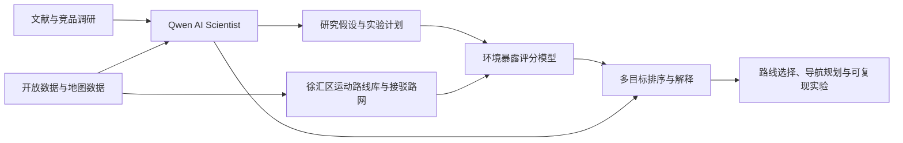
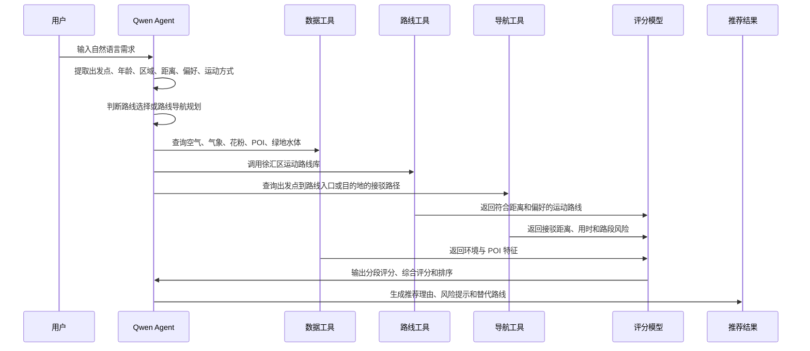
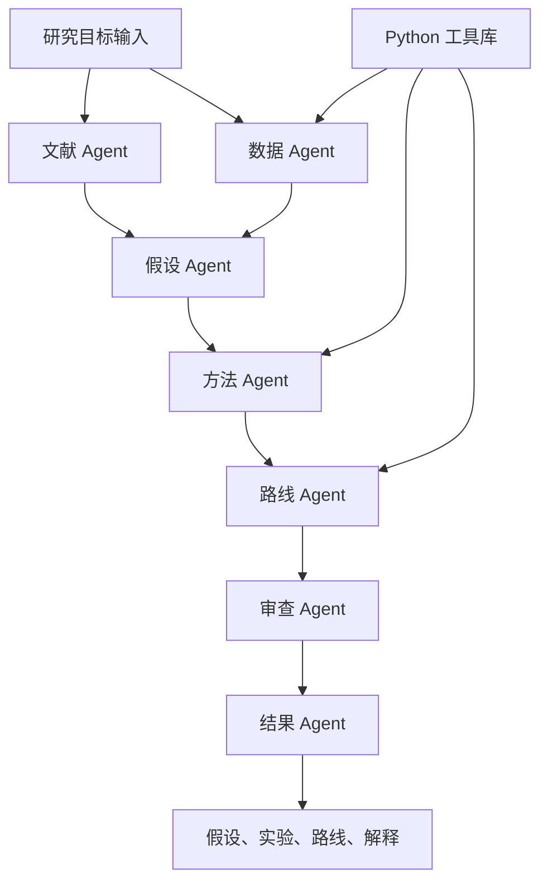

# 面向上海城市户外运动的多源环境暴露感知与健康路线决策 AI Scientist

_面向 XH-202619 赛题的项目立项书草案，第一阶段聚焦上海市徐汇区。_

---

## 一、项目定位与交付目标

### 1.1 方案题目

本项目题目为“面向上海城市户外运动的多源环境暴露感知与健康路线决策 AI Scientist”。项目以 Qwen 系列国产开源大模型为基础，围绕上海城市户外运动中的空气污染、花粉、噪声、绿地、水体、道路、生活补给和出发导航因素，研发一套面向科研假设生成、路线选择、路线导航规划、环境评分和真实案例验证的 AI Scientist 系统。第一阶段先聚焦上海市徐汇区，临港新城放入后续扩展。

### 1.2 项目背景

跑步、步行、骑行等户外运动具有健康收益，但高强度呼吸会提升污染物吸入剂量。用户在选择路线时通常只关注距离、用时、风景和交通便利，较少获得面向具体路线段的环境暴露风险提示。现有地图与运动产品能够提供导航、路线记录、运动社区和空气质量查询，环境暴露、个人健康偏好与路线规划之间仍缺少一套连贯的研究与应用闭环。

本项目的切入点是：把“今天去哪里运动、从哪里出发、走哪条路、避开哪些环境风险、途经哪些补给点”转化为一个可验证的科学问题，再由 AI Scientist 自动完成文献挖掘、数据源识别、假设生成、实验设计、模型调用、路线推荐、导航规划与结果解释。

第一阶段产品场景分为两类：

| 场景 | 用户状态 | 核心问题 | 输出结果 |
| --- | --- | --- | --- |
| 路线选择 | 用户已经在户外或已到达徐汇区某个位置 | 附近哪里适合跑、跑几公里、避开什么风险 | 附近 1-3 条运动路线、环境评分、路线理由和补给提示 |
| 路线导航规划 | 用户从当前位置、家里、学校或公司出发 | 先到哪里开始运动、到达后按哪条路线跑 | 接驳导航路径、运动路线、总耗时、环境评分和替代方案 |

### 1.3 与 AI Scientist 赛题的关系

XH-202619 赛题要求团队基于 Qwen 系列模型和阿里云百炼平台，构建能够理解科学问题、整合文献与数据、识别知识缺口、生成可验证科学假设的 AI 系统原型。[^1] 本项目将“上海健康跑步与步行路线规划”作为真实案例，展示 AI Scientist 从问题提出到原型验证的完整流程。

项目与赛题要求的对应关系如下：

| 赛题要求 | 本项目对应内容 |
| --- | --- |
| 问题理解 | 将户外运动路线选择抽象为多源环境暴露优化问题 |
| 文献挖掘与事实提取 | 自动整理 PM2.5 暴露、低污染路径、跑步行为、健康导航等论文证据 |
| 可验证假设生成 | 生成“多源环境评分能够降低路线暴露风险并提升运动舒适度”的研究假设 |
| 论证可行与多轮迭代 | 由数据 Agent、路线 Agent、审查 Agent 对数据可得性、算法口径和结果可信度进行迭代 |
| 人在回路 | 研究成员确认数据源、参数权重、路线场景与评估指标 |
| 真实案例 | 徐汇区路线选择与路线导航规划案例的环境暴露评分与推荐 |
| 源代码与上下文工程 | Python 数据处理、路线生成、评分模型、Qwen Agent 工作流与提示词模板 |

### 1.4 第一阶段交付内容

第一阶段覆盖上海市徐汇区，生成一套面向跑步、步行和散步的运动路线库，同时支持从当前位置或固定出发点前往路线入口的导航规划。阶段交付包括：

- 数据源清单：空气质量、气象、花粉、噪声、绿地水体、道路、POI、行政边界与候选路线来源
- 徐汇区运动路线库：约 150 条候选路线，包含路线入口、起终点、途经点、距离、用时、运动方式和场景标签
- 徐汇区接驳导航样例库：覆盖当前位置、家、学校、公司、地铁站到路线入口、公园入口、滨江入口、目的地的导航路径
- 环境暴露评分模型：PM2.5、花粉、噪声、绿量、水体、道路等级、补给点、路线连续性和接驳成本等评分
- Qwen AI Scientist 工作流：文献 Agent、数据 Agent、假设 Agent、实验 Agent、路线 Agent、审查 Agent
- 典型用户案例验证：如“25 岁用户已经在徐汇滨江，想就近跑 5 km”和“用户从家出发，前往公园入口后完成 5 km 低污染跑”
- 可复现实验脚本：主要使用 Python，覆盖数据清洗、路线生成、评分、排序和解释输出

---

## 二、科学假设、创新点与技术难点

### 2.1 核心科学假设

本项目提出的核心科学假设为：

> 融合小时级空气质量、城市生态空间、噪声环境、花粉风险、道路结构、生活 POI 和接驳成本的多源环境暴露评分，能够在可接受的距离和时间增加范围内，为徐汇区户外运动用户推荐暴露风险更低、生态舒适度更高、场景匹配度更强的运动路线与出发导航方案。

该假设包含三层可验证内容：

- 暴露降低：推荐路线相较最短路线在 PM2.5、噪声或综合环境风险上更低
- 舒适提升：推荐路线具有更高的绿地、水体、滨水或公园步道覆盖
- 需求匹配：推荐路线能够满足当前位置、固定出发点、目标距离、运动方式、补给点、年龄和敏感人群偏好

### 2.2 研究创新点

本项目的创新点集中在五个方面：

| 创新点 | 具体体现 |
| --- | --- |
| AI Scientist 驱动 | 由 Qwen Agent 自动提出假设、组织数据、生成实验计划和解释结果 |
| 多源环境暴露 | 同时考虑 PM2.5、花粉、噪声、绿量、水体、道路等级和 POI |
| 双场景路线决策 | 同时覆盖“附近路线选择”和“从出发点到路线入口的导航规划” |
| 运动场景聚焦 | 第一阶段聚焦徐汇区跑步、步行和散步，优先完成单区闭环 |
| 可解释路线推荐 | 输出推荐理由、风险来源、路线优劣比较和用户偏好匹配说明 |

### 2.3 关键难点

项目难点主要来自数据尺度差异和研究闭环设计：

- 空气质量数据通常来自监测站或格网，路线规划需要映射到道路段
- 花粉数据在上海缺少稳定官方入口，早期需要使用季节、天气和植被类型做风险代理
- 噪声、绿视率和交通强度存在空间精度差异，需要统一到路段或路线级别
- 用户需求具有自然语言表达形式，需要 Agent 转换成可计算约束
- 路线评分涉及多目标权衡，需要同时兼顾距离、暴露、舒适、补给、出发点和运动方式
- 路线导航规划需要同时处理“到达运动入口”和“完成运动路线”两段路径，评价指标需要拆分后再汇总

### 2.4 总体技术路径



---

## 三、参考论文、同类工作与差异化

### 3.1 武汉 UAHNS 论文

Jiang 等人在 Environment International 发表的 UAHNS 论文提出了城市空气健康导航系统，使用 XGBoost 预测未来 1 小时 PM2.5，再通过两步空间插值生成 300 m × 300 m 的 PM2.5 分布，随后将污染分布映射到道路网络，用 Neo4j 图算法计算低 PM2.5 暴露路线。论文在武汉完成系统验证，XGBoost 的 R2 超过 0.90，RMSE 约 15.74 微克/立方米，低暴露路线相较最短路线在骑行和步行场景下降低约 14.9% 和 16.9% 暴露风险。[^2]

本项目借鉴该论文的“预测 - 插值 - 路段赋权 - 低暴露路径”主链路，同时扩展到跑步、散步、骑行等户外运动场景，并加入绿地、水体、噪声、花粉、POI、年龄偏好和 Agent 解释。

### 3.2 北京慢跑 PM2.5 暴露论文

Guo 等人在 Science of the Total Environment 发表的研究使用北京运动 App 的大规模 GPS 轨迹和小时级 PM2.5 数据，计算慢跑者的暴露浓度和吸入剂量。研究发现，慢跑暴露具有显著时空差异，城市中心、工作日、秋冬季和部分时段的 PM2.5 风险更高，距离、持续时间、速度、活动空间等行为特征会影响吸入剂量。[^3]

本项目借鉴该论文对“路线轨迹 + 小时级污染 + 个体暴露剂量”的建模思路，用于支持年龄、运动强度、距离和时间选择等个体化解释。

### 3.3 三城低 PM2.5 骑行路线论文

Wu 等人在 Environmental Pollution 发表的研究使用低成本传感器采集台北、大阪、首尔骑行通勤 PM2.5，并结合 OpenStreetMap 土地利用特征，采用随机森林建立两阶段模型，识别低 PM2.5 暴露路线。研究显示，低暴露路线相较最短路线最高可降低 32.1% 平均 PM2.5 暴露，但距离增加 37.8%。[^4]

本项目借鉴该论文的三点经验：低成本传感器作为后续实测扩展方案，土地利用特征可用于解释道路级污染差异，最短路线和低暴露路线的对比适合作为评估指标。

### 3.4 国内外同类工作与产品

| 类型 | 代表工作或产品 | 主要能力 | 与本项目关系 |
| --- | --- | --- | --- |
| 健康路径研究 | Green Paths | 将空气质量、噪声和绿化纳入步行/骑行路线规划(只支持芬兰赫尔辛基首都圈) | 可借鉴多环境因子和开源系统设计[^5] |
| 空气健康导航 | UAHNS | PM2.5 预测、插值和低暴露路径 | 可借鉴主算法链路 |
| 运动路线 App | Keep、咕咚、悦跑圈 | 跑步记录、路线推荐、社区和训练 | 可借鉴路线场景，环境暴露能力较弱 |
| 地图平台 | 高德地图 | 步行、骑行、POI 搜索、天气等开放接口 | 可作为路线和 POI 数据入口[^6] |
| 空气质量工具 | AQICN、IQAir | 实时 AQI、PM2.5、空气质量预报 | 可作为实时环境数据入口[^7] |
| 花粉健康工具 | IQAir、花粉播报等 | 花粉与过敏风险提示 | 可作为花粉风险参考 |

国内产品通常聚焦运动记录、路线导航或空气质量查询。本项目强调科研假设生成、数据建模、路线优化和可解释输出之间的闭环，核心成果面向 AI Scientist 竞赛原型，而非单一运动工具。

### 3.5 本方案的优势与创新边界

本方案的优势是把“研究问题生成”和“路线推荐原型”放在同一条链路中。Qwen AI Scientist 负责组织问题、证据、假设、实验和解释；Python 模型负责数据处理、路线生成和评分排序；两者共同形成可复现的科研案例。

创新边界需要保持清晰：第一阶段输出徐汇区道路段环境暴露估计和综合风险评分，暂缓声称道路级 PM2.5 实测真值；花粉模块先采用代理风险模型，后续接入更稳定数据源；路线导航规划先覆盖出发点到运动入口的接驳导航，临港新城和上海其他市辖区放入后续扩展。

---

## 四、研究流程与技术实现

### 4.1 研究范围

第一阶段选择上海市徐汇区。徐汇区城市密度高、滨江资源突出、商业 POI 丰富、地铁站点密集，日常晨跑、夜跑、饭前饭后散步、社区步行和滨水跑需求集中，适合先完成“运动路线评分 + 出发导航规划”的单区闭环。

第一阶段路线覆盖两类任务：

| 任务 | 目标 | 典型输入 | 典型输出 |
| --- | --- | --- | --- |
| 路线选择 | 用户已在户外，寻找附近可直接开始的运动路线 | 当前位置、目标距离、运动方式、偏好 | 附近运动路线、入口距离、环境评分、补给点 |
| 路线导航规划 | 用户从当前位置或固定出发点前往目的地或运动入口 | 出发点、目的地、目标运动距离、时间 | 接驳路径、运动路线、总耗时、分段评分 |

徐汇区候选路线覆盖：

- 跑步路线：3 km、5 km、8 km、10 km
- 步行路线：1 km、2 km、3 km
- 散步路线：低强度、绿地优先、路口少
- 主题路线：滨水、公园、早餐店、便利店、地铁接驳、低噪声、低空气风险
- 接驳导航：当前位置、家、学校、公司、地铁站到徐汇滨江、公园入口、绿道入口和指定目的地

后续扩展阶段再覆盖临港新城和上海其他市辖区，每区 150-200 条候选运动路线，形成城市级路线场景库。

### 4.2 数据体系与处理口径

本项目的数据处理目标是把不同来源、不同尺度的数据变成同一种可计算对象：路段环境特征表。路线先被切成 50 m 或 100 m 的道路段，每个路段记录空气风险、花粉风险、噪声风险、绿地水体舒适度、道路属性和补给点命中情况，再按路线长度或通行时间汇总成整条路线评分。

统一链路如下：

1. 原始数据入库  
   空气质量、气象、花粉、噪声、绿地水体、路网和 POI 分别保留原始记录、来源链接、获取时间和处理脚本。原始表只做格式保存，后续分析使用清洗后的中间表。

2. 时间对齐  
   所有环境数据都对齐到用户目标时段。用户选择“现在出门”时，读取最近 1 小时有效数据；用户选择今天稍晚、明天或后天时，读取预报和历史趋势，生成目标时段估计值。

3. 空间对齐  
   所有空间数据统一到同一坐标系。点数据使用站点或 POI 经纬度，面数据使用格网、行政区、绿地、水体和声环境区划，道路数据使用路段中心点和路段缓冲区。

4. 路段特征生成  
   对每个路段计算环境特征，包括所在 PM2.5 背景场、到主干道距离、到高架距离、到公园和水体距离、缓冲区内绿地覆盖率、周边商业 POI 密度、路口密度等。

5. 风险和舒适度评分  
   PM2.5、花粉、噪声转成风险分，绿地水体和补给点转成舒适度或可用性分。每个分数都保留数据来源和置信度。

6. 路线汇总  
   一条路线由多个路段组成，路线空气风险、噪声风险、绿地水体舒适度等指标按路段长度加权汇总，再叠加用户年龄、过敏标签、运动方式和补给偏好生成最终排序。

这里的代理变量指用公开且相关的特征近似表示难以直接观测的风险。例如缺少实时道路噪声时，用道路等级、高架距离、主干道距离、商业 POI 密度近似表示噪声风险；缺少上海稳定花粉监测时，用季节、天气、绿地类型和公园草地距离近似表示花粉风险。输出统一使用“道路段级环境暴露估计”和“综合风险评分”。

#### 4.2.1 PM2.5 数据处理

PM2.5 是空气风险的核心变量，处理流程参考武汉 UAHNS 的“预测 - 空间插值 - 路段赋权 - 低暴露路径”链路，并补充道路侧修正。

##### 数据来源

- 上海市生态环境局空气质量实时发布页面及其站点页、分区页，用于获取上海当前小时站点和分区空气质量。数据入口：[空气质量实时发布](https://sthj.sh.gov.cn/kqzlssfb/index.html)、[实时看板](https://link.sthj.sh.gov.cn/aqi/indexMix.jsp)、[站点页](https://link.sthj.sh.gov.cn/aqi/siteAqi/siteAqi.jsp)、[分区页](https://link.sthj.sh.gov.cn/aqi/subarea/subarea.jsp)。[^8]
- 官方站点小时接口和历史查询接口，用于构建站点时间序列、最近 24 小时趋势和历史同季节均值。数据入口：[站点 24 小时接口](https://link.sthj.sh.gov.cn/aqi/kqzl/KqzlSitehourlydataController/getSiteHourlyDataBySiteId.do)、[全市日均查询页](https://link.sthj.sh.gov.cn/aqi/wholeCityDaily/wholeCityDailySearch.jsp)、[日均 JSON 接口](https://link.sthj.sh.gov.cn/aqi/kqzl/kqzlCountydailydataController/getCountyDailyDataListByLst.do)、[过去 30 天趋势接口](https://link.sthj.sh.gov.cn/aqi/kqzl/kqzlCountydailydataController/getAqiEctByAqiItemNameNum.do)。
- AQICN、IQAir、中国环境监测总站作为备用来源，用于接口异常、缺测和外部对照。数据入口：[AQICN API](https://aqicn.org/api/)、[IQAir API](https://www.iqair.com/air-pollution-data-api)、[中国环境监测总站实时数据](https://www.cnemc.cn/sssj/)。[^7][^11][^12]
- TAP / ChinaHighPM2.5、ScienceDB 中国 1 km 小时级污染物数据、Zenodo ChinaHighPM2.5，用于提供城市 PM2.5 背景场和历史空间分布。数据入口：[TAP / ChinaHighPM2.5](https://tapdata.org.cn/?lang=en&page_id=826)、[ScienceDB 中国 1 km 小时级污染物数据](https://www.scidb.cn/en/detail?dataSetId=d7ccf030cd754907a2783818501a1c8b)、[Zenodo ChinaHighPM2.5](https://zenodo.org/records/6398971)。[^9][^13][^14]

##### 处理流程

1. 建立站点表和小时观测表  
   站点表保存站点名称、经纬度、所属区域和数据来源；小时观测表保存每个站点在每个小时的 PM2.5、AQI、PM10、O3、NO2 等数值。入库时统一时间格式和单位，标记缺失、重复、异常跳变和接口返回失败。

2. 构造目标时段特征  
   当前出行直接读取最近 1 小时有效站点值。未来时段则为每个站点构造预测特征，包括最近 1 小时、3 小时、24 小时 PM2.5 均值与变化率，同小时历史均值，星期、月份、季节，以及温度、湿度、风速、风向、降水等气象条件。

3. 预测目标时段站点 PM2.5  
   使用 XGBoost 或 LightGBM 训练“历史空气质量 + 气象 + 时间特征”到目标小时 PM2.5 的映射。训练时按时间切分训练集和测试集，例如用前 80% 时间训练、后 20% 时间测试，避免未来信息进入训练过程。评估指标使用 R2、RMSE 和 MAE。

4. 生成区域 PM2.5 背景场  
   有格网数据时，先裁剪到徐汇区，得到基础 PM2.5 背景场。随后用站点预测值校正格网偏差：计算每个站点的预测 PM2.5 与站点所在格网 PM2.5 的差值，再把差值用 IDW 或 Kriging 插值到研究区域，最后叠加回格网背景场。缺少可用格网时，直接用站点预测值进行 IDW 或 Kriging 插值，得到区域连续背景面。

5. 映射到道路段  
   把路网切成 50 m 或 100 m 道路段。每个路段取中心点或缓冲区，与 PM2.5 背景面叠加，得到路段基础 PM2.5 暴露估计。路线穿过多个格网时，按每段长度加权取值。

6. 做道路侧修正  
   在基础 PM2.5 暴露估计上加入道路特征修正。快速路、主干路、高架附近、路口密度高、商业 POI 密集的路段上调空气风险；靠近公园、滨水步道、绿地覆盖率较高的路段下调空气风险。修正幅度第一阶段采用可解释规则，后续如果获得移动监测或低成本传感器数据，再用实测数据校准。

7. 形成空气风险评分  
   路段输出两个结果：PM2.5 暴露估计值和空气风险等级。路线空气风险按路段长度加权汇总。推荐结果展示时同时给出“相较最短路线的空气风险下降幅度”和“距离增加率”。

##### 校验方式

PM2.5 模型的校验分三层：站点预测层看 R2、RMSE、MAE；空间映射层做留一站点验证，观察某个站点被拿掉后能否由其他站点和格网合理恢复；路线推荐层比较最短路线、空气优先路线和综合路线的空气风险差异。

#### 4.2.2 气象数据处理

##### 数据来源

气象数据主要用于目标时段判断和空气风险解释。数据来源包括中国气象数据网、高德天气查询 API、和风天气 API。数据入口：[中国气象数据网](https://data.cma.cn/)、[高德天气查询 API](https://lbs.amap.com/api/webservice/guide/api/weatherinfo)、[和风天气 API](https://dev.qweather.com/docs/api/)。[^15][^16][^17]

##### 处理流程

1. 按目标时段获取天气  
   对用户输入的出行时间提取温度、湿度、风速、风向、降水、天气现象和预报发布时间。当前出行读取实时天气，未来出行读取逐小时或逐日预报。

2. 对齐空气预测模型  
   气象数据按小时合并到 PM2.5 站点小时表中，作为 XGBoost 或 LightGBM 的输入特征。风速、风向、湿度和降水用于解释污染扩散，温度和湿度用于辅助判断 O3 和体感风险。

3. 生成运动舒适度  
   对每条路线生成目标时段天气标签，例如高温、降雨、强风、闷热。高温和强降水降低推荐分，轻微降雨可能降低短时花粉风险，强风会提高花粉扩散和体感不适风险。

4. 确定空间处理方式  
   在一片公园或几公里路线内，温度、湿度、风速这类气象要素空间差异通常较小，第一阶段按区域或路线级处理。后续如果接入更细的城市微气候或热岛数据，再扩展到路段级热舒适度。

##### 评分与输出

气象结果进入评分时分两类：一类作为 PM2.5 和花粉风险的修正条件，另一类作为路线级出行舒适度提示。输出示例为“今晚风速较高，滨水路段体感风更明显”或“目标时段有降雨，路线推荐降低户外运动优先级”。

#### 4.2.3 花粉数据处理

##### 数据来源

花粉数据采用“外部预报优先，代理模型兜底”的策略。外部来源包括 Google Pollen API、IQAir 上海页面及其他花粉健康服务；上海稳定公开源不足时，使用季节、天气和植被特征构造花粉风险。数据入口：[Google Pollen API](https://developers.google.com/maps/documentation/pollen/overview)、[IQAir 上海页面](https://www.iqair.com/china/shanghai)。[^18]

##### 处理流程

1. 优先读取外部花粉预报  
   如果 API 可用，按目标日期和区域获取树木花粉、草类花粉、杂草花粉等级，以及整体过敏风险。读取后直接映射到路线所在区域，并按用户过敏标签调整权重。

2. 构造花粉代理模型  
   缺少 API 或接口覆盖不足时，使用月份、季节、天气和植被特征估计风险。春秋季设置较高基础风险；风速较高、天气干燥时上调风险；降雨后短时下调风险。

3. 叠加路段植被暴露  
   对每个路段计算到公园、草地、林地、绿道和行道树密集区的距离，并统计路段缓冲区内绿地覆盖率。靠近草地、林地、公园入口和绿道的路段，对过敏人群上调花粉风险。

4. 用户标签修正  
   普通用户只展示轻量花粉提示；过敏用户、老人和儿童画像提高花粉权重。春秋季过敏用户优先避开高草地覆盖、高林地覆盖和强风时段路线。

5. 置信度标注  
   API 花粉预报覆盖目标区域时，标注为高置信度；使用季节、天气和植被代理估计时，标注为中低置信度，并在推荐解释中写明“花粉风险由季节、天气和植被特征估计”。

##### 评分与输出

花粉结果进入评分时生成路段花粉风险等级，再按路线长度加权汇总。对过敏用户，花粉风险参与综合排序；对普通用户，花粉主要进入风险提示。

#### 4.2.4 噪声数据处理

##### 数据来源

噪声风险适合做道路段级处理，因为同一片区域内主干路、高架、商业街和公园步道的差异明显。数据来源包括上海市生态环境局公开噪声资料、声环境功能区资料、OSM 或高德道路等级、高架和主干路位置、商业 POI 和交通设施分布。数据入口：[上海市生态环境局](https://sthj.sh.gov.cn/)、[OpenStreetMap](https://www.openstreetmap.org/)、[高德路径规划 API](https://lbs.amap.com/api/webservice/guide/api/direction)。[^10][^19]

##### 处理流程

1. 建立区域噪声底图  
   如果能获取声环境功能区或噪声公开资料，先将其叠加到徐汇区，作为区域噪声背景。每个路段根据所在功能区获得基础噪声风险。

2. 计算道路侧噪声代理  
   对每个路段计算道路等级、到主干道距离、到高架距离、路口密度、商业 POI 密度和交通设施密度。快速路、主干路、高架附近、路口密集和商业密集路段噪声风险上调；公园步道、滨水步道、支路和绿道风险下调。

3. 形成路段噪声风险  
   第一阶段输出低、中、高三档噪声风险，用于路线排序和解释。后续如接入移动采样或噪声实测值，再把代理风险校准成分贝估计。

4. 服务特定用户画像  
   散步、老人、亲子和低噪声偏好用户提高噪声权重；跑步和骑行用户维持默认权重。推荐解释中指出主要避让原因，例如“避开高架旁路段”和“优先选择滨水步道”。

##### 校验方式

噪声校验主要看空间合理性：主干路和高架附近应高于公园步道，商业密集街区应高于滨水低车流路段。若结果和人工常识冲突，检查道路等级、POI 半径和权重设置。

#### 4.2.5 绿地水体、路网与 POI 数据处理

这三类数据既参与路线生成，也参与 PM2.5、花粉、噪声的路段修正和最终解释。

##### 绿地水体

绿地水体来源包括 OpenStreetMap、ESA WorldCover、CLCD 中国土地覆盖数据和上海绿道建设资料。数据入口：[OpenStreetMap](https://www.openstreetmap.org/)、[ESA WorldCover](https://worldcover2021.esa.int/)、[CLCD 中国土地覆盖数据](https://zenodo.org/records/5816591)、[上海绿道建设资料](https://lhsr.sh.gov.cn/ldjs1/)。[^19][^20][^21][^25] 处理时先裁剪到研究区域，再提取公园、绿地、草地、林地、水体和滨水空间。对每个路段计算到最近公园、水体、绿地的距离，以及 50 m、100 m、200 m 缓冲区内绿地和水体覆盖率。绿地水体分数用于生态舒适度，也用于花粉风险和空气风险修正。

##### 路网

路网来源包括高德路径规划 API、OpenStreetMap Overpass API 和 Geofabrik OSM Extracts。数据入口：[高德路径规划 API](https://lbs.amap.com/api/webservice/guide/api/direction)、[OpenStreetMap Overpass API](https://wiki.openstreetmap.org/wiki/Overpass_API)、[Geofabrik OSM Extracts](https://download.geofabrik.de/)。[^6][^22][^23] 处理时先建立步行、跑步、骑行可用路网，再把路线切成标准路段，计算道路等级、路口密度、路线长度、绕行率和重合率。道路等级同时服务 PM2.5、噪声和路线连续性评分。

##### POI

POI 来源包括高德 POI 搜索 API、OpenStreetMap 和上海市公共数据开放平台。数据入口：[高德 POI 搜索 API](https://lbs.amap.com/api/webservice/guide/api-advanced/search)、[OpenStreetMap](https://www.openstreetmap.org/)、[上海市公共数据开放平台](https://data.sh.gov.cn/)。[^24][^26] 处理时按路线缓冲区查询早餐店、便利店、厕所、饮水点、地铁站、公园入口等点位，计算最近距离、沿线数量和是否顺路。POI 结果用于补给匹配、主题路线生成和推荐解释，例如“经过便利店”和“靠近地铁站出口”。

#### 4.2.6 用户需求与文献知识

##### 用户需求

用户需求通过自然语言输入或预设画像进入系统。系统从输入中抽取区域、运动方式、目标距离、目标时段、年龄、过敏标签、低噪声偏好、补给偏好等信息，并转成评分权重。例如过敏用户提高花粉权重，老人和亲子场景提高噪声权重，固定训练距离提高距离匹配权重。

##### 文献知识

文献知识来源包括 PubMed、ScienceDirect、政府公开资料、官方产品页面和开源仓库。数据入口：[PubMed](https://pubmed.ncbi.nlm.nih.gov/)、[ScienceDirect](https://www.sciencedirect.com/)。文献 Agent 将核心论文整理成论文卡片，记录研究对象、数据来源、方法、指标和局限；审查 Agent 检查推荐解释是否超出数据支持范围。最终结果需要同时保存引用、数据来源、模型参数和中间表，保证同样输入能够复现同样路线排序。

### 4.3 候选路线与接驳导航生成

候选路线生成采用“徐汇区边界 + 运动入口 + 途经 POI + 地图路径 + 路线过滤”的流程。第一阶段优先用 Python 调用地图 API 或 OSM 数据，不依赖人工从运动 App 批量导入内部路线。系统同时维护运动路线库和接驳导航库：运动路线库服务“附近哪里适合跑”，接驳导航库服务“从当前位置或家里怎么到达运动入口”。

路线生成步骤如下：

1. 建立徐汇区边界  
   获取徐汇区行政边界，裁剪路网、绿地、水体和 POI。重点覆盖徐汇滨江、衡复风貌区、上海植物园周边、漕河泾、徐家汇、龙华、康健等日常运动场景。

2. 建立运动入口池  
   选取地铁站出口、公园入口、滨江步道入口、社区中心、商业节点、学校和办公区作为可达入口。每个入口记录经纬度、周边 POI、可接入道路和安全代理特征。

3. 建立途经点池  
   按需求构建早餐店、便利店、超市、卫生间、公园、水体、观景点、运动场、地铁站等 POI 池，供环线跑、补给路线和目的地路线调用。

4. 生成运动路线候选  
   使用高德步行路径 API 或 OSM 路网算法生成路线。环线跑采用“入口 - 途经点 - 入口”结构，目的地跑采用“入口 - 目的地”结构，附近路线采用“当前位置 - 最近入口 - 运动环线”的组合结构。

5. 生成接驳导航候选  
   对当前位置、家、学校、公司、地铁站等出发点，生成到运动入口、公园入口、滨江入口或指定目的地的接驳路径。接驳段单独记录距离、用时、道路等级、换乘便利性、空气风险和步行安全代理。

6. 路线过滤  
   按目标距离、重复率、绕行率、道路连通性、高风险道路比例、入口可达性和场景贴合度进行过滤。路线选择场景重点过滤“离用户太远”的路线，导航规划场景重点过滤“接驳成本过高”的路线。

7. 路线标注  
   给每条路线添加运动方式、距离、预计时间、场景标签、途经 POI、入口类型、适合人群、推荐时段、路线选择适配度和导航规划适配度。

徐汇区 150 条运动路线建议按下表分配：

| 类型 | 数量 | 说明 |
| --- | ---: | --- |
| 滨江跑步 | 35 | 3-10 km，覆盖徐汇滨江、龙腾大道、滨水步道 |
| 公园与绿道 | 35 | 1-8 km，覆盖上海植物园、康健园、社区绿地和绿道 |
| 社区环线 | 30 | 1-5 km，覆盖居民区周边晨跑、夜跑和散步 |
| 补给主题 | 25 | 途经早餐店、便利店、厕所、地铁站等 POI |
| 低暴露主题 | 25 | 低空气风险、低噪声、少主干道、绿地水体优先 |

接驳导航样例建议覆盖 30-50 组典型出发点和入口组合，用于演示从家、当前位置、学校、公司、地铁站出发的完整规划能力。

### 4.4 环境暴露与舒适度评分

路线评分分为路段级、运动路线级和导航规划级。路段级评分负责把环境数据映射到道路段，运动路线级评分负责汇总运动路线本身的环境暴露与舒适度，导航规划级评分负责把接驳成本、入口可达性和运动路线质量合并。

路段评分变量建议包括：

| 变量 | 评分方向 | 数据来源 |
| --- | --- | --- |
| PM2.5 或 AQI | 数值越高风险越高 | 监测站、API、格网数据 |
| 花粉风险 | 等级越高风险越高 | 花粉服务、植被季节代理 |
| 噪声风险 | 主干道、高架、商业密集区风险更高 | 噪声报告、道路等级、POI 密度 |
| 绿量 | 绿地、公园、行道树越多越好 | 绿地水体、街景绿视率后续扩展 |
| 水体邻近 | 滨水路线舒适度更高 | OSM 水体、滨江步道 |
| 道路等级 | 主干路风险高，步道和绿道更优 | 高德或 OSM |
| POI 补给 | 早餐店、便利店、厕所、地铁站提升可用性 | 高德 POI、OSM |
| 路线距离 | 与用户目标距离越接近越好 | 路线几何 |
| 路口密度 | 路口越多连续性越差 | 路网拓扑 |
| 入口可达性 | 距离当前位置或固定出发点越近越好 | 路径规划、路网拓扑 |
| 接驳成本 | 接驳距离和时间越低越好 | 高德路径、OSM 路网 |

综合评分可先采用可解释加权模型。早期由研究成员设置权重，后续通过用户反馈或实验结果更新权重。示例权重如下：

| 目标 | 默认权重 | 适用场景 |
| --- | ---: | --- |
| 空气风险 | 0.25 | 空气敏感、低污染偏好 |
| 花粉风险 | 0.10 | 过敏人群、春秋季 |
| 噪声风险 | 0.10 | 散步、老人、亲子 |
| 绿地水体 | 0.20 | 公园跑、滨水跑、散步 |
| 距离匹配 | 0.15 | 固定距离训练 |
| POI 匹配 | 0.10 | 早餐、便利店、厕所 |
| 连续性与安全代理 | 0.10 | 路口少、低绕行、步道优先 |

路线选择场景采用“运动路线评分 + 入口距离惩罚”的组合。用户已经在户外时，系统先筛选当前位置附近的入口和路线，再按环境暴露、距离匹配、绿地水体、POI 和入口距离排序。

路线导航规划场景采用“接驳导航评分 + 运动路线评分”的组合。用户从家、学校、公司或当前位置出发时，系统同时评价到达运动入口的接驳段和入口后的运动段，输出总距离、总用时、接驳风险、运动风险和综合推荐理由。

### 4.5 路线规划算法

项目算法分为五层：

| 层级 | 算法或方法 | 作用 |
| --- | --- | --- |
| 空气预测 | XGBoost、LightGBM、随机森林 | 使用历史空气质量和气象数据预测未来 1 小时 PM2.5 或空气风险 |
| 空间映射 | IDW、Kriging、最近站点修正、格网叠加 | 将站点或格网环境数据映射到道路段 |
| 路段评分 | 加权评分、归一化、敏感人群权重修正 | 形成可解释的路段风险与舒适度 |
| 路线排序 | Dijkstra、A*、多目标排序、Pareto 筛选 | 输出低风险、距离合理、场景匹配的运动路线 |
| 接驳规划 | 步行路径规划、入口搜索、组合排序 | 输出从出发点到运动入口或目的地的导航路径 |

第一阶段建议以“可解释规则 + 轻量机器学习”为主。PM2.5 预测可训练 XGBoost 或 LightGBM，路线排序先采用加权评分。若数据质量暂时有限，先使用空气质量当前值、历史均值和空间距离插值完成路线评分，再逐步加入机器学习模型。接驳规划优先调用地图路径 API 或 OSM 最短路算法，组合排序由综合评分模型完成。

### 4.6 用户需求到路线推荐的推理流程

用户输入示例：

> 25 岁，现在人在徐汇滨江附近，想就近跑 5 km，空气风险低一点，最好靠近水边，途中经过早餐店或便利店。

> 25 岁，今晚从家出发，想去附近公园或滨江完成 5 km 跑步，路线空气风险低一点，结束后方便坐地铁回家。

系统处理流程如下：



输出内容包括：

- 推荐路线 1-3 条
- 每条路线的运动距离、预计时间、运动方式、路线入口和途经点
- 接驳段距离、接驳时间、运动段距离和总耗时
- 空气风险、花粉风险、噪声风险、绿地水体评分和接驳成本评分
- 与最短路线或默认路线的对比
- 推荐理由和避开路段说明
- 数据来源和置信度提示

### 4.7 基于 Qwen 的 AI Scientist 架构

AI Scientist 由多个 Agent 协作完成。第一阶段采用 Python 工具链和 Qwen API，整体架构如下：



各 Agent 职责如下：

| Agent | 职责 | 输入 | 输出 |
| --- | --- | --- | --- |
| 文献 Agent | 提取论文事实、方法、指标和局限 | PDF、论文链接、摘要 | 结构化论文卡片 |
| 数据 Agent | 判断数据源可得性、字段、频率、许可 | API、开放数据、文件 | 数据清单和字段说明 |
| 假设 Agent | 生成科学假设和研究问题 | 文献事实、数据条件 | 假设与验证路径 |
| 方法 Agent | 设计模型、算法和实验 | 假设、数据清单 | 方法流程和评估指标 |
| 路线 Agent | 调用路线库和评分模型 | 用户需求、候选路线 | 路线排序和理由 |
| 审查 Agent | 检查引用、数据口径、夸大表述和可复现性 | 全部中间结果 | 修改建议 |
| 结果 Agent | 生成最终研究计划与案例输出 | 审查后结果 | 结构化方案和案例解释 |

### 4.8 实验设计与评估指标

第一阶段实验围绕徐汇区展开。系统选取约 150 条运动路线和 30-50 组接驳导航样例，覆盖多个用户画像和两类场景：已经在户外的路线选择，以及从当前位置或固定出发点开始的路线导航规划。

基线方案：

| 基线 | 含义 |
| --- | --- |
| 最短路线 | 只按距离最短推荐 |
| 绿地优先路线 | 只按绿地和水体比例推荐 |
| 空气优先路线 | 只按 PM2.5 或 AQI 风险推荐 |
| 综合模型路线 | 按多源环境暴露和用户需求综合推荐 |
| 接驳最短方案 | 只按出发点到运动入口的接驳距离最短推荐 |
| 分段综合方案 | 同时考虑接驳段和运动段的综合推荐 |

评估指标：

| 指标 | 说明 |
| --- | --- |
| 暴露风险降低率 | 综合模型相较最短路线的 PM2.5 或综合风险下降幅度 |
| 距离增加率 | 推荐路线相较最短路线增加的距离比例 |
| 绿地水体覆盖率 | 路线附近绿地和水体覆盖水平 |
| POI 命中率 | 用户指定早餐店、便利店、厕所等需求是否满足 |
| 路线多样性 | 同一区域推荐路线之间的重合度 |
| 入口可达性 | 路线入口到当前位置或固定出发点的距离和时间 |
| 分段总成本 | 接驳段和运动段合并后的总距离、总用时和综合风险 |
| 场景识别准确率 | 系统是否正确判断用户需要路线选择或导航规划 |
| 可解释性评分 | 推荐理由是否能对应数据特征 |
| 可复现性 | 同样输入是否得到稳定输出和可追踪数据来源 |

### 4.9 Python 工程结构建议

第一阶段以 Python 为主，工程可按以下结构组织：

```text
project/
  data_raw/              原始数据
  data_processed/        清洗后数据
  notebooks/             探索性分析
  src/
    data/                数据抓取与清洗
    geo/                 边界、路网、POI、路线处理
    exposure/            环境暴露评分
    routing/             候选运动路线生成和排序
    navigation/          出发点、目的地和路线入口接驳规划
    agents/              Qwen Agent 工作流
    evaluation/          基线对比和指标评估
  outputs/
    routes/              候选运动路线库
    navigation/          接驳导航样例
    scores/              路线评分结果
    cases/               用户案例输出
```

---

## 五、阶段计划与风险控制

### 5.1 第一阶段计划

| 阶段 | 时间 | 目标 |
| --- | --- | --- |
| 阶段 1 | 第 1-2 周 | 完成论文卡片、数据源清单、徐汇区边界和路网初版 |
| 阶段 2 | 第 3-4 周 | 生成徐汇区约 150 条运动路线和 30-50 组接驳导航样例 |
| 阶段 3 | 第 5-6 周 | 完成环境暴露评分模型、接驳成本评分和基线路线对比 |
| 阶段 4 | 第 7-8 周 | 完成 Qwen Agent 工作流、路线选择案例和导航规划案例 |
| 阶段 5 | 第 9-10 周 | 整理可复现实验脚本、结果表和阶段总结 |

### 5.2 后续扩展计划

后续将从徐汇区扩展到临港新城和上海其他市辖区。扩展重点包括：

- 每区 150-200 条候选路线
- 更多运动场景和用户画像
- 更稳定的花粉与噪声数据源
- 街景绿视率模型
- 低成本传感器实测校验
- 面向小程序或前端展示的接口

### 5.3 风险控制

| 风险 | 影响 | 控制策略 |
| --- | --- | --- |
| PM2.5 实时数据不稳定 | 影响实时展示和短时预测 | 使用官方站点、第三方 API 和历史数据三层来源 |
| 花粉数据缺少上海官方稳定入口 | 影响过敏风险可信度 | 使用植被、季节、天气代理，明确置信度 |
| 路线生成重复度高 | 候选路线质量下降 | 加入起终点池、途经点池和重合度过滤 |
| 接驳段过长 | 用户体验下降 | 限制入口搜索半径，分开展示最近入口和最佳运动路线 |
| 多目标权重主观 | 推荐结果争议较大 | 保留可解释权重表，提供敏感性分析 |
| Agent 幻觉引用 | 影响科学可信度 | 审查 Agent 校验引用与数据来源 |
| 区域扩展工作量大 | 延长项目周期 | 第一阶段先完成徐汇区闭环，再复制到其他区 |

### 5.4 可复现成果清单

第一阶段结束时应形成以下成果：

- 徐汇区边界、路网、POI 和候选路线数据
- 徐汇区约 150 条运动路线及其环境特征
- 徐汇区 30-50 组接驳导航样例及其分段评分
- 环境暴露评分脚本和参数说明
- 路线选择和路线导航规划的典型用户输入与推荐输出样例
- 最短路线、空气优先路线、绿地优先路线、接驳最短方案、分段综合方案对比结果
- Qwen AI Scientist 的提示词、工具调用流程和中间输出
- 引用论文与数据源清单

---

## 六、五人小组初步分工

第一阶段以五人小组并行推进，工作量尽量均衡。每名成员都需要交付可复现文件、代码或结构化数据。

| 成员 | 角色 | 主要任务 | 阶段交付 |
| --- | --- | --- | --- |
| 成员 A | 文献与数据源负责人 | 整理三篇核心论文、国内外同类工作、上海空气质量、气象、花粉、噪声、绿地水体数据源 | 论文卡片、数据源表、引用清单 |
| 成员 B | GIS 与路线生成负责人 | 获取徐汇区边界、路网、POI，生成约 150 条运动路线和接驳导航样例 | 路线库、入口池、途经点池、接驳路径、路线过滤脚本 |
| 成员 C | 环境暴露模型负责人 | 构建 PM2.5、花粉、噪声、绿地水体、道路等级和 POI 的评分模型 | 路段评分脚本、权重表、路线评分结果 |
| 成员 D | Qwen Agent 负责人 | 设计 AI Scientist 多智能体流程、提示词、上下文工程和工具调用 | Agent 工作流、提示词模板、中间结果样例 |
| 成员 E | 实验验证与工程整合负责人 | 设计路线选择和导航规划的基线对比、评估指标、典型用户案例，整合 Python 工程结构 | 实验脚本、对比表、案例输出、项目目录规范 |

协作方式建议：

- 每周固定同步一次数据字段、路线质量、模型结果和 Agent 输出
- 每个脚本提供输入文件、输出文件和运行命令
- 所有数据源记录获取日期、字段含义和许可说明
- 任何模型结果都保留参数、权重和中间数据，便于复现

---

## 参考资料

[^1]: XH-202619. “基于国产开源大模型的 AI Scientist 的研发与应用比赛方案.” 本地文件：`D:\SJTU\交大\揭榜挂帅\AI_Scientist\XH-202619_基于国产开源大模型的AI Scientist的研发与应用.pdf`

[^2]: Jiang, P., Gao, C., Zhao, J., Li, F., Ou, C., Zhang, T., Huang, S. (2024). “An exploration of urban air health navigation system based on dynamic exposure risk forecast of ambient PM2.5.” *Environment International*. https://pubmed.ncbi.nlm.nih.gov/38878652/

[^3]: Guo, W., He, J., Yang, W. (2024). “Association between outdoor jogging behavior and PM2.5 exposure: Evidence from massive GPS trajectory data in Beijing.” *Science of the Total Environment*. https://doi.org/10.1016/j.scitotenv.2024.174759

[^4]: Wu, T.-G., Chen, Y.-D., Chen, B.-H., et al. (2022). “Identifying low-PM2.5 exposure commuting routes for cyclists through modeling with the random forest algorithm based on low-cost sensor measurements in three Asian cities.” *Environmental Pollution*. https://doi.org/10.1016/j.envpol.2021.118597

[^5]: Digital Geography Lab. “Green Paths.” University of Helsinki. https://www.helsinki.fi/en/researchgroups/digital-geography-lab/green-paths

[^6]: 高德开放平台. “路径规划 API.” https://lbs.amap.com/api/webservice/guide/api/direction

[^7]: AQICN. “World Air Quality Index Project API.” https://aqicn.org/api/

[^8]: 上海市生态环境局. “空气质量实时发布.” https://sthj.sh.gov.cn/kqzlssfb/index.html

[^9]: TAP. “ChinaHighPM2.5 Dataset.” https://tapdata.org.cn/?lang=en&page_id=826

[^10]: 上海市生态环境局. “上海市噪声污染防治相关公开资料.” https://sthj.sh.gov.cn/

[^11]: 中国环境监测总站. “实时数据.” https://www.cnemc.cn/sssj/

[^12]: IQAir. “Air Quality API.” https://www.iqair.com/air-pollution-data-api

[^13]: ScienceDB. “China 1 km Hourly Real-Time Air Pollutant Grid Dataset.” https://www.scidb.cn/en/detail?dataSetId=d7ccf030cd754907a2783818501a1c8b

[^14]: Zenodo. “ChinaHighPM2.5 dataset.” https://zenodo.org/records/6398971

[^15]: 中国气象数据网. “气象数据服务.” https://data.cma.cn/

[^16]: 高德开放平台. “天气查询 API.” https://lbs.amap.com/api/webservice/guide/api/weatherinfo

[^17]: 和风天气. “Weather API Documentation.” https://dev.qweather.com/docs/api/

[^18]: Google Maps Platform. “Pollen API Overview.” https://developers.google.com/maps/documentation/pollen/overview

[^19]: OpenStreetMap. “OpenStreetMap.” https://www.openstreetmap.org/

[^20]: European Space Agency. “ESA WorldCover 2021.” https://worldcover2021.esa.int/

[^21]: Zenodo. “Annual China Land Cover Dataset and its dynamics.” https://zenodo.org/records/5816591

[^22]: OpenStreetMap Wiki. “Overpass API.” https://wiki.openstreetmap.org/wiki/Overpass_API

[^23]: Geofabrik. “OpenStreetMap Data Extracts.” https://download.geofabrik.de/

[^24]: 高德开放平台. “搜索 POI API.” https://lbs.amap.com/api/webservice/guide/api-advanced/search

[^25]: 上海市绿化和市容管理局. “绿道建设.” https://lhsr.sh.gov.cn/ldjs1/

[^26]: 上海市公共数据开放平台. “数据开放平台.” https://data.sh.gov.cn/
